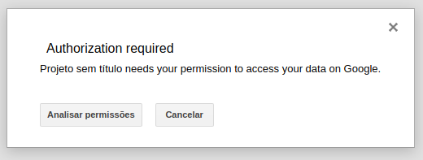
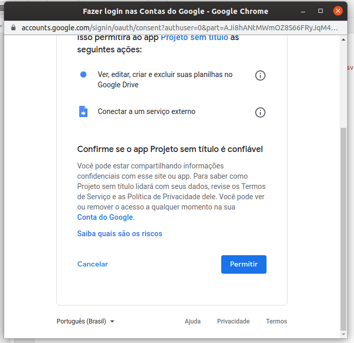

Se você utiliza o Excel da Microsoft, provavelmente está acostumado a utilizar e importar dados de fontes externas, por exemplo arquivos CSV. Conseguimos ter essa mesma facilidade no Google Planilhas utilizando o Google Apps Script.

## O que é Google Apps Script?

O [Apps Script é](https://developers.google.com/apps-script) uma plataforma de script desenvolvida pela Google para o desenvolvimento de aplicativos leves na plataforma G Suite. É baseado em JavaScript 1.6, mas também inclui algumas funcionalidades do 1.7, 1.8 e um subconjunto da API do ECMAScript 5. Os projetos do [Apps Script](https://developers.google.com/apps-script) são executados na infraestrutura cloud da Google. De acordo com a própria *Google*, o Apps Script "fornece maneiras fáceis de automatizar tarefas nos produtos e serviços de terceiros". O Apps Script também está disponível para o Google Docs e Apresentações.

Você encontra t*odos os scripts deste tutorial na [planilha de exemplo](https://docs.google.com/spreadsheets/d/1qHZgB9PDH70RkgPmzzMmrHmNyk6gettTuawES3miHgA/edit?usp=sharing)*, faça uma cópia em seu drive para conseguir visualizar os scripts e editar a planilha.

***Confira também**: [Transferindo arquivos por SFTP no Google Cloud usando o FileZilla](http://marquesfernandes.com/2019/11/19/transferindo-arquivos-por-sftp-no-google-cloud-usando-o-filezilla)*

## Acessando o Apps Script

Para acessar o Google Apps Scripts, crie uma planilha em branco ou copie a [planilha de exemplo](https://docs.google.com/spreadsheets/d/1qHZgB9PDH70RkgPmzzMmrHmNyk6gettTuawES3miHgA/edit?usp=sharing); Clique em *Ferramentas > Editor de script*:

Uma nova aba com o editor de texto do Google Apps Script abrirá:

## Criando os Scripts

Podemos facilmente importar arquivos CSV nas Planilhas do Google usando a função `Utilities.parseCsv()` do Google Apps Script. Os códigos abaixo mostram como importar e exibir os dados de um arquivo CSV por URL, salvo no Google Drive ou como anexo no Gmail.

### Autorizando o Google Apps Scripts

Pra todos os exemplos abaixo, ao executar os scripts precisamos autorizar o Google Apps Scripts para acessar as algumas funcionalidades das APIs do Google.

Provavelmente, por seu script não ser ainda homologado, a tela abaixo aparecerá:

Clique em *Mostrar Avançado* > *Acessar Projeto* e continue para a autorização:

### Importando o arquivo CSV de um anexo de email no Gmail

function importarCSVDoGmail() {
  
  var emails = GmailApp.search("from:henrique@marquesf.com"); // Filtramos nossos emails
  var email = emails\[0\].getMessages()\[0\]; // Pegamos a primeira mensagem da thread do email
  var anexo = email.getAttachments()\[0\]; // Pegamos o primeiro anexo do email
  
  // Validamos se esse anexo é um CSV
  if (anexo.getContentType() === "text/csv") {
    
    var planilha = SpreadsheetApp.getActiveSheet(); // Selecionamos o objeto da planilha ativa
    var csv = Utilities.parseCsv(planilha.getDataAsString(), ",");
    
    // Limpamos o conteúdo da planilha antes de importar os dados
    sheet.clearContents().clearFormats();
    // Importamos todos os dados a partir da célula A1
    sheet.getRange(1, 1, csv.length, csv\[0\].length).setValues(csv);
  } 
}

Em nossa variável de emails vamos realizar um busca de filtro em nosso Gmail para retornar o primeiro e-mail correspondente, podemos utilizar qualquer operador de busca do Gmail dentro da função `GmailApp.search("operador:busca")`, confira aqui a [lista completa de operadores](https://support.google.com/mail/answer/7190?hl=pt-BR).

### **Importando o arquivo CSV do Google Drive**

function importarCSVDoGoogleDrive() {

    var arquivo = DriveApp.getFilesByName("data.csv").next();
    var csv = Utilities.parseCsv(arquivo.getBlob().getDataAsString());
    var planilha = SpreadsheetApp.getActiveSheet();
    planilha.getRange(1, 1, csv.length, csv\[0\].length).setValues(csv);

}

No exemplo acima estamos buscando o arquivo `data.csv` que está na raiz do Google Drive, altere esse caminho conforme sua necessidade.

## **Baixar e importar o arquivo CSV de um website externo**

function importarCSVDaWeb() {

    // URL de download do arquivo CSV
    var csvUrl = "/wp-content/uploads/2020/01/exemplo\_csv.csv";
    var csv = UrlFetchApp.fetch(csvUrl).getContentText();
    var dados = Utilities.parseCsv(csv);

    var planilha = SpreadsheetApp.getActiveSheet();
    planilha.getRange(1, 1, dados.length, dados\[0\].length).setValues(dados);

}

Lembrando que o serviço *UrlFetchApp* faz apenas requisições HTTP, não sendo possível ainda conectar em servidores FTP.
