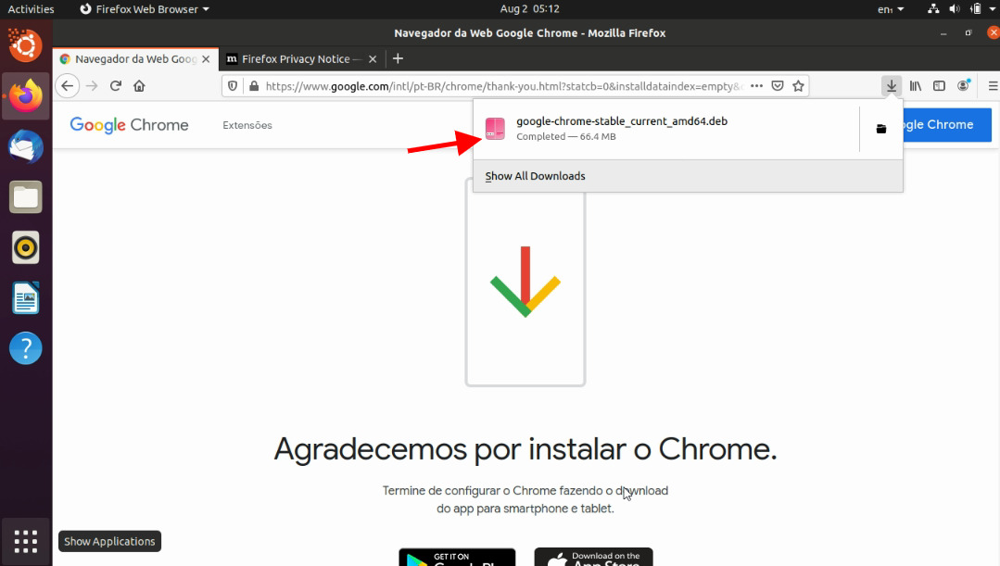

Google Chrome es el navegador web más popular del mundo. Es rápido, seguro y lleno de características para ofrecer la mejor experiencia de navegación. Cuando entras en una nueva instalación de Ubuntu, el navegador predeterminado instalado es Firefox, ha mejorado mucho en los últimos años, pero Chrome sigue siendo la opción predeterminada de la mayoría de los usuarios. Si vas a la tienda ubuntu (Ubuntu Store), probablemente no encontrarás Google Chrome para instalar, pero su versión de código abierto Chromium, aunque son similares (Chromium es el proyecto de código abierto), no son los mismos.

Entonces, ¿cómo se instala Google Chrome en Ubuntu? Hay dos maneras de instalar, los usuarios más avanzados pueden hacer esto directamente desde la línea de comandos o descargando el mismo instalable que en Windows.

-   [Instalación de Google Chrome por archivo](#metodo1)
-   [Instalar Google Chrome por línea de comandos](#metodo2)

## 1\. Instalación de Google Chrome en Ubuntu por archivo

Si eres nuevo en el mundo Linux, la instalación por línea de comandos puede ser extremadamente complicada, pero no te preocupes, Ubuntu lo sabe y así trata de traerte una experiencia más sencilla.

Primero ve a h[ttps://www.google.com/chrome](https://www.google.com/chrome/)/ para acceder a la página de descarga de Chrome.

Haga clic en descargar, asegúrese de que ubuntu instalado es de 64 bits, si es la última versión de Ubuntu es seguro que es de 64 bits.

Elija la opción DEB para Ubuntu/Debian.

Guarde el archivo localmente, abrir directamente con Ubuntu Store puede no funcionar.

Abra el archivo y siga los pasos de instalación! ¡Es tan simple como eso! Ahora ya tienes Google Chrome instalado en tu Ubuntu.

## 2\. Instalación de Google Chrome en Ubuntu a través de Terminal

Si eres un usuario ya acostumbrado al mundo Linux, probablemente prefieras hacer cosas por la línea de comandos. Aunque no es tan simple como instalar otras aplicaciones, el uso de sólo apt-get instalar chrome no funcionará.

Para instalar Google Chrome desde el terminal, necesitamos descargar el archivo DE*B m*ediante el comando `wge`t:

$wget https://dl.google.com/linux/direct/google-chrome-stable\_current\_amd64.deb

Ahora podemos usar `dpkg` para instalar Chrome desde el archivo DEB descargado:

$ sudo dpkg -i google-chrome-stable\_current\_amd64.deb

Ahora sólo tienes que buscar Google Chrome en tu lista de aplicaciones y empezar.

## Cómo optimizar Google Chrome

Ahora que tienes tu Google Chrome en funcionamiento, consulta este a[rtículo sob](http://marquesfernandes.com/como-otimizar-a-velocidade-e-desempenho-do-seu-google-chrome/)re cómo optimizar tu navegador y mantener tu rendimiento actualizado.
