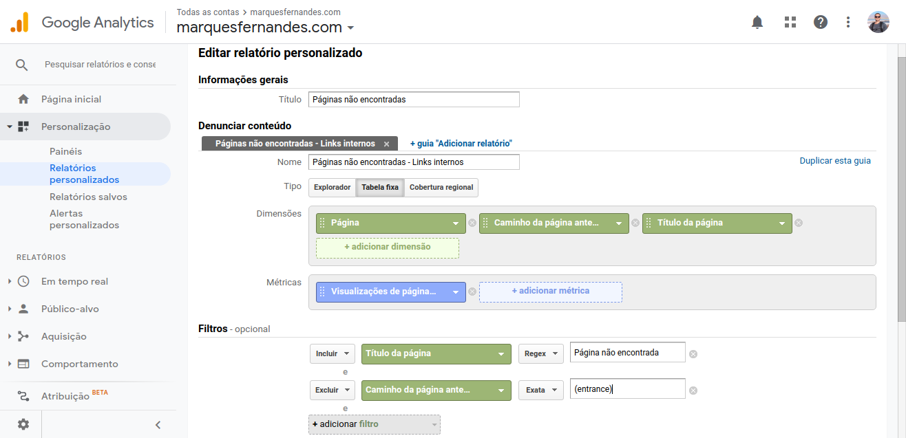
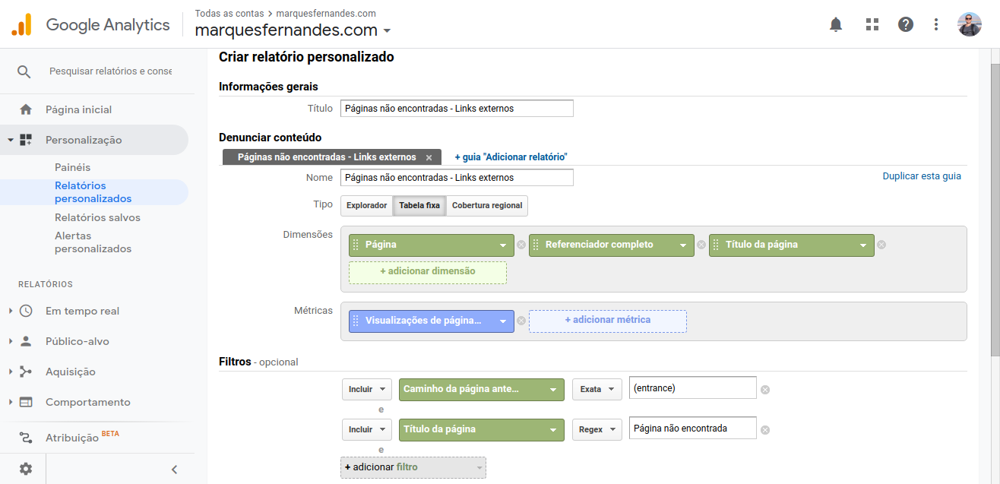
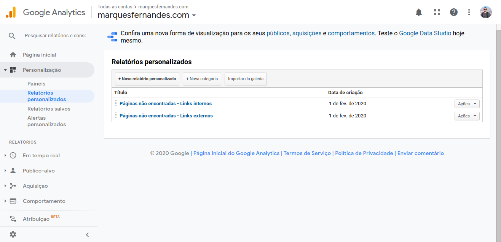

Neste artigo vamos aprender como monitorar erros 404 do seu site pelo [Google Analytics](https://analytics.google.com/analytics/web/). Se o seu site está configurado corretamente para esse tipo de erro, o Google Analytics já consegue monitorar automaticamente. Os relatórios personalizados que vamos aprender a criar, vão ajudar a facilmente identificar e corrigir quais páginas estão originando esse erro.

**Confira também:** [Filtrando pré-visualização e wp-admin do WordPress no Google Analytics](http://marquesfernandes.com/filtrando-pre-visualizacao-e-wp-admin-do-wordpress-no-google-analytics/)

Primeiro precisamos descobrir se nossas páginas 404 estão configuradas corretamente:

-   A sua página 404 deve sempre carregar na mesma URL que apresentou o erro, **NÃO** devemos redirecionar para uma página customizada (Exemplo: /404/)
-   Qual uma página não existe em seu site, ela deve retornar o código de status **HTTP 404 (Not Found)**, não o código 200 (Ok) e nem algum código de redirecionamento, leia o ponto acima.
-   **Para facilitar o monitoramento:** Padronize o título dessa página, de preferência com títulos que identifiquem facilmente o erro, como "Página não encontrada" ou "404".

Podemos usar como exemplo esta página: [http://marquesfernandes.com/esta-pagina-nao-existe](http://marquesfernandes.com/esta-pagina-nao-existe).

## Relatório customizada para encontrar erros 404 causados por links INTERNOS

O primeiro relatório que vamos aprender a criar monitora os links internos que estão causando erros 404 em seu site. Links internos, são links que apontam de uma página para outra dentro do seu site. Como teoricamente temos total controle sobre esses links, conseguiremos atuar em arrumar eles mais rapidamente. Links quebrados são péssimos para a performance SEO e para a experiência do usuário.

1.  No seu painel do Google Analytics vá em **Personalização > Relatórios Personalizados > + Novo relatório personalizado**.
2.  Seleciona o tipo **Tabela fixa**.
3.  Seleciona as dimensões **Página; Caminho da Página Anterior; Título da página.**
4.  Seleciona a métrica **Visualizações de páginas únicas**.
5.  Adicione um filtro que **exclua** o valor **(entrance)** para a dimensão **Caminho da Página Anterior**. Esse filtro garante que apenas erros 404 causados por um link interno apareçam.
6.  Adicione um filtro para o **título da página** que identifique suas páginas não encontradas.

Agora salve seu relatório e veja o resultado:

## Relatório customizada para encontrar erros 404 causados por links EXTERNOS

Agora vamos aprender como monitorar erros 404 vindos por links externos. Links externos, são links que direcionam para alguma página do seu site em um site diferente do seu. Normalmente você não tem controle direto sobre esses links, mas assim que encontrados você pode facilmente avisar o administrador do site para corrigir.

1.  No seu painel do Google Analytics vá em **Personalização > Relatórios Personalizados > + Novo relatório personalizado**.
2.  Seleciona o tipo **Tabela fixa**.
3.  Seleciona as dimensões **Página; Referenciador completo; Título da página.**
4.  Seleciona a métrica **Visualizações de páginas únicas**.
5.  Adicione um filtro que **inclua** o valor **(entrance)** para a dimensão **Caminho da Página Anterior**. Esse filtro garante que apenas erros 404 causados por um link interno apareçam.
6.  Adicione um filtro para o **título da página** que identifique suas páginas não encontradas.

Se tudo der certo, você terá agora dois relatórios para te ajudar a identificar e corrigir esses erros. Monitore sempre que possível esses relatórios, não deixe um erro simples de ser consertado afetar o seu SEO!

