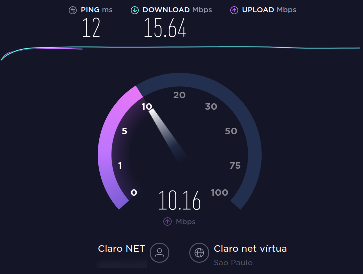
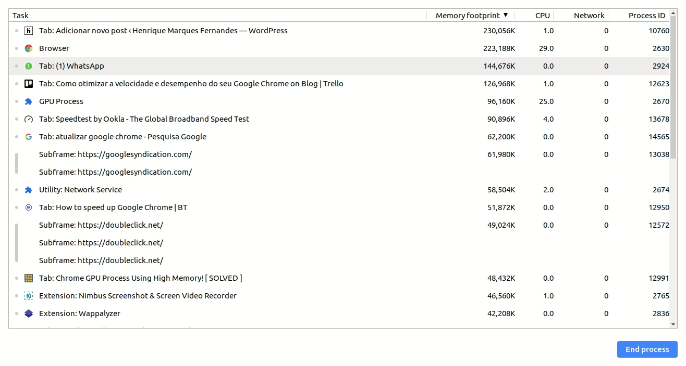

Atualmente o seu navegador é provavelmente o programa mais importante de seu computador. Tudo o que fazemos, desde email, redes sociais e até editar documentos acontecem em nosso navegador. O Google chrome é o queridinho do mundo e também do brasileiro, com a impressionante marca de [~80% de market share](https://gs.statcounter.com/browser-market-share/all/brazil), sendo o navegador mais utilizado disparado, na sua distante traseira está o navegador Safari da Apple com pouco mais de 5%.

Se o seu navegador está parecendo mais lento que o normal, não se desespere, existem algumas dicas úteis para melhorar a velocidade do seu navegador.

## 1 - Verifique a velocidade da sua internet

Pode parecer óbvio, mas muitas vezes culpamos o pobre navegador por conta de uma conexão ruim. Faça um teste de velocidade em um site como o [speedtest.net](https://www.speedtest.net/). É possível que você identifique o problema logo de cara, faça o teste principalmente se você estiver em um conexão pública, como um aeroporto ou restaurante. E se sua conexão estiver de fato lenta (~xingue a net/claro~), verifique se você ou alguém em sua rede não está baixando algo ou assistindo um vídeo.

## 2 - Verifique suas abas abertas

Todos temos um amigo acumulador de abas no navegador, se você é esse amigo, veja a real necessidade de todas as abas, isso acaba com a performance do seu navegador e consequentemente de seu computador. Agora, se você acha que precisa mesmo de todas as abas, use alguma extensão como a [Tabs Outliner](https://chrome.google.com/webstore/detail/tabs-outliner/eggkanocgddhmamlbiijnphhppkpkmkl?hl=pt-BR) para te ajudar nisso.

## 3 - Verifique se seu navegador está atualizado

Mais uma dica óbvia porém super importante, não só pela velocidade mas também pela sua segurança, constantemente o Google lança atualizações que contém novas funcionalidades, ajustes de segurança e melhorias de performance. Quando uma atualização estiver disponível um alerta amarelo visível aparecerá no lugar dos três pontinhos no canto superior direito, caso queria ter certeza se existe alguma atualização disponível clique nos três pontinhos do canto superior direito, Ajuda > Sobre o Google Chrome.

([Imagem](https://tecnoblog.net/wp-content/uploads/2018/11/Atualizar-Google-Chrome-700x326.png)[:](https://tecnoblog.net/wp-content/uploads/2018/11/Atualizar-Google-Chrome-700x326.png) [tecnoblog](https://tecnoblog.net/wp-content/uploads/2018/11/Atualizar-Google-Chrome-700x326.png))

## 4 - Verifique suas extensões - Chrome Extensions

Se você possuí extensões do Google Chrome instalada, agora é a hora de verificar, confirme as extensões que você usa com frequência e desabilite as que não são usadas, veja também se alguma extensão está drenando recursos de seu computador, pelo atalho `Shift + ESC` abra o gerenciador de tarefas do Google Chrome e veja o consumo de processadores e memória de suas abas e extensões.

## 5 - Limpe os dados temporários

O Google Chrome guarda diversos arquivos com o intuito de melhorar a experiência do usuário, mas em alguns casos esses arquivos podem sobrecarregar e atrapalhar o desempenho do navegador, para limpar clique nos três pontinhos no canto superior direito, **Mais ferramentas** > **Limpar dados de navegação**. Limpe todos os dados de imagens e arquivos, não recomendo selecionar as outras opções, os ganhos são poucos e você perderá todo seu histórico e terá que fazer login em todos os sites que usa.

## 6 - Faça uma varredura com seu anti-vírus

Muitas vezes Malwares podem estar comprometendo a performance do seu computador, consequentemente deixando o seu navegador lento. Faça uma boa varredura com seu anti-vírus: Se você está no Windows pode o [AVG,](https://www.avg.com/pt-br/homepage#pc) sua versão gratuita é muita boa, e se estiver no Linux [confira esse tutorial de como escanear seu sistema por Malwares](http://marquesfernandes.com/2019/12/04/como-escanear-seu-servidor-linux-por-malwares-debian-ubuntu).

## 7 - Habilite funcionalidades do Chrome escondidas (Avançado)

O Google Chrome possuí algumas funcionalidades escondidas, elas podem mudar, desaparecer ou até mesmo gerar comportamentos inesperados em seu navegador, portanto só altere coisas aqui se precisar muito e estiver seguro do que está fazendo.

-   Recursos experimentais de tela - Isso permite que o Chrome use telas opacas para ampliar os tempos de carregamento e aumentar o desempenho.  
    [chrome://flags/#enable-experimental-canvas-features](chrome://flags/#enable-experimental-canvas-features)
-   Número de threads de varredura - Alterar esse número de "Padrão" para "4" acelerará a renderização da imagem.  
    [chrome://flags/#num-raster-threads](chrome://flags/#num-raster-threads)
-   Ativar fechamento rápido de guias / janelas - Isso executará o manipulador JavaScript onload do Chrome, independentemente da GUI, para acelerar o fechamento das guias.  
    [chrome://flags/#enable-fast-unload](chrome://flags/#enable-fast-unload)
-   Descarte automático de guias - Se ativado, as guias são descartadas automaticamente da memória quando a memória do sistema está baixa. As guias descartadas ainda estão visíveis na faixa de guias e são recarregadas quando clicadas.  
    [chrome://flags/#automatic-tab-discarding](chrome://flags/#automatic-tab-discarding)
-   Dimensionamento do FontCache - reutilize uma fonte em cache no renderizador para atender a diferentes tamanhos de fonte para um layout mais rápido.  
    [chrome://flags/#enable-font-cache-scaling](chrome://flags/#enable-font-cache-scaling)
-   Otimizar a reprodução de vídeo em segundo plano - Desative as faixas de vídeo quando o vídeo for reproduzido em segundo plano para otimizar o desempenho.  
    [chrome://flags/#disable-background-video-track](chrome://flags/#disable-background-video-track)
-   Ativar cache simples para HTTP - O cache simples para HTTP é um novo cache. Ele se baseia no sistema de arquivos para alocação de espaço em disco.  
    [chrome://flags/#enable-simple-cache-backend](chrome://flags/#enable-simple-cache-backend)
-   Ativar modo de armazenamento em cache V8 - Modo de armazenamento em cache para o mecanismo JavaScript V8.  
    [chrome://flags/#v8-cache-options](chrome://flags/#v8-cache-options)

## 8 - Seu computador é apenas lento

As vezes seu computador simplesmente não tem capacidade e apenas um upgrade pode salvar sua paciência. Cada vez mais demandamos de nosso navegador, páginas mais complexas, vídeos em 8k, multi abas para multi tasking... Computadores com poucos recursos podem simplesmente não conseguir lidar com tanta carga de trabalho e por isso talvez seja a hora de fazer um [upgrade ou comprar um novo](https://click.linksynergy.com/deeplink?id=FPuxaVz3TuY&mid=42758&murl=https%3A%2F%2Fwww.americanas.com.br%2Fcategoria%2Finformatica%2Fnotebook).

