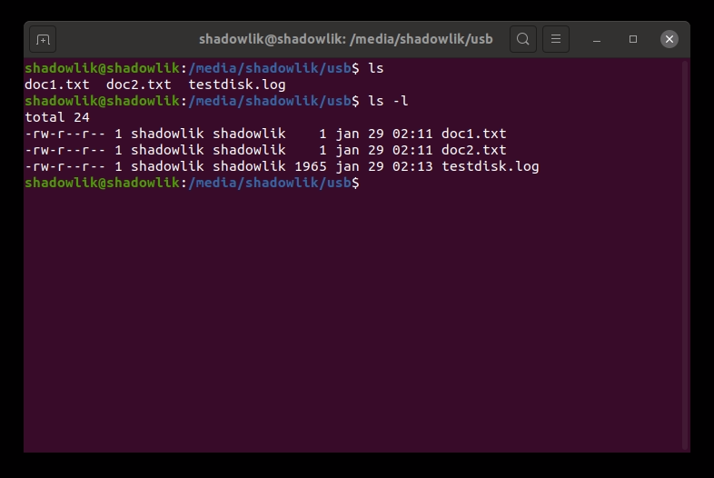
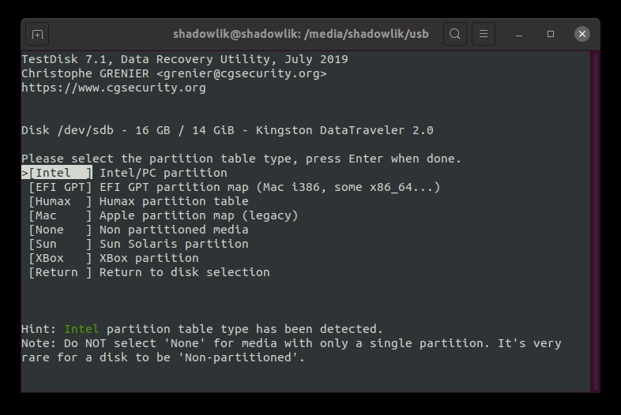
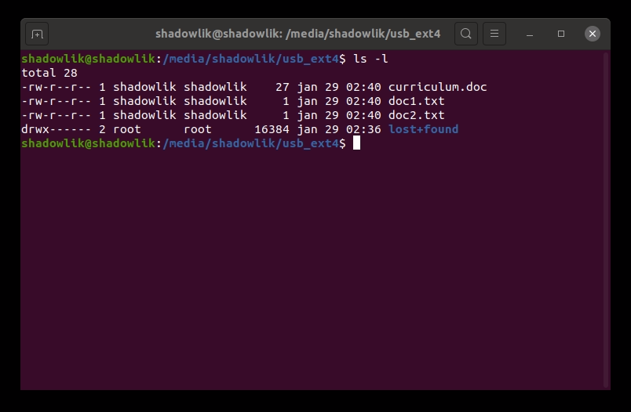
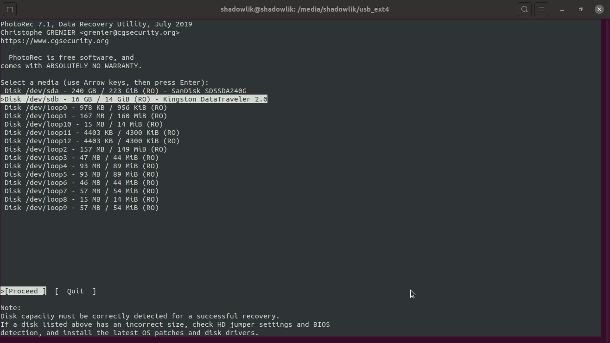
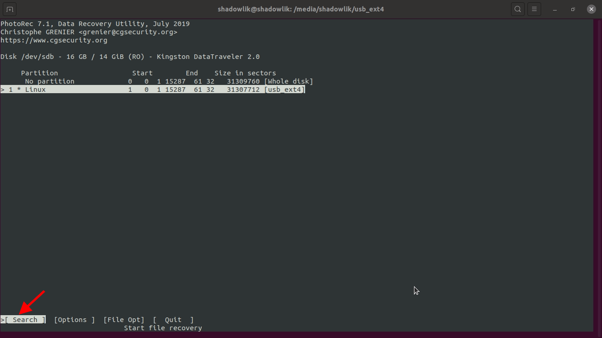
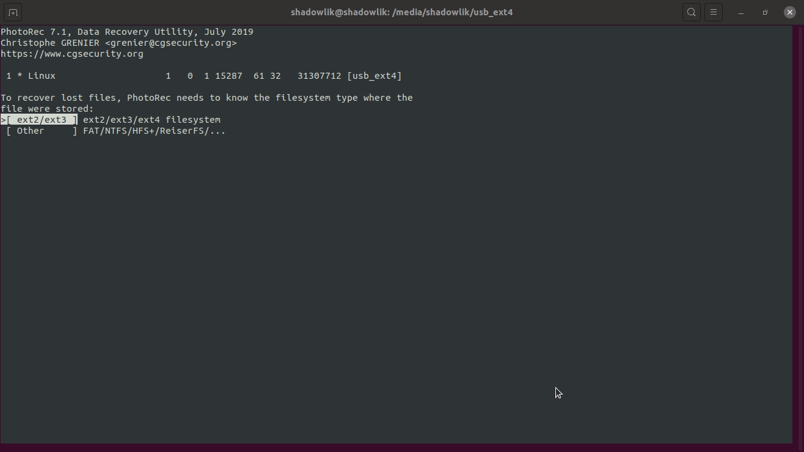
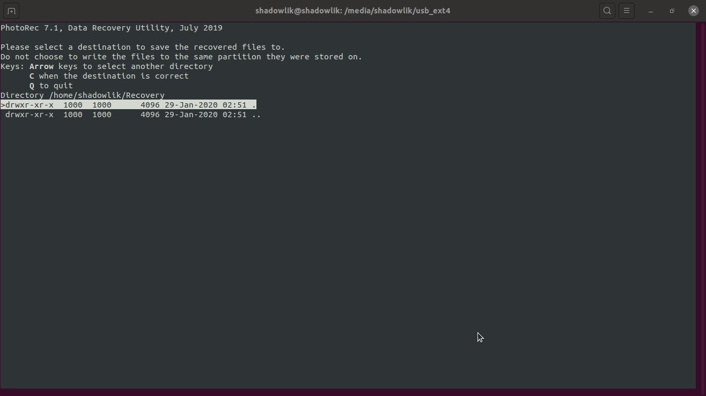
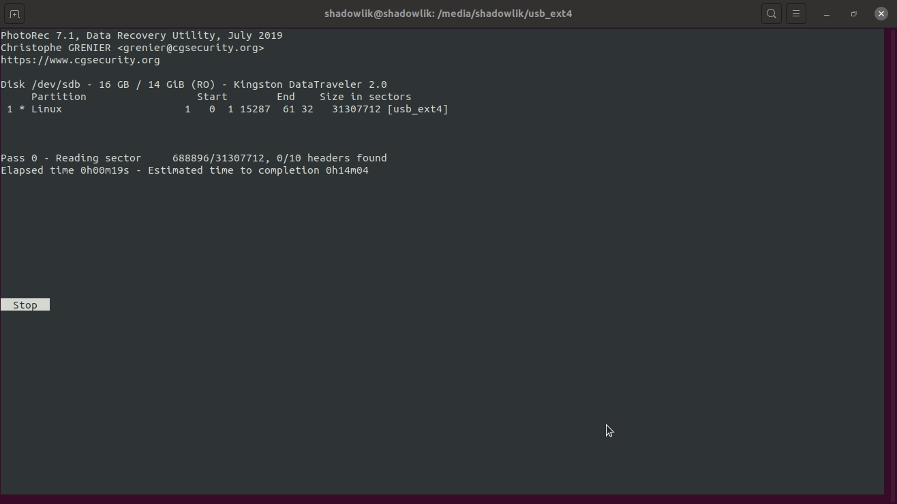

Você já teve aquela sensação horrível? Um sentimento desesperador que vem quando você percebe que excluiu acidentalmente um arquivo importante e ele não está na lixeira? Eis que começa o processo de luto, a negação, a raiva...

Mas, que tal não passar por todas as fases do luto? Respire, não se preocupe e lembre-se de que você não está sozinho! Mais cedo ou mais tarde [todo mundo acaba fazendo isso](https://www.tecmundo.com.br/programacao/103701-cara-cade-firma-rapaz-deleta-empresa-linha-codigo-errada.htm) em um momento de distração.

*\- Mas como você me diz para não me preocupar? Ta maluco?! Eu acabei de deletar um script que estava trabalhando há horas!!!*

Calma pequeno gafanhoto, neste artigo vamos aprender como recuperar arquivos excluidos no Linux usando as ferramentas TestDisk e Photorec. Não se assuste se você não tem muita experiência com a linha de comando, é bem fácil de usar e você vai conseguir recuperar qualquer arquivo deletado no Ubuntu/Debian e em outras distribuições Linux.

Quando deletamos um arquivo no Linux, ele é removido de uma lista e não necessariamente do disco. Desde que você não tenha salvo ou alterado muitas coisas na sua máquina, essa lista ainda existe! Ufa! E só pra você entender, dependendo do tamanho do arquivo e do espaço livre em seu HD, os arquivos excluídos podem persistir indefinidamente, mesmo se você alterar muitos arquivos em seu disco.

[Confira como deletar permanentemente e seguramente arquivos no Linux.](http://marquesfernandes.com/como-deletar-permanentemente-arquivos-no-linux/)

Agora que você está mais calmo, vamos para a parte boa, você não precisa ser um hacker para recuperar seus arquivos excluídos, basta saber abrir o terminal, copiar/colar alguns comandos e seguir o passo-a-passo que vou te mostrar de como usar as ferramentas para recuperar seus arquivos excluídos.

## 0 - Descobrindo o tipo da partição

Se você estiver em modo EFI e/ou a partição em que seu arquivo deletado estava é **ext3** ou **ext4**, siga a [**etapa 1.1**](#Instalando-o-TestDisk) e depois pule para **[Recuperando arquivos deletados com Photorec](#photorec)**.

Caso não tenha certeza qual o tipo da partição, use o comando `df -Th` para listar todas as partições e seus tipos de suas unidades de disco:

df -Th

## 1 - Como recuperar arquivos deletados no Linux usando o TestDisk

Vou explicar o nosso exemplo: Eu tenho um pendrive com três arquivos, e sem querer vou deletei com o comando `rm curriculum.txt` o meu precioso currículo, levei horas escrevendo, ó céus! Quando deletamos pela linha de comando, nosso arquivo não vai automaticamente para a lixeira, então teremos a impressão de que ele se foi para sempre.

Nosso cenário de exemplo

E olha que legal, eu não entro mais em pânico, e não é porque estamos em um cenário simulado e sim porque sei que tudo o que preciso fazer para recuperar é usar as ferramentas certas! De bônus você vai ficar com aquela sensação de que virou um hacker recuperando arquivos do além.

### 1.1 - Instalando o TestDisk

Primeiro precisamos instalar a ferramenta TestDisk. A maioria das distribuições linux já tem essa ferramenta em seu repositório. No Ubuntu/Debian você consegue instalar usando o gerenciador de pacote direto do terminal:

`sudo apt install testdisk`

### 1.2 - Executando o TestDisk

Agora execute o TestDisk no terminal com o comando:

`sudo testdisk`

### 1.3 - Criando um arquivo de log

Não se assuste com a interface, ela é bem intuitiva. Continue calmo, estamos perto de recuperar seu arquivo! Use as setas para navegar entre os menus e a tecla enter para selecionar.

Você provavelmente esta usando uma versão superior do 7.0, então muito dos comandos recomendados já estarão em destaque. Quase sempre a recomendação acerta, então a primeira coisa que precisamos é criar um arquivo de log com a opção `Create`. Selecione ela e pressione o enter.

### 1.4 - Selecionando o seu disco

Nessa etapa você verá uma listagem de seus discos. Selecione a partição onde estava o seu arquivo, se você não sabe qual é continue seguindo as recomendações da ferramenta, no meu caso é o disco do pendrive da Kingston. *Não esqueça de selecionar no menu de navegação a opção* `Proceed`.

### 1.5 - Selecionando o tipo de partição

Agora vamos seguir o mesmo conselho do passo **4** e confiar na sugestão do TestDisk.

### 1.6 - Selecionando o utilitário

Nessa etapa precisaremos analisar um pouco melhor. Caso ainda não tenha notado, essa ferramenta não é só para recuperar arquivos deletados, e sim um poderoso utilitário para discos. Mas se veja com calma a descrição das opções, você verá que o que queremos fazer está em `Advanced`.

### 1.7 - Selecionando a partição

Agora precisamos selecionar a partição onde está localizado nosso arquivo, provavelmente a partição correta, será a partição com o maior número de sectores. No menu de navegação selecione `Undelete`.

### 1.8 - Encontrar o diretório de nosso arquivo

Encontramos a pasta do nosso arquivo, e olha quem está ali em vermelho! Nosso arquivo deletado vive!

Não ligue pra diferença dos prints, eu tive que refazer as etapas e acabei precisando deletar o arquivo de log anterior do TestDrive

### 1.9 - Recuperando o arquivo deletado

Agora para recuperar nosso arquivos precisamos selecionar nosso arquivo e pressionar a tecla "**c**". Depois você precisará escolher para qual diretória deseja recuperar o arquivo e se tudo der certo uma mensagem como a seguinte deverá aparecer: "Copy done! 1 ok, 0 failed".

Pronto! Se você fez todos os passos e conseguiu a mensagem de sucesso, seu arquivo estará a salvo. Confira se o conteúdo dele continua intacto, caso algo tenha dado errado, repita todos os passos. E se você fez todos os passos, talvez o tipo da sua partição não seja possível restaurar usando o TestDisk, ext4 por exemplo, mas não se preocupe... Podemos usar uma outra ferramenta que é instalada junta com o pacote do TestDisk, a Photorec!

## 2 - Como recuperar arquivos deletados no Linux usando o Photorec

Infelizmente os passos acima não são possíveis para alguns tipos de partições (ext3 e ext4 por exemplo), para recuperar arquivos deletados nesse tipo de partição precisaremos passar por um processo um pouco mais chato e usando outro programa. Lembrando que esse método pode ser utilizado para praticamente todos os outros tipos de partições também.

O processo poderá ser um pouco mais demorado dependendo da quantidade de arquivos deletados que você tem em disco que sejam da mesma extensão do que você deseja recuperar.

Vamos supor que eu deletei um arquivo chamado **curriculum.doc**.

### 2.1 - Executando o Photorec

Execute o comando `sudo photorec` em seu terminal para iniciar o programa de recuperação.

### 2.2 - Selecionando os tipos de arquivos

Selecione o tipo de arquivos que desejamos recuperar, quando mais específico for, menos tempo levaremos para recuperar o nosso arquivo. Clique a tecla **"s"** para descelecionar todas as opções e procure a extensão do seu arquivo, em nosso caso **.doc**. Após ter selecionado todas as extensões desejadas, clique **"b"** para salvar a nova configuração e logo em seguida clique enter na opção quit para retornar ao menu principal.

### 2.3 - Selecionando a partição

Selecione a partição, e com a opção Search selecionada pressione enter.

Nessa etapa, precisamos selecionar qual o tipo da nossa partição, selecione conforme a sua necessidade, em nosso caso a seleção automática já acertou qual a opção correta.

### 2.4 - Selecionando o modo de busca

Selecione a opção free para uma busca mais rápida apenas nos espaços de memória desalocados, ou se preferir, faça uma busca na partição inteira.

### 2.5 - Selecionando a pasta de destino

Agora precisamos selecionar para qual pasta desejamos que nossos arquivos recuperados sejam enviados, eu recomendo que você crie uma pasta em um disco diferente do que você está tentando recuperar. Eu criei uma pasta chamada Recovery no disco principal para enviar os arquivos recuperados. Navegue até achar o destinado desejado e então pressione a tecla "c" para dar inicio a recuperação.

### 2.6 - Executando a recuperação dos arquivos

O processo de busca do Photoreco costuma ser mais demorado que o do TestDrive pois ele varre toda a partição em busca de todos os arquivos deletados com as extensões que selecionamos para procurar, você pode acompanhar o processo e em tempo real verificar se algum arquivo já foi recuperado para a pasta selecionada no último passo.

### 2.7 - Encontrando o arquivo recuperado

Na pasta de destino você verá que uma ou mais pastas `recup_dir.*` serão criadas, nelas estarão os arquivos recuperados, caso você note que existem muitas pastas para procurar o seu arquivo, use o comando `find . -name *nomedoarquivo*.doc` para encontrar recursivamente o arquivo desejado.

## Conclusão

Como você viu, deletar um arquivo não é o fim do mundo, existem maneiras de recuperar nossos arquivos mesmo que eles não apareçam na lixeira. Mas não vamos contar só com a "sorte", busque sempre ter muito cuidado ao deletar e executar comandos no terminal, alguns comandos e situações podem ser irreversíveis.
