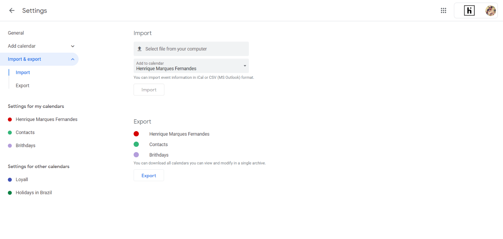

O Facebook vem caindo em desuso ao longo dos anos e muitos de seus usuários, como eu, já não acessam mais tão frequentemente a rede social, provavelmente por terem migrado para outras plataformas sociais. No entanto, uma coisa que ainda é muito útil no Facebook, são as notificações de aniversário integradas. Eu particularmente uso o Facebook basicamente para isso, e para entrar em outros sites e aplicativos. Recentemente me peguei pensando, e se eu tivesse todos esses aniversários do Facebook no meu calendário do Google? Como eu já uso o Google Agenda para as minhas coisas do dia a dia, seria muito mais prático. Portanto, se você está no mesmo barco que eu, saiba que é possível sim sincronizar todos os aniversários do seu Facebook para o calendário e aplicativo do Google Agenda.

Com o uso de uma extensão do Chrome e alguns cliques, você pode sincronizar seu calendário de aniversários do Facebook com o do Google. Desta forma, o Google Calendar, que passa a ser o serviço de calendário padrão na maioria dos celulares por aí, irá ajudá-lo a não esquecer do dia especial dos seus amigos, familiares e colegas.

Então chega de enrolação e vamos aprender a transferir a programação de aniversários do Facebook para o Google Agenda.

## 1\. Instalar a extensão Birthday Calendar Extractor

Instale a extensão ' [Birthday Calendar Extractor for Facebook](https://chrome.google.com/webstore/detail/birthday-calendar-extract/imielmggcccenhgncmpjlehemlinhjjo/related?hl=pt) ' diretamente da Chrome Webstore.

## 2\. Gerar o arquivo ICS

Agora visite [Facebook.com](https://facebook.com/) e quando estiver lá, clique no ícone Extrator de Calendário de Aniversário nos atalhos de extensão superior direito. Importante ressaltar que caso o seu facebook esteja com o idioma de exibição em português, será necessário trocar para um dos idiomas compatíveis com a extensão, como o inglês.

Clique em 'Generate Google Calendar - ICS' e o download do arquivo será feito em alguns segundos. O ICS é um formato de calendário universal usado pelo Microsoft Outlook, Google Calendar e Apple Calendar. Importante: Não altere nada nesse arquivo.

## 3\. Importar o arquivo de aniversários para Google Agenda

Vá até a sua página do Google Agenda. Pressione o ícone de roda dentada > configurações > Importar / Exportar e você estará na página de [importação](https://calendar.google.com/calendar/u/0/r/settings/export?pli=1) do Google Agenda.

Escolha o arquivo do local de download (onde quer que esteja em seu PC) e clique no botão importar. Eu recomendo que você crie um calendário específico para isso, será mais fácil de organizar as datas, e se deseja exibir ou não os aniversários depois.

Em um instante, a transferência será concluída e você será notificado sobre a importação bem-sucedida. Agora, se você quiser, pode remover o aplicativo do Facebook do seu telefone, desativar ou parar de usar a plataforma por completo. Você verá os dados de aniversário destacados no aplicativo e no Widget do Google Agenda. Se desejar, pode também configurar o Google para enviar diariamente um e-mail com o resumo contendo todos os aniversários do dia.

Gostou do artigo? Deixe seu comentário!
