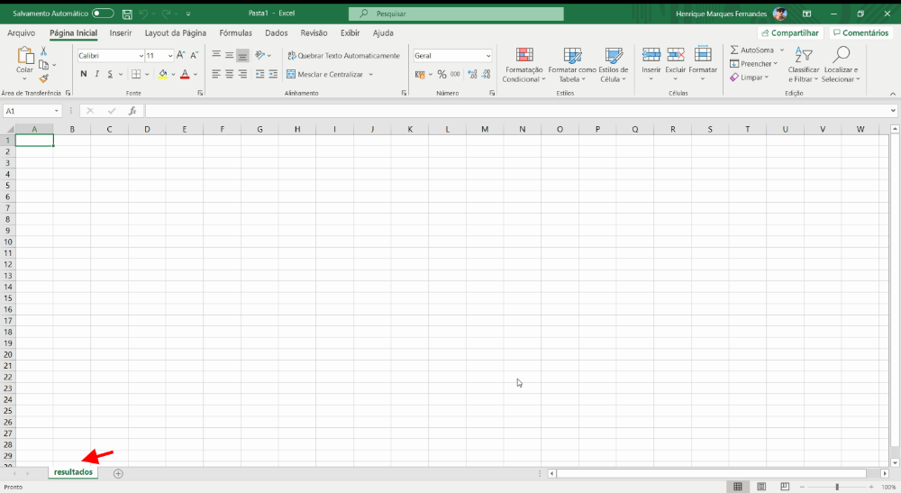
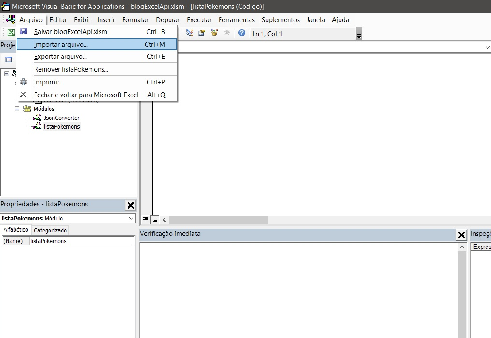
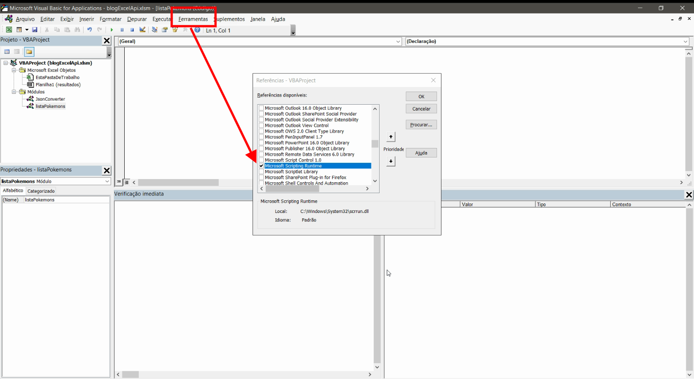

Excel es probablemente una de las herramientas más utilizadas en este mundo, por lo que la demanda de integraciones con hojas de cálculo extremadamente complejas es un escenario recurrente. Las API permiten una facilidad de acceso a la información en los sistemas, que se está volviendo cada vez más estándar en el mercado, con esto en mente, algunas demandas de conexión a sistemas a través de API en Excel son necesarias y muy útiles, así que decidí compartir un poco de cómo creé esta integración. Aprendamos a consultar las API de Rest mediante VBA y convertir el resultado en JSON que se usará en la hoja de cálculo.

Este artículo espera que conozca los conceptos básicos de Excel y VBA, así como [qué es una API y cómo funciona](http://marquesfernandes.com/o-que-e-uma-api-e-para-que-serve/). Nuestro objetivo será consultar una [API pública de Pokemons](https://pokeapi.co/) y enumerar el resultado en la pestaña `Resultados`.

## Creación de una hoja de cálculo en blanco

Primero vamos a crear una hoja de trabajo en blanco con la macro habilitada, dentro de ella crearé una pestaña llamad`a resultado`s.

## Creación de la macro para consultar la API

Por el acceso `directo a`lt + f11 abriremos el editor de macros de Excel y crearemos un módulo llama`do ListPokemon`s.

### Importación de la biblioteca VBA-JSON

Como la API que consultamos devuelve un [JSON](http://marquesfernandes.com/o-que-e-json-e-para-que-serve/) como respuesta, necesitaremos importar la biblioteca [JSON de VBA](https://github.com/VBA-tools/VBA-JSON), se encargará de todo el trabajo aburrido de traducir el JSON y devolver como una matriz y un objeto. La instalación es bastante simple, sólo [tiene que descargar la última versión aquí](https://github.com/VBA-tools/VBA-JSON/releases) y en el editor de macros ir en `archivo > Importar archivo > JsonConverter.bas`.

### Habilitación de Microsoft Scripting Runtime

También necesitamos habilitar Microsoft Scripting Runtime, así que simplemente examine Herramientas > R`eferencias y examine y habilit`e el tiempo de ejecución de secuencias de `comandos de microsoft en la list`a.

## Creación de la macro VBA para consultar la API REST

A continuación tenemos el código completo de nuestra solicitud, puede parecer aterrador, pero no te preocupes, te explicaré lo que cada parte está haciendo:

Sub listPokemons()
Dim json As String
Dim jsonObject As Object, item As Object
Dim i As Long
Dim ws As Worksheet
Dim objHTTP As Object

«Seleccionamos nuestra hoja de cálculo de resultados
Set ws - Hojas de trabajo ("resultados")

"Creamos nuestro objeto de la requistación y enviamos
Set objHTTP á CreateObject("WinHttp.WinHttp.5.1")
URL: "https://pokeapi.co/api/v2/pokemon"
objHTTP.Open "GET", URL, False
objHTTP.Send
strResult á objHTTP.responseText
json - strResult

Set objectJson á JsonConverter.ParseJson(json)

«Creamos las celdas de encabezado
Ws. Células(1, 1) - "nombre"
Ws. Células(1, 2) - "enlace"

«En bucle la propiedad results de la respuesta de la API
i 2 'Vamos a iniciar el contador en la línea 2
Para cada pokemon In objectJson("results")
    Ws. Células(i, 1) - pokemon("name")
    Ws. Cells(i, 2) á pokemon("url")
    i i + 1
Siguiente

End Sub

Primero definimos todas las variables que usaremos en nuestros scripts, incluida la importación de la biblioteca JSON de VBA que importamos anteriormente en nuestro proyecto.

Dim json As String
Dim jsonObject As Object, item As Object
Dim i As Long
Dim ws As Worksheet
Dim xmlhttp As Object
Set xmlhttp á CreateObject("MSXML2.serverXMLHTTP")
Dim objHTTP As Object

A continuación seleccionamos la hoja de cálculo que queremos mostrar los resultados de la consulta de API, en nues`tro caso Hojas de trabajo` ("resultados") y luego creamos un objeto que nos permitirá realizar la solicitud para la `API https://pokeapi.co/api/v2/pokemo`n. Tomaremos la respuesta y la pondremos en la var`iabl`e json, por ahora no es más que un texto.

«Seleccionamos nuestra hoja de cálculo de resultados
Set ws - Hojas de trabajo ("resultados")

"Creamos nuestro objeto de la requistación y enviamos
Set objHTTP á CreateObject("WinHttp.WinHttp.5.1")
URL: "https://pokeapi.co/api/v2/pokemon"
objHTTP.Open "GET", URL, False
objHTTP.Send
strResult á objHTTP.responseText
json - strResult

Aquí ocurre la magia, la función Pars`eJson de` la biblioteca VBA JSON convierte el texto de nuestra variable `jso`n en un objeto accesible en nuestro script. Ahora podemos acceder a todas las propiedades mediante programación en nuestro código.

Set objectJson á JsonConverter.ParseJson(json)

Ahora que tenemos el resultado de nuestra API accesible, creamos en la primera fila de la hoja de trabajo el encabezado que contiene las columnas de no**mbre** y v**íncul**o.

«Creamos las celdas de encabezado
Ws. Células(1, 1) - "nombre"
Ws. Células(1, 2) - "enlace"

Ahora, antes de analizar el script, necesitamos comprender el resultado de la API. Si abre el enlace [https://pokeapi.co/api/v2/pokemon](https://pokeapi.co/api/v2/pokemon) en su navegador verá el siguiente resultado:

{
  "count": 964,
  "next": "https://pokeapi.co/api/v2/pokemon?offset=20&limit=20",
  "anterior": nulo,
  "resultados": \[
    {
      "name": "bulbasaur",
      "url": "https://pokeapi.co/api/v2/pokemon/1/"
    },
    {
      "name": "ivysaur",
      "url": "https://pokeapi.co/api/v2/pokemon/2/"
    },
    {
      "name": "venusaur",
      "url": "https://pokeapi.co/api/v2/pokemon/3/"
    },
    {
      "name": "charmander",
      "url": "https://pokeapi.co/api/v2/pokemon/4/"
    },
    {
      "name": "charmeleon",
      "url": "https://pokeapi.co/api/v2/pokemon/5/"
    },
    {
      "name": "charizard",
      "url": "https://pokeapi.co/api/v2/pokemon/6/"
    },
    {
      "name": "Squirtle",
      "url": "https://pokeapi.co/api/v2/pokemon/7/"
    },
    {
      "name": "wartortle",
      "url": "https://pokeapi.co/api/v2/pokemon/8/"
    },
    {
      "name": "blastoise",
      "url": "https://pokeapi.co/api/v2/pokemon/9/"
    },
    {
      "name": "caterpie",
      "url": "https://pokeapi.co/api/v2/pokemon/10/"
    },
    {
      "name": "metapod",
      "url": "https://pokeapi.co/api/v2/pokemon/11/"
    },
    {
      "name": "libre de mantequilla",
      "url": "https://pokeapi.co/api/v2/pokemon/12/"
    },
    {
      "name": "weedle",
      "url": "https://pokeapi.co/api/v2/pokemon/13/"
    },
    {
      "name": "kakuna",
      "url": "https://pokeapi.co/api/v2/pokemon/14/"
    },
    {
      "name": "beedrill",
      "url": "https://pokeapi.co/api/v2/pokemon/15/"
    },
    {
      "name": "pidgey",
      "url": "https://pokeapi.co/api/v2/pokemon/16/"
    },
    {
      "name": "pidgeotto",
      "url": "https://pokeapi.co/api/v2/pokemon/17/"
    },
    {
      "name": "pidgeot",
      "url": "https://pokeapi.co/api/v2/pokemon/18/"
    },
    {
      "name": "rattata",
      "url": "https://pokeapi.co/api/v2/pokemon/19/"
    },
    {
      "name": "raticate",
      "url": "https://pokeapi.co/api/v2/pokemon/20/"
    }
  \]
}

Estamos interesados en los property`results`, una matriz que contiene una lista de pokemons con sus respectivos nombres y enlaces a más detalles. Accederemos a esta matriz `en json object ("re`sults") y loop para mostrar cada pokemon resultado en una nueva fila en nuestra tabla.

«En bucle la propiedad results de la respuesta de la API
i 2 'Vamos a iniciar el contador en la línea 2
Para cada pokemon In objectJson("results")
    Ws. Células(i, 1) - pokemon("name")
    Ws. Cells(i, 2) á pokemon("url")
    i i + 1
Siguiente

Si todo sucede como se esperaba, al presionar f5 `pa`ra rotar nuestra macro, en su hoja de cálculo debería ver el siguiente resultado:

## Conclusión

Este fue un ejemplo muy sencillo de consulta, con el objeto [HT](http://marquesfernandes.com/o-que-e-http/)[TP](http://marquesfernandes.com/o-que-e-http/) es posible realizar todo tipo de solicitudes, GET, POST, UPDATE, ... Lo interesante es entender cómo se realiza la solicitud y cómo puede mostrar el resultado, gracias a la biblioteca JSON de VBA, que ya reduce drásticamente el trabajo requerido. Ahora sólo tiene que adaptar este flujo y script a su necesidad.
