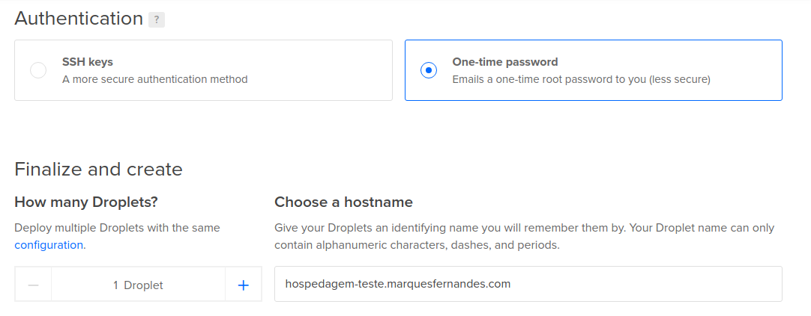
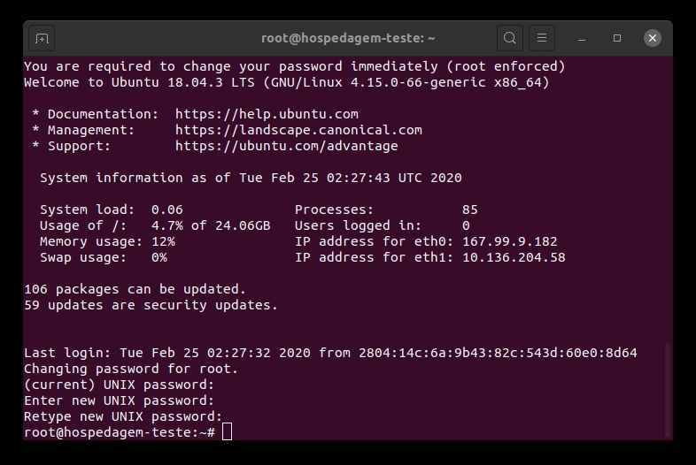
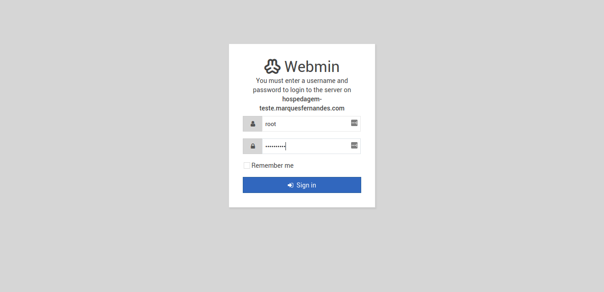
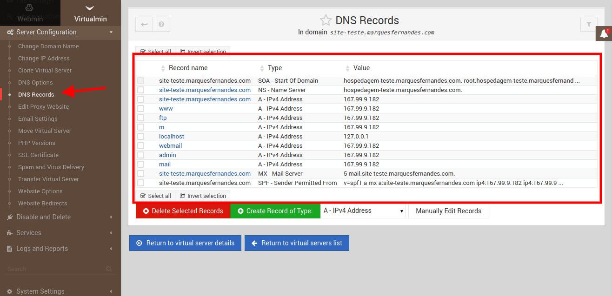
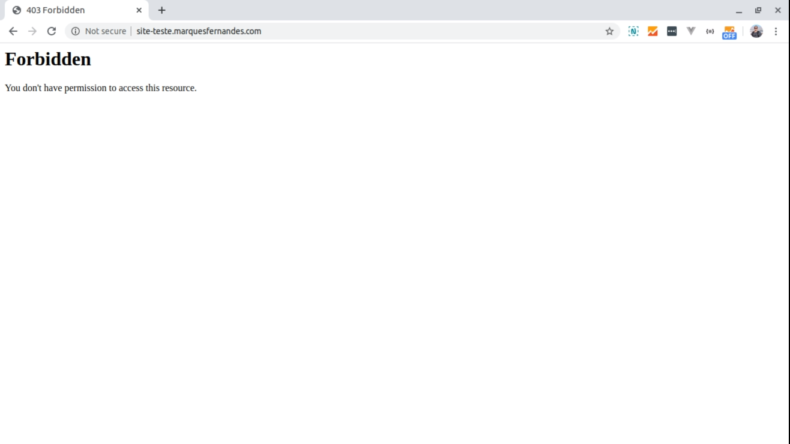
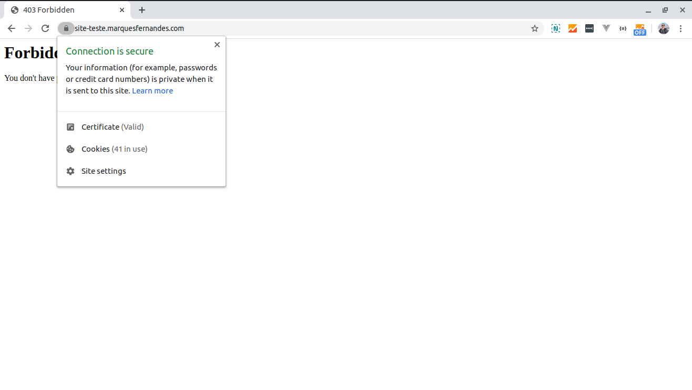

Cuando empecé como Freelancer no hice nada sobre alojar sitios web, y mucho menos servidores. ¿Dns? ¿Eso es una enfermedad? Todo parecía tan complicado que me llevó a optar por servicios como UO[L Host, L](https://uolhost.uol.com.br/#rmcl)oc[aweb y](https://www.locaweb.com.br/) Host[gator, y c](https://www.hostgator.com.br/17815.html)on ellos me quedé y tamizado durante mucho tiempo...

**Descargo de res**ponsabilidad 1: Si usted es un usuario laico que está buscando configurar un blog o un sitio web institucional para su empresa y no tiene mucho conocimiento técnico, no lo piense dos veces, opte por uno de estos servicios! Personalmente re[comiendo h](https://www.hostgator.com.br/17815.html)ostgator, tienen un panel administrativo intuitivo y el apoyo es relativamente bueno...

**Descargo de r**esponsabilidad 2: El alojamiento del sitio puede ser algo ambiguo, así que aclare que en este artículo cuando me refiero a "alojamiento de sitios": Sistema para crear y administrar sitios en PHP; Creación y configuración de cuenta de usuario, correo electrónico, FTP; Algunas otras características de alojamiento estándar que se encuentran en el mercado.

**Descargo de res**ponsabilidad 3: Si vas a construir y ofrecer servicios de alojamiento, piensa y reflexiona sobre todos los aspectos positivos y en su mayoría negativos de asumir esta responsabilidad: Tendrás que lidiar y controlar el uso de los recursos de la máquina por parte de tus clientes, el spam en la IP de tu servidor, el acceso y la creación de cuentas, el posible tiempo de inactividad, gestionar copias de seguridad y mucho más... Es un buen trabajo.

Normalmente estoy en contra de reinventar la rueda y siempre que sea posible priorizo el uso de servicios ya hechos que hacen mi vida más fácil, siempre y cuando satisfagan mis necesidades... Este no fue el caso y después de muchos problemas en situaciones "avanzadas" donde necesitaba optimizar alguna configuración, decidí buscar una solución que me diera más autonomía.

## Servicios utilizados

-   [Cloudflare](https://cloudflare.com/): Tal vez uno de los servicios "freemiuns" más completos que he utilizado, aquí manejo toda mi configuración de DNS y puedo contar con muchos otros servicios nativos gratuitos muy útiles: Seguridad y prevención de DDOS, Red de entrega de contenido (CDN), Almacenamiento en caché y optimizaciones de rendimiento... 

-   [DigitalOcea](https://m.do.co/c/6bc37502c1d9)n: Toda mi "infraestructura en la nube" está aquí, por R$ 22 / mes ($5 doletas / mes, cotización de 24/02/2020) se puede subir a un servidor que puede mantener en silencio entre 10 x 15 sitios institucionales que no reciben muchas visitas, y tienen toda la libertad también para subir a la demanda, con un solo clic puede aumentar los recursos de su máquina, sin ninguna configuración necesaria! Otro positivo es en su apoyo, aaaa el apoyo de DigitalOcean<3, é maravilhoso! (DigitalOcean, me patrocina!)
-   [Virtualmin](https://www.virtualmin.com/): Nuestro sistema de alojamiento administrativo, software de código abierto, hermoso, extremadamente completo y configurable. Hará toda la magia de instalar, configurar y administrar todos los servicios necesarios para nuestro hosting, Apache + PHP para sitios web dinámicos, servicio de correo electrónico, configuración de acceso FTP, creación y administración de cuentas de usuario y correo electrónico, y mucho más.

## Pasos

## Creación de servidores en la nube

En primer lugar, cree su cuenta de [DigitalOcean](https://m.do.co/c/6bc37502c1d9) ( d. ).

Vamos a crear un servidor con el sistema operativo Ubuntu Server 18.04, en Dig[italOcean, va](https://m.do.co/c/6bc37502c1d9)mos a utilizar el Droplet más básico para las pruebas:

Seleccione ahora el plan, para este artículo voy a utilizar la máquina más barata, seleccionar según su necesidad, actualmente utilizar una gota de 15 dólares para alojar mi blog y 14 sitios más, 4 de ellos con más de 20k accesos mensuales:

Ahora vamos a seleccionar en qué región queremos que se cree nuestro Droplet, vamos a configurar también algunos servicios opcionales:

**Redes privadas: crea** una IP local, útil para si en el futuro desea crear un clúster de hospedaje, por lo que puede usar una IP interna con baja latencia. IPv6: Permite la  
**com**patibilidad con el nuevo protoloco de Internet, IPv6Monitoring: In  
**stala algun**os paquetes de monitoreo DigitalOcean, útiles para que pueda realizar un seguimiento del estado de su máquina directamente desde el panel de control DO.

Ahora un paso muy importante de creación, primero seleccionaremos el método de autenticación con la máquina virtual, el modo más seguro es a través de las claves SSH, pero para facilitar vamos a elegir el método "Contraseña de una sola vez", enviará una contraseña temporal a nuestro correo electrónico. En nombre de host, pondremos qué dominio queremos que nuestra máquina sea responsable, importante utilizar algún nombre intuitivo porque esto aparecerá en algunos lugares, como en los encabezados en el envío de correos electrónicos, y también lo utilizaremos como la forma de nuestro panel administrativo:

Haga clic en Crear y espere a que se complete el proceso. Cuando la creación se complete correctamente, se enviará un correo electrónico con su contraseña raíz temporal.

## Configuración del servidor y notas DNS - Parte 1

En primer lugar, cree su cuenta de Cloudflare (d. ).

En primer lugar, debe agregar y validar su dominio en Cloudflare, debe tener acceso a la configuración avanzada del dominio, ya sea en su cuenta de Registro.br o en el revendedor al que compró el dominio. Cloudflare tiene un tutorial muy intuitivo, así que me pareció redundante para escribir, si alguien tiene alguna pregunta deja en los comentarios que estaré encantado de ayudar.

A continuación, configuremos nuestro hosped`agem-teste.marquesfernandes.com de domini`o para que apunten a la IP de nuestra máquina recién creada:

### Configuración de la Nota A - IPv4

Vamos a crear el primer tipo Una nota p`a`ra nuestro IPv`4,` recuerde deshabilitar el e*stado del pr*oxy por ahora:

### Configuración de la nota AAAA - IPv6

Ahora vamos a crear la nota de tipo AA`AA p`ara nuestro IP`v6,` recuerde deshabilitar el e*stado del pr*oxy por ahora:

## Instalación y configuración de Virtualmin

Probaremos nuestro registro de configuración DNS a través de SSH en nuestra máquina utilizando el usuario raíz y la contraseña enviada al correo electrónico. Si está en Windows, puede usar PowerShell para esto o algún e[mulador de termin](http://marquesfernandes.com/melhores-emuladores-de-terminal-para-windows/)al que tenga funcionalidad SSH.

• root@hospedagem-teste.marquesfernandes.com ssh

Atención, tendrá que poner la contraseña enviada a su correo electrónico dos veces, y luego ingrese una nueva contraseña segura dos veces, recuerde crear una contraseña muy segura, después de todas muchas cosas importantes suyas y tal vez los clientes estarán en este servidor:

Instalación de Virtualmin - P1

En primer lugar vamos a actualizar cualquier paquete de nuestra máquina virtual recién creada, esto instalará actualizaciones recientes del sistema y seguridad para mí nuestro sistema:

• Sudo apt-get update
• sudo apt-get upgrade

La instalación de Virtualmin es muy simple, sólo tenemos que descargar el script de shell de instalación oficial:

#wget http://software.virtualmin.com/gpl/scripts/install.sh

Ahora ejecute el script de instalación como root:

• sudo /bin/sh install.sh

Tenga en cuenta, ya que algunas preguntas se harán durante el proceso de instalación:

Instalación de Virtualmin - P2

Probablemente querrás responder sí a todas las preguntas. La instalación puede tardar unos minutos:

Instalación de Virtualmin - P3

Ahora para probar nuestra instalación, necesitamos acceder en nuestro navegador a la siguiente direcc`ión https://hospedagem-teste.marquesfernandes.com:1000`0\. Reemplace la dirección URL pero de su hosting y mantenga el puerto predete`rmina`do 10000, probablemente encontrará el error de privacidad, es porque aún no hemos configurado nuestro certificado SSL:

Proceda al inicio de sesión, aquí vamos a utilizar el usuario `raíz` y la contraseña establecida para el acceso a la máquina en el primer paso del tutorial:

Si trabaja, debería ver el panel de administración de Virtualmin como se muestra a continuación:

En nuestro primer inicio de sesión, Virtualmin hará una configuración inicial basada en varias preguntas, leerá cuidadosamente y responderá según sea necesario. Ahora recomiendo que se tome el tiempo para leer la documentación de Virtualmin/Webmin, para que no se confunda, Virtualmin es el sistema que administra uno o más Webmin, esa es la parte del cliente (sitio y servicios). Hay varias configuraciones que querrá ajustar, crear plantillas de cuenta de cliente, con diferentes límites y servicios, y mucho más.

## Creación de la cuenta de cliente en Virtualmin

Ahora vamos a crear una cuenta de cliente en nuestra instalación de Virtualmin, es decir, vamos a crear un sitio web y configurar todos los pasos mínimos para que funcione.

### Creación del servidor

Vamos a crear un servidor para el sitio `de site-teste.marquesfernandes.com,` con la plantilla de configuración de servidor predeterminada y el plan de cuenta también. Habilitemos la funcionalidad "Configurar sitio web SSL", para realizar la configuración del sitio en *Https* también:

Creación de servidores

### Creación de una nueva cuenta de usuario y correo electrónico

Ahora crearemos una prueba de cuenta de usuario/correo electrónico en nuestro nuevo servidor.

Creación de una nueva cuenta de usuario y correo electrónico

## Configuración y notas del servidor DNS - Parte 2

Ahora vamos a configurar las notas DNS para nuestro nuevo sitio creado site`-teste.marquesfernandes.com, vam`os a agregar entradas tanto a nuestro sitio, como para el acceso al servidor FTP y correo electrónico. Para ello encontraremos todos los ajustes básicos de DNS de nuestro servidor y los replicaremos en Cloudflare:

Configuración DNS

Recordando que, la configuración FTP y MX no debe tener el estado de proxy habilitado en Cloudflare, porque nuestra nota necesita reflejar la IP real y esta opción sirve para enmascarar la IP real de la nota, muy útil si desea ocultar y utilizar los servicios de cloudflare, dejaremos esta opción habilitada para todos los demás puntos. Después de configurar todo el DNS necesario, tiempo para probar si nuestro sitio está de pie:

Voila, esto significa que nuestra nota y sitio web están funcionando, ya que no tenemos ningún archivo html o sistema instalado, el mensaje predeterminado del sistema es "Prohibido".

## Generación del certificado SSL co[n Let's Encrypt](https://letsencrypt.org/pt-br/getting-started/)

Ahora que tenemos nuestras notas funcionando, vamos a configurar nuestro sitio web para utilizar el certificado SSL, para que podamos acceder a nuestro sitio web a través del protocolo segu`ro https:/`/.

L[et's Encrypt](https://letsencrypt.org/pt-br/getting-started/) es una entidad de certificación (CA) gratuita, automatizada y abierta que funciona en beneficio del público. Es un servicio prestado por [el Internet Security Research Group (ISRG](https://www.abetterinternet.org/)).

Generación de un certificado SSL válido - Parte 1

Así de simple, si todo sucede según lo esperado, tendrá un certificado válido instalado y ya podrá acceder a su sitio mediante el protocolo seguro.

Generación de un certificado SSL válido - Parte 2

Vamos a probar accediendo a nuestro siti`o web https://site-teste.marquesfernandes.co`m:

## Subir contenido al sitio

Bueno, ahora que tenemos todo configurado y trabajando vamos por FTP una página de inicio para nuestro sitio, será una página PHP muy simple sólo para probar:

<!-- index.html -->
<!DOCTYPE HTML>
<html>
<head></head>
  <meta http-equiv="Content-Type" content="text/html; charset=UTF-8" />
  <title>Marques Fernandes - Virtualmin</title>

<body></body>
  <h1><?php echo "A data de hoje: " .</h1> date("d/m/Y"); ?>

Vamos a subir nuestro archivo `index.php` a nuestro servidor a través de FTP por host `ftp.site-teste.marquesfernandes.com, a`ntes de que necesitemos crear un usuario con acceso al FTP raíz del sitio:

Creación de un usuario FTP

Ahora podemos iniciar sesión con el usuario y la contraseña utilizando el programa Filezilla para cargar nuestro archivo:

Carga de contenido a través de FTP con Filezilla - Parte 1

Si todo va bien, al acceder a nuestro sitio web deberíamos ver el siguiente mensaje:

Carga de contenido a través de FTP con Filezilla - Parte 2

Bueno, con este tutorial usted será capaz de crear su propio alojamiento, e incluso revender alojamiento a un precio muy asequible. Esa fue parte 1 de la creación, pronto escribiré la parte 2 con algunos consejos importantes para su servidor de correo electrónico, mantenimiento del servidor y algunos temas más relevantes que aprendí en la carrera después de 5 años gestionando mis propias máquinas y alojamiento.

Si usted tiene alguna pregunta o le gustaría algún tutorial, dejar su comentario! Estaré encantado de tratar de ayudar.
