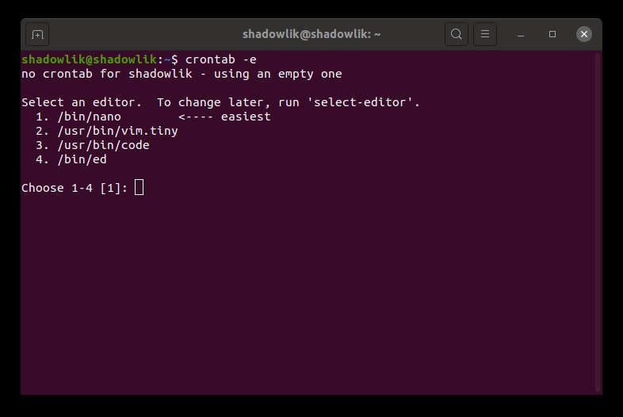
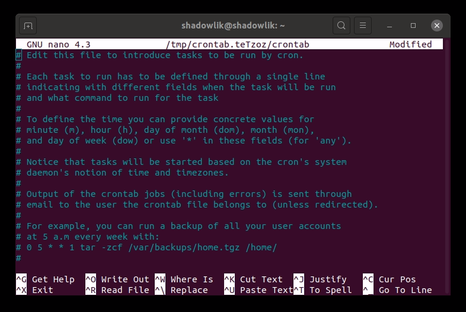

El demonio cron, o Crontab, en Linux realiza tareas en segundo plano en momentos programados específicos, es el equialente del Programador de tareas de Windows. Básicamente puede ejecutar cualquier comando de terminal con este programador.

Una tarea muy común realizada con Crontab es automatizar copias de seguridad, mantenimiento del sistema y otras tareas repetitivas. La sintaxis es potente y flexible, por lo que puede realizar una tarea cada quince minutos o un minuto específico en un día específico cada año.

## Significado de Crontab

No hay una explicación concluyente, pero la respuesta más aceptada es de Ken Thompson (autor de unix cron): El nombre cr*on p*roviene d*e chro*n, el prefijo griego para '*tiemp*o'. Y tabulación tabla de referencias, una tabla que contiene crons: Horario (Tabla de tiempo).

## Sintaxis de Crontab

La sintaxis cron consta de un grupo de 5 variables separadas por espacio: `* * * *` \*. Cada grupo puede contener uno o más números, separados por comas a valores unitarios o por un guión simple que identifica un rango de rango y, por último, el comando que se va a ejecutar. A continuación se muestran algunos ejemplos de sintaxis de programación:

| Min | Hora | día del mes | Mes | día de la semana | Descripción |
| --- | --- | --- | --- | --- | --- |
| \* | \* | \* | \* | \* | Funciona cada minuto |
| 0 | 2 | 1,2,3 | \* | \* | Funciona a las 2:00 a.m. cada 1, 2 y 3 días al mes |
| 0 | 23 | \* | \* | 1-5 | Funciona a las 11pm de lunes a viernes |
| 0 | 0 | 25 | 12 | \* | Actúa a las 00hs de Navidad |

## [Crontab.guru](https://crontab.guru/)

Un sitio que uso mucho para validar mis crons: [Crontab.guru](https://crontab.guru/). En este sitio se puede ver visualmente cómo se comportan sus caídas cron, es muy importante tener cuidado al crear crons complejos, ya que esto puede conducir a resultados catastróficos si se configura mal!

## Creación de un horario en Crontab

Vayamos al negocio, vamos a aprender a crear una programación. Como ejemplo, crearemos un cron que se ejecuta cada minuto y escribe un mensaje de registro en un archivo. Lo primero que debemos hacer es ejecutar el siguiente comando:

$crontab -e

Si es la primera vez que ejecuta el comando, debe indicar qué editor de texto desea utilizar:

Elija el editor predeterminado para su Crontab

Me gusta el editor nano, así que seleccioné la opción 1. A continuación, un archivo de texto con algunos comentarios explicando cómo utilizar, podemos proceder al final del archivo, donde vamos a crear nuestra programación.

Comentarios de archivos Crontab

Agreguemos la siguiente línea al final del archivo:

\* \* \* \* echo "Worked" >>

Básicamente, esta programación se ejecutará cada minuto agregando una línea en el archivo cron.log ubicado en nuestra carpeta de inicio. Para guardar su cron utilice el ctrl + O acceso directo para guardar y cerrar el archivo, ahora su programación ya está en vigor! Para comprobar que funciona correctamente, utilicemos el siguiente comando:

$ tail -f á/cron.log

Si todo sucede igual de lo esperado, después de unos minutos verás unas líneas con nuestro texto: "Funcionó". Este ejemplo es muy simple, puede ejecutar cualquier comando aceptado en el terminal a través de Crontab.
