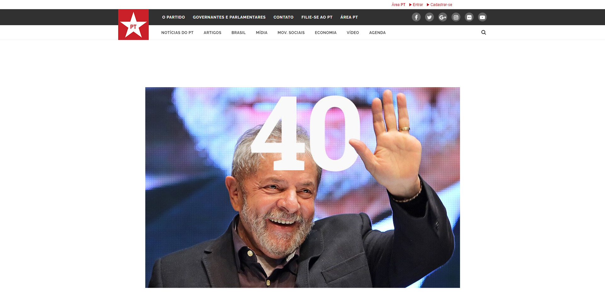
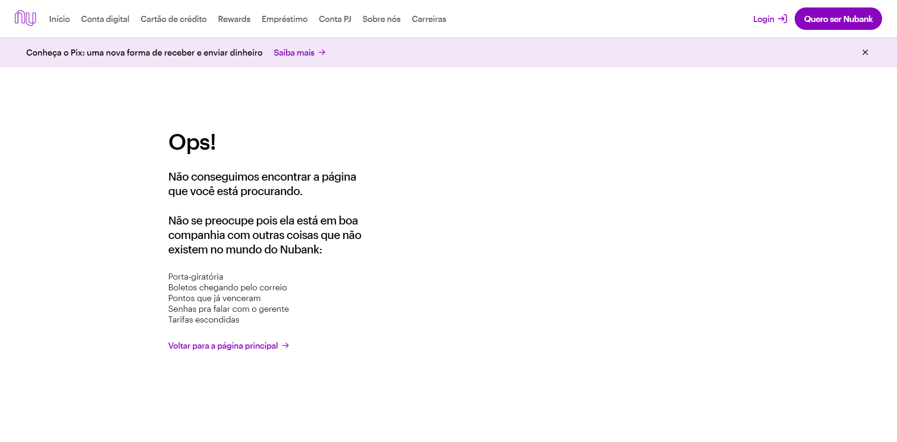
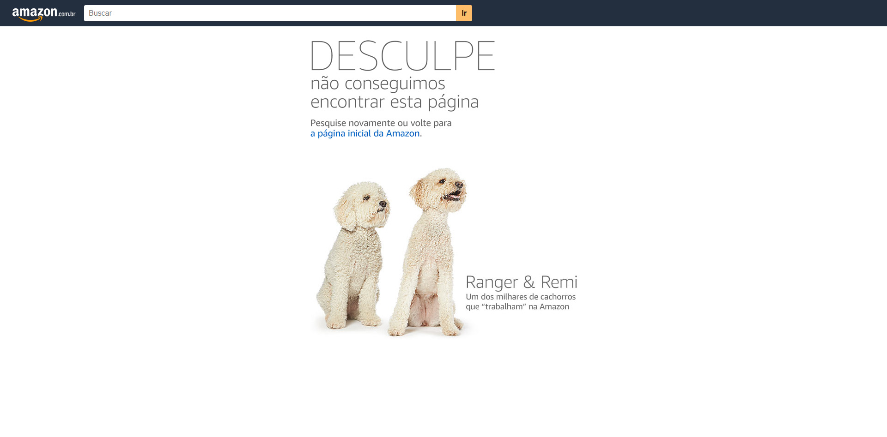
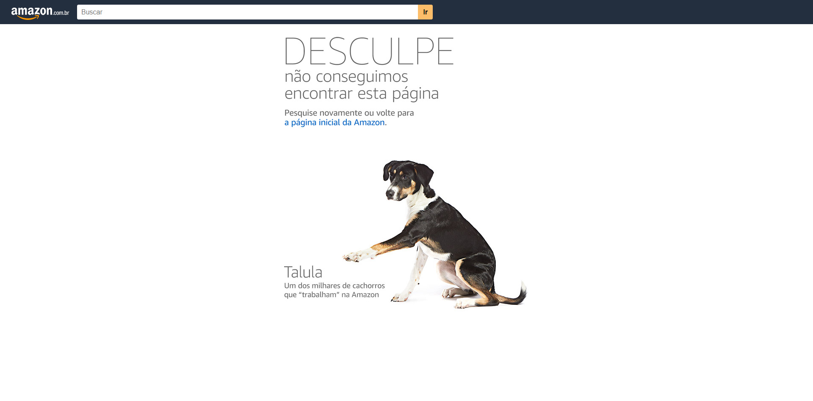
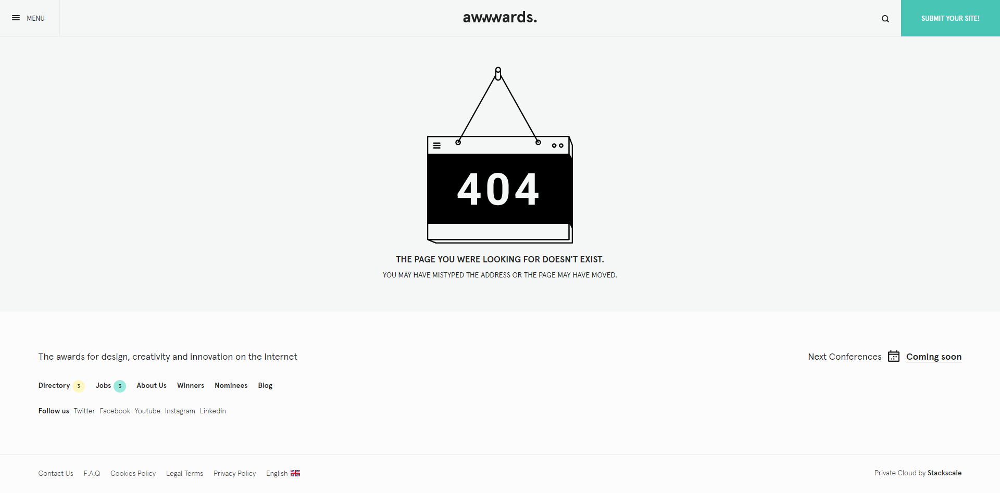
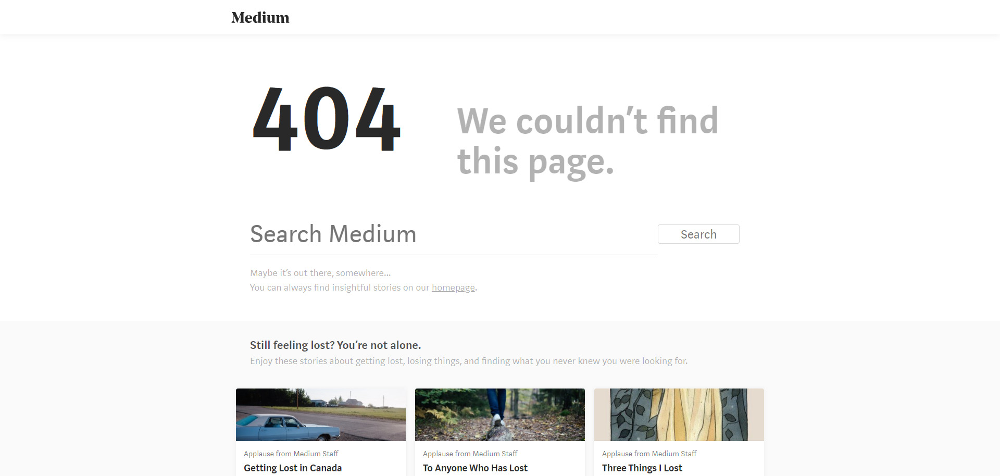
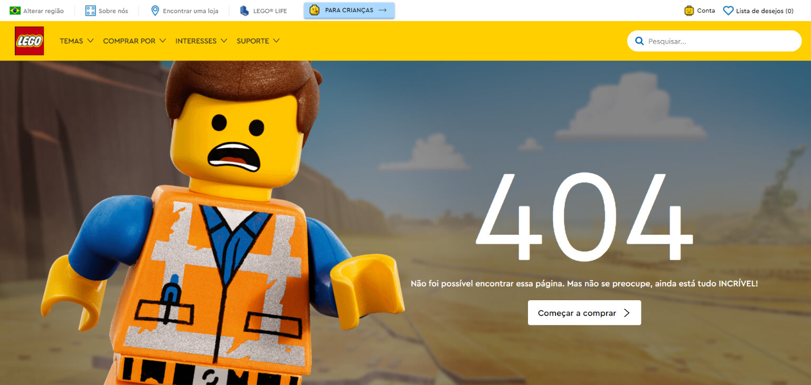
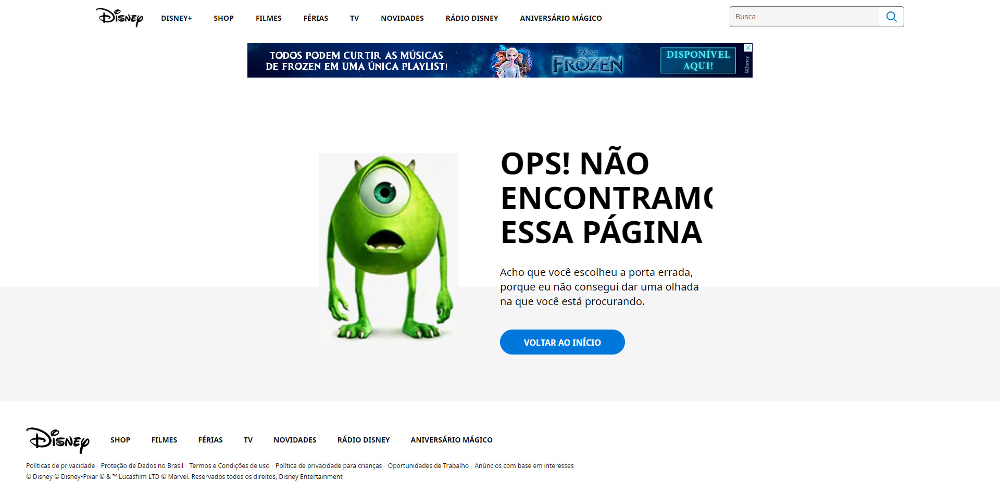

Una página de error 404 divertida y hermosa muestra que te preocupas por tus usuarios y puede ser una forma inteligente de mostrar la personalidad de tu marca.

Pocas empresas prestan la debida atención a la página no encontrada, sin embargo es importante pensar en tu usuario en todos los flujos posibles, incluso los inesperados.

Una página no encontrada puede traer información útil a su cliente, dirigiéndoles y evitando que abandonen su sitio.

A continuación, encontrará algunas empresas que han desarrollado páginas creativas para el error 404 y han manejado este error inesperado con excelencia en sus sitios web.

## 1\. [Partido de los Trabajadores](https://pt.org.br/error404)

Independientemente de su posición política, no podemos dejar de reconocer el excelente trabajo de los diseñadores del sitio web del Partido de los Trabajadores. Utilizando uno de los rasgos más conocidos del político más famo[so](https://pt.org.br/error404) de PT, los diseñadores encontraron una forma creativa y divertida de presentar este error a sus usuarios.

## 2\. [Nubank](https://nubank.com.br/error404)

N[ubank](https://nubank.com.br/error404) desarrolló una página extremadamente simple pero eficiente. Aprovecharon el posible error del usuario para vincularlo con otras cosas negativas que tienen los competidores y ellos no.

## 3\. [Amazonas](http://amazon.com.br/error404)

-   
    
-   
    
-   
    

La página de [Amazo](http://amazon.com.br/error404)n es simple, pero agradable. Mostrar el error de forma legible e invitar al usuario a volver a su página de inicio. Cada vez que accede a una página de error 404, se muestra un perro que trabaja en diferentes Amazon.

## 4\. [awwwards](https://www.awwwards.com/erro404/)

Aw[wwards cr](https://www.awwwards.com/erro404/)eó una página que también es simple, mostrando información posiblemente útil para su usuario en el pie de página.

## 5\. [Canva](https://www.canva.com/error404)

La herramien[ta C](http://amazon.com.br/error404)anva pensó en una forma diferente para tu página no encontrada. Al ingresar una URL inexistente, se muestra un juego de rompecabezas, junto con un enlace para regresar a la página de inicio.

## 6\. [Ebay](https://www.ebay.com/n/error)

La página d[e Eb](https://www.ebay.com/n/error)ay muestra una imagen relajada y un mensaje con un enlace al área de soporte. También utilizan el pie de página para mostrar algunas ofertas en su sitio.

## 7\. [Mailchimp](https://mailchimp.com/error404/)

La página de error d[e Mailchi](https://mailchimp.com/error404/)mp, aunque aún no está traducida al portugués, presenta una caricatura de lo que parece ser un caballo buscando algo en un agujero y un botón que redirige a la página de inicio del sitio.

## 8\. [Medio](https://medium.com/error404)

El mensaje de error 404 es alto y claro, pero tampoco tiene traducción al portugués. Y de forma divertida la página recomienda artículos de su plataforma sobre "sentirse perdido".

## 9\. [Lego](https://www.lego.com/pt-br/error404)

Un poco de emoción puede rescatar una mala situación, incluso si es solo la expresión de un juguete de plástico virtual.

## 10\. [Disney](https://disney.com.br/error404)

La página de Disney muestra un mensaje simple de un botón en la página de inicio con una expresión divertida de uno de tus personajes.
