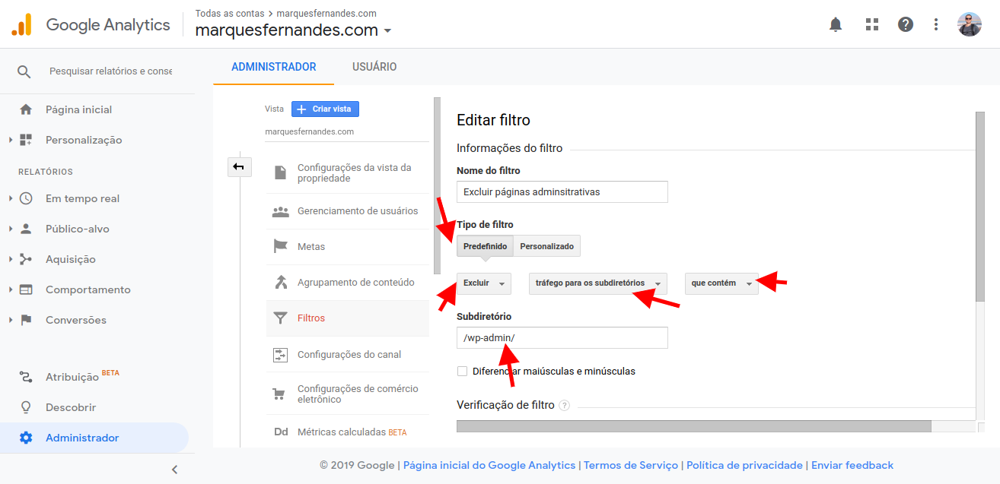

Si ejecuta un blog o sitio web en Wordpress, probablemente utilice Google Analytics para supervisar su tráfico. En los nuevos sitios, que todavía están empezando a ganar tráfico, es muy fácil sucio la recopilación de datos con éxitos "falsos" accediendo a su panel administrativo (el famoso /wp-admin) y al escribir y previsualizar sus páginas (vista previa-verdadero). Si a ti, como yo, te gusta previsualizar y ver cómo encajarán tus artículos y comportarte con tu tema, necesitamos filtrar estos hits para generar datos reales y limpios para su análisis futuro.

## Filtrado de páginas de vista previa

Antes de crear cualquier filtro, debemos crear una nueva **vista previa** en la propiedad. Esto genera una copia de seguridad de los datos para crear y probar los filtros; Si algo sale mal y ensuciamos sus datos, todavía tenemos los datos originales y sin procesar de la propiedad. Para crear una nueva visualización:

1.  Inicie sesión en [Analytics](http://analytics.google.com/) y haga clic en **Admin**.
2.  Asegúrese de que la cuenta y la propiedad correctas están seleccionadas en la lista desplegable superior izquierda.
3.  En la pestañ**a de vis**ita, haga clic **en Crear visit**a. De un nombre descriptivo, como *"Pruebas de filtr*o."

Crear nueva vista en la propiedad

Una vez creado, vuelva a la página Administrador y compruebe que la vi**sita r**ecién creada está seleccionada. Ahora vamos a crear dos filtros para eliminar las páginas de vista previa y wp-admin:

1.  Haga clic e**n Filtros** en la pest**aña Vis**ita y haga clic en el b**otón +Agregar filtr**o.
2.  Ponga un nombre significativo, como *"Eliminar páginas de vista previa*."

Crear nuevo filtro

3.  En **Tipo de filtro,** seleccione **Personalizad**o.
4.  Seleccione la opción **Elimina**r.
5.  En **El campo Filtro**, seleccion**e URI de solicitud**.
6.  En **Tipo de patrón de** filtro, v*ista previa y  
    verdadero. (Este texto está presente en todas las páginas de vista previa, incluidas las [vistas previas públicas](http://marquesfernandes.com/2019/12/04/como-permitir-a-pre-visualizacao-publica-em-artigos-nao-publicados-no-wordpress), si está habilitado.)*

Eliminar páginas de vista previa

8.  Haga clic en **Guarda**r.

## Filtrado de páginas del panel administrativo (/wp-admin)

Para filtrar las páginas del panel administrativo, seguiremos casi todos los mismos pasos antes, excepto la definición del filtro.

1.  Cree un nuevo filtro haciendo clic en el b**otón +Agregar filt**ro (en la misma propiedad de vista).
2.  Ponga un nombre significativo como "Eliminar páginas administrativas."
3.  En **Tipo de filtro, se**leccione Predet**erminad**o.
4.  Seleccione la opci**ón Elimi**nar**, tráfico al subdirectorio** y q**ué contien**e.
5.  En **subdirector**io type, */wp-admin/  
    *(Esta ruta está presente en todas las páginas del panel administrativo).

Eliminar páginas administrativas (/wp-admin/)

Listo, ahora los datos de su nu**eva** vista creada deben borrarse de los hits y vistas de páginas falsas.
