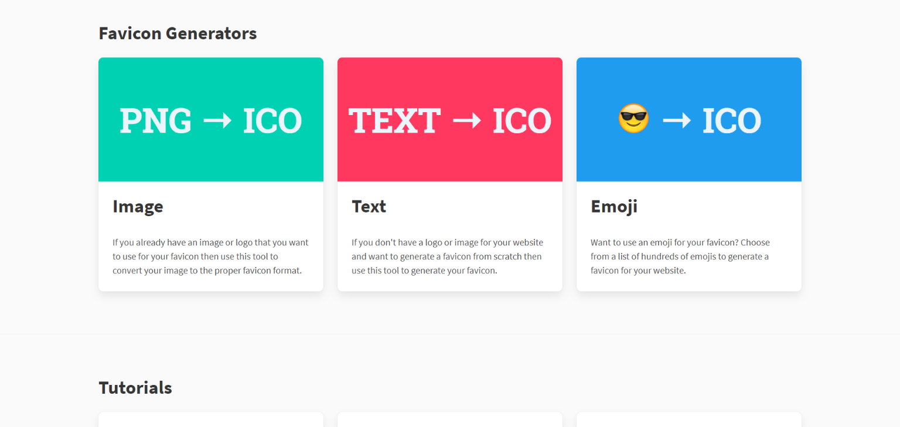
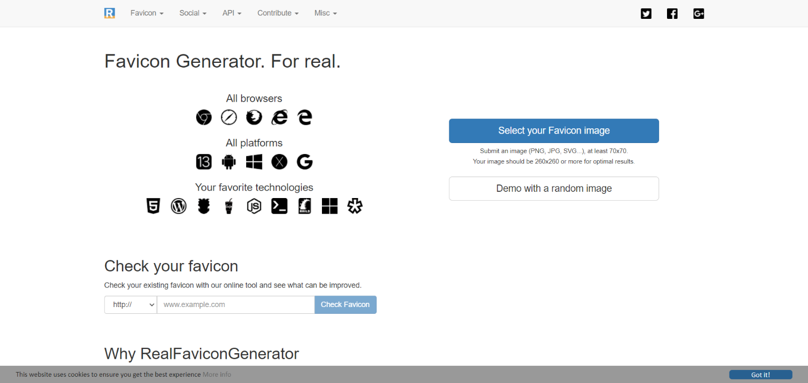

[**Favicon**,](http://marquesfernandes.com/tudo-sobre-favicons-e-touch-icons/) **[“Favourite Icon”](http://marquesfernandes.com/tudo-sobre-favicons-e-touch-icons/)** (Ícone Favorito), é uma imagem utilizada pelos navegadores para representar graficamente uma página na internet. Atualmente os navegadores aceitam diversos tipos e tamanhos de favicons diferentes, cada um otimizado para um dispositivo. Gerar e redimensionar esses ícones pode ser um trabalho chato mas, não se preocupe, existem ferramentas que facilitam todo esse processo. Separei uma lista com as melhores ferramentas para se ajudar a gerar todos os ícones possíveis, e também configurar opções como a cor de fundo em dispositivos mobile.

## 1\. [Favicon.io](https://favicon.io/)

[https://favicon.io/](https://favicon.io/)

[Favicon.io](https://favicon.io/) permite a criação de favicons a partir de imagens, texto e emojis. Gerando todos os formatos possíveis para as mais diversas plataformas.

## 2\. [Favicon Generator](https://www.favicon-generator.org/)

[https://www.favicon-generator.org/](https://www.favicon-generator.org/)

O [Favicon Generator](https://www.favicon-generator.org/) possui uma interface bem simples, ele gera os favicons para todas as plataformas e permite a customização de cor de tema mobile. Simples e eficiente.

## 3\. [Real Favicon Generator](https://realfavicongenerator.net/)

[https://realfavicongenerator.net/](https://realfavicongenerator.net/)

[Real Favicon](https://realfavicongenerator.net/) é um gerador simples, não permite muitas customizações mas cumpre o seu trabalho. Possui também versões offline, feitas nas linguagem de programação populares.

## 4\. [Favic-o-matic](https://favicomatic.com/)

[https://favicomatic.com/](https://favicomatic.com/)

[Favic-o-matic](https://favicomatic.com/) permite uma ampla customização da geração do favicon.
