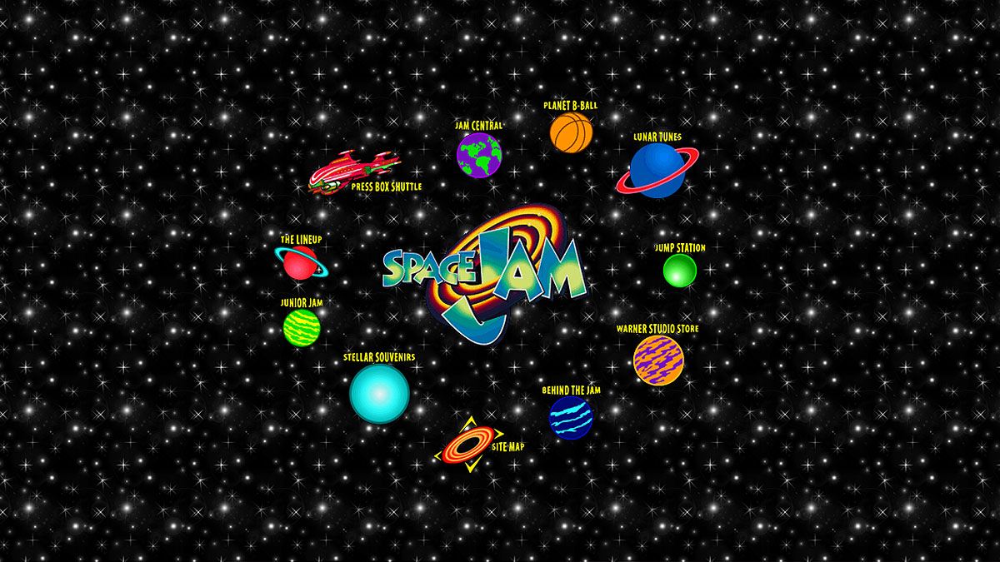

**JavaScript, o** JS **p**ara los íntimos, es uno de los lenguajes de programación más populares y utilizados en el mundo. Es un lenguaje interpretado, de alto nivel y multiparadigma (orientado a objetos, funcional, imperativo y prototipo). Con él, es posible desarrollar a partir de páginas dinámicas, aplicaciones para smartphones, sistemas complejos e incluso videojuegos.

Hoy vamos a aprender más acerca de lo que es JavaScript, cómo funciona y dónde podemos utilizar ese lenguaje.

## Descargo de responsabilidad: JavaScript no es Java

El nombre es similar y causa mucha confusión, per**o JavaScrip**t NO es Java. Hay una breve relación en la creación del lenguaje, pero se detiene allí. Lo explicaré mejor en el siguiente párrafo.

## Breve historia de JavaScript

Internet era muy diferente de cómo lo conocemos hoy en día, hubo un tiempo en que las páginas eran simplemente sitios web estáticos, aburridos y sin vida. En sus primeros días, *la World Wide* Web era sólo un gran grupo de páginas tabuladas escritas en HTML, con enlaces e imágenes llamativas. Con los años, y la popularización de Internet, las necesidades y funcionalidades se volvieron cada vez más complicadas y requerían una forma más avanzada de crear páginas que interactuaran mejor con los usuarios.

Uno de los sitios más famosos de los años 90 [y un ejemplo aún viv](https://www.spacejam.com/)o de cómo era el internet raíz.

JavaScript fue creado por Brendan Eich en 1995 durante su tiempo en Netscape Communications (para la generación Z, Netscape fue uno de los primeros navegadores), quien, además de crear JavaScript, también fue uno de los fundadores de Mozilla Corporation. Inicialmente llamado Mocha, sus primeras versiones fueron utilizadas exclusivamente por Netscape y su desarrollo se inspiró en Java, Scheme y Self languages. A lo largo de la historia, Netscape terminó asociándose con Sun, un desarrollador de Java que quería utilizar la tecnología Netscape para fortalecer su lenguaje recién creado (Java), y luego comenzó a servir el lenguaje de scripting JavaScript como un compañero de Java, sin darse cuenta de la posible competencia que los dos eventualmente tendrían.

Durante un tiempo, la lucha por el espacio de otras tecnologías web mantuvo JavaScript algo "congelado" y con cierto rechazo de algunos desarrolladores. Pero alrededor del año 2[000, Douglas Crock](https://pt.wikipedia.org/wiki/Douglas_Crockford)ford, uno de los grandes responsables de la popularización del formato JSON y, en consecuencia, del redescubrimiento de JavaScript, entonces en poco tiempo el lenguaje ganó fuerza y dominó el mundo de Internet gracias al trabajo de desarrolladores independientes y una comunidad en crecimiento. JavaScript se convierte cada vez más en un lenguaje robusto y multiapropéción, prácticamente un Bombril con sus mil y una utilidades.

## ¿Cómo funciona?

> Las computadoras no entienden JavaScript, los entornos sí.

JavaScript es un lenguaje interpretado y nocompilado para el código de máquina, es decir, JavaScript no convierte mucho de 1 y 0, por lo que "los ordenadores no entienden javascript". Para que esto suceda, el lenguaje neces*ita un* motor y un entorno de *tiempo de ejec*ución para que funcione.

Un motor J*avaScr*ipt es un programa "C++ escrito" (no todos los motores son, por ejemplo), que es un lenguaje compilado que el equipo puede entender y ejecutar, por lo que el motor pasa a través de todo el código JavaScript y lo convierte en algo que el procesador del equipo puede entender y ejecutar - código de máquina. Este motor funciona dentro de un contexto, que constituye nuestr*o entorno de tiempo de* ejecución, como en el caso del navegador Chrome y NodeJS, ambos utilizan el mismo motor pero tienen algunos contextos y funcionalidades diferentes. Tenemos algunos motores famosos, el mencionado [V8](https://v8.dev/) funciona en Chrome, Opera y Node y fue desarrollado por Google, ya Firefox se embarca en el mot[or SpiderMon](https://developer.mozilla.org/pt-BR/docs/Mozilla/Projects/SpiderMonkey)key desarrollado por Mozilla.

Y todo este contexto hace de JavaScript un lenguaje de alto nivel, el motor es responsable de toda la abstracción y el problema de comunicarse con la máquina, haciendo el desarrollo más fácil y optimizado.

## Ecmascript

JavScript sigue las especificaciones definidas en [ECMAScrip](https://www.ecma-international.org/publications/standards/Ecma-262.htm)t, una especificación de lenguaje de programación basada en scripts que Ecma International esta[ndariza y mantiene](https://pt.wikipedia.org/wiki/Ecma_International). Está diseñado para estandarizar lenguajes de scripting y ayudar a organizar las diversas implementaciones independientes del lenguaje.

## ¿Para qué es?

JavaScript es un lenguaje muy versátil, con una comunidad que crece cada día, y sus aplicaciones también, lo que lo convierte en una opción popular para las empresas con personal reducido: JavaScript, un lenguaje para gobernarlos todos. Probablemente escucharás mu[chas v~erdades~ jocosas qu](https://dayssincelastjavascriptframework.com/)e cada 5 minutos nace una biblioteca hecha en nuevo JavaScript...

### JavaScript en el navegador

Como aprendimos antes, este lenguaje nació para dar vida al navegante y se mantiene firme y fuerte en su objetivo. Anteriormente el marco principal y prácticamente único de Internet era jQuery (en [realid](https://jquery.com/)ad actualmente más de 70 millones d[e sitios todavía se](https://trends.builtwith.com/websitelist/jQuery) ejecutan con jQuery), pero con el avance de los motores y la capacidad de procesamiento de ordenadores y teléfonos móviles, han surgido nuevos, más robustos y complejos marcos para mejorar la experiencia del usuario.

Algunos de los marcos más populares hoy en día:

-   [ReactJ](https://pt-br.reactjs.org/)S - Desarrollado y mantenido por Facebook, y abierto a la comunidad.
-   [VueJS](https://vuejs.org/) - Desarrollado y mantenido po[r Evan Y](https://twitter.com/youyuxi)ou (ex Google), y abierto a la comunidad.
-   [Angula](https://angular.io/)r - Desarrollado y mantenido por Google, y abierto a la comunidad.

### JavaScript en backend con [NodeJS](http://marquesfernandes.com/afinal-o-que-e-nodejs/)

En 2009, No[de.js f](http://nodejs.org/)ue desarrollado por Ryan Dahl alrededor de V8; Esencialmente como una forma de ejecutar programas JavaScript fuera del contexto de un navegador. Echa un vistazo al a[rtículo Después de todo l](http://marquesfernandes.com/afinal-o-que-e-nodejs/)o que es NodeJS, donde explico mejor la historia de NodeJS y cómo funciona.

En el ejemplo siguiente, tenemos un script simple que consume un recurso de Internet que contie[ne todos los datos de Pokemo](https://pokeapi.co/)ns y devuelve la información de Pikachu:

### JavaScript en desarrollo móvil

JavaScript tiene buenas bibliotecas para el desarrollo móvil, convirtiéndose en una buena alternativa al desarrollo nativo. Con una sola base de código, pudimos desarrollar páginas web, aplicaciones iOS y Android. Algunas aplicaciones famosas como Facebook, Instagram y Airbnb se desarrollan con JS. Estos son algunos de los marcos más famosos:

-   [React Native](https://facebook.github.io/react-native/)
-   [PhoneGap](https://phonegap.com/)/[Cordova](https://cordova.apache.org/)
-   [NativeScript](https://www.nativescript.org/)
-   [Iónico](https://ionicframework.com/)

En el ejemplo siguiente tenemos una aplicación de calculadora construida con React Native:

Vea la calcu<a href='https://codepen.io/necolas/pen/KrBQmd'>ladora nativa de Pen Rea</a>ct de Nicolas Gallagher (<a href='https://codepen.io/necolas'>@necolas</a>) en <a href='https://codepen.io'>CodePen</a>.

### JavaScript en [IoT](http://marquesfernandes.com/internet-das-coisas/)

Su amplia portabilidad también permite la programación de [dispositivos integrado](http://marquesfernandes.com/internet-das-coisas/)s. Bibliotecas como [Johnny-F](http://johnny-five.io/)ive le permiten desarrollar para Ard[uino,](http://johnny-five.io/#arduino) Te[ssel 2,](http://johnny-five.io/#tessel) [Raspberry P](http://johnny-five.io/#raspberrypi)i[, Intel Edi](http://johnny-five.io/#edison)s[on, Particle](http://johnny-five.io/#spark) Pho[ton, y más...](http://johnny-five.io/platform-support/) usando JavaScript, el lenguaje se compila en el idioma nativo de cada dispositivo.

var cinco - require("johnny-five");
var board - nuevos cinco. Junta Directiva();

board.on("ready", function()
  var llevó a los cinco nuevos. Led(13);
  led.blink(500);
});

### JavaScript para el desarrollo de juegos

Y por último, gracias a los grandes avances en las mejoras de rendimiento del motor y las nuevas características integradas en los navegadores, podemos crear juegos que se ejecutan directamente en el navegador:

Ver el juego<a href='https://codepen.io/davisonpro/pen/pGbxmP'> de JavaScript P</a>en de Davison Pro (<a href='https://codepen.io/davisonpro'>@davisonpro</a>) en <a href='https://codepen.io'>CodePen</a>.

Más ejemplos de juegos hechos con JavaScript se pueden encontrar en este e[nlac](https://developer.mozilla.org/en-US/docs/Games/Examples)e.

## ¿Dónde aprender a programar con JavaScript?

Si usted ha estado emocionado por el lenguaje y todas sus aplicaciones, tengo buenas noticias para usted! Hay varios buenos materiales en Internet, también se pueden encontrar buenos cursos en Udemy.

