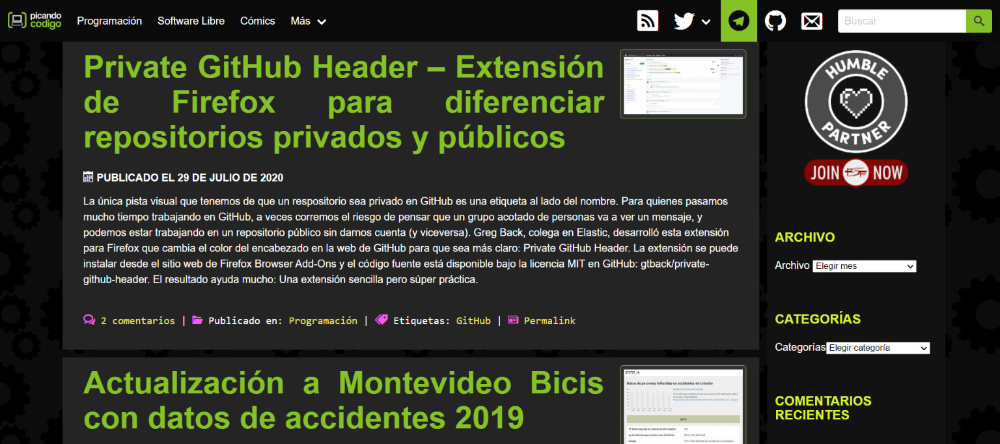

Recientemente decidí distribuir mis artículos en español además de portugués, fue una decisión estratégica igual cuando decidí que este blog sería en portugués, noté que el español, aunque tiene más contenido que el portugués, también sufre un déficit de contenido. Viví en México durante un año, por eso tengo un cariño especial por el idioma y vi que muchos amigos allí estaban interesados ​​en leer y aprender sobre tecnología.

Ahora puedes encontrar una banderita en el menú para acceder al blog en la versión en español, la traducción se ha hecho de forma automática por el momento y algunos artículos ya han sido revisados, la mayoría de ellos aún no, así que si encuentras errores, por favor contáctame.

Para empezar este trabajo de traducción, comencé a investigar a otros escritores para ver cómo trabajan la información en su idioma. He separado para ti una lista de los blogs de tecnología en español que encontré y se me hicieron interesantes durante esta investigación.

## [Xataka](https://www.xataka.com/)

Xataka es un portal completo sobre tecnología y gadgets, que recuerda a los portales brasileños [Canaltech](https://canaltech.com.br/) y [TechTudo](https://www.techtudo.com.br/).. Cubren gran cantidad de noticias sobre el mundo de la tecnología y también están presentes en muchos otros portales de contenido y tienen otros proyectos interesantes como [3djuegos.com](https://www.3djuegos.com/) y [sensacine.com.mx](https://sensacine.com.mx/).

## [Picando codigo](https://picandocodigo.net/)

**[Picando código](https://picandocodigo.net/)** es el blog personal de Fernando Briano, donde escribe sobre lenguajes de programación, herramientas y metodologías para el desarrollo de software e información sobre software libre. Ha sido un usuario de GNU / Linux durante algunos años y documenta todas sus experiencias con Debian y ArchLinux en su blog. También puede encontrar artículos sobre videojuegos, ciencia ficción, cómics y más.

> Una vez leí que el aprendizaje constante es parte del trabajo del programador y, a través de esto, comparto lo que estoy aprendiendo. El intercambio generado en los posts técnicos me lleva a afirmar mis conocimientos tratando de explicarlos, además de aprender cosas nuevas gracias a los aportes de los lectores.
> 
> [**Fernando Briano**](http://fernandobriano.com/)

## [Enrique Dans](https://www.enriquedans.com/)

**[Enrique Dans](https://www.enriquedans.com/)** comparte en su página personal todas mis actividades profesionales y personales relacionadas con las múltiples facetas de la tecnología, su difusión y sus efectos en las personas, las empresas o la sociedad en general.

> Es una página puramente personal, que solo escribo, y que utilizo con dos propósitos principales: mantener un repositorio ordenado de todas mis actividades y recibir retroalimentación permanente muy valiosa sobre temas que, en muchos casos, termino incorporando posteriormente.
> 
> **Enrique Dans**

## [Wwwhatsnew](https://wwwhatsnew.com/)

[WWwhatsnew.com](https://wwwhatsnew.com/) fue creado en 2005 por Juan Diego Polo. En el sitio, todos los días se discuten varias aplicaciones web, noticias de tecnología y consejos para quienes trabajan con marketing en línea.

La idea principal es mostrar que no hay nada que no se pueda hacer en línea. La llamada web 2.0 ofrece recursos que nos permiten aprovechar el conocimiento social de miles de personas para crear servicios cada vez más ricos, generando una cantidad ilimitada de ganancias que pueden ser utilizadas para el crecimiento personal y profesional.

También verás noticias publicadas en Internet, con la evolución de conocidos servicios y eventos que están transformando la web, además de estar muy relacionados con el Social Media Marketing, los cursos online y la innovación tecnológica.

## [Loogic](https://loogic.com/)

Desde su fundación en 2003, **[Loogic](https://loogic.com/)** se ha convertido en el medio de información de referencia para emprendedores y startups del mundo de la tecnología y la innovación en España y Latinoamérica. Sus promotores son Javier Martín, Ignacio de Miguel y Agustín Cuenca.

También desarrollan iniciativas como [Loogic Ventures](https://loogic.com/ventures/) en colaboración con Mariano Torrecilla y [Smart Money](http://smartmoney.events/) en colaboración con Javier Esteban.

## [Linea de Código](http://lineadecodigo.com/)

**[Línea de Código](http://lineadecodigo.com/)** quiere ayudarte a aprender a codificar. Para ello, ofrece ejemplos sencillos y explicados paso a paso de diferentes lenguajes de programación. Seguimos todos los ejemplos con su correspondiente código fuente para que puedas probarlo directamente.

**Conclusão**

Yo siempre encorajo las personas que quieren empezar en el mundo de la programación y tecnología a aprender ingles, es el idioma más utilizado y seguramente tendrás mejores oportunidades de contenido. Pero, sé también que esta no es la realidad de muchas personas por el mundo, entonces iniciativas como estés sitios listados son muy importantes para dar acceso para todos a la información.
