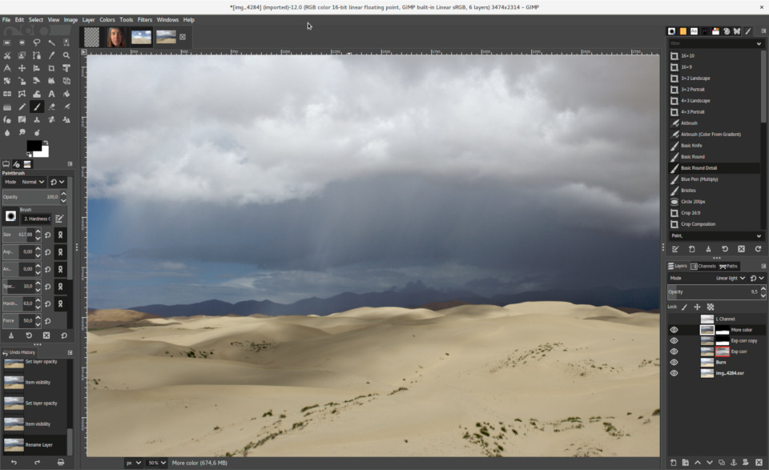
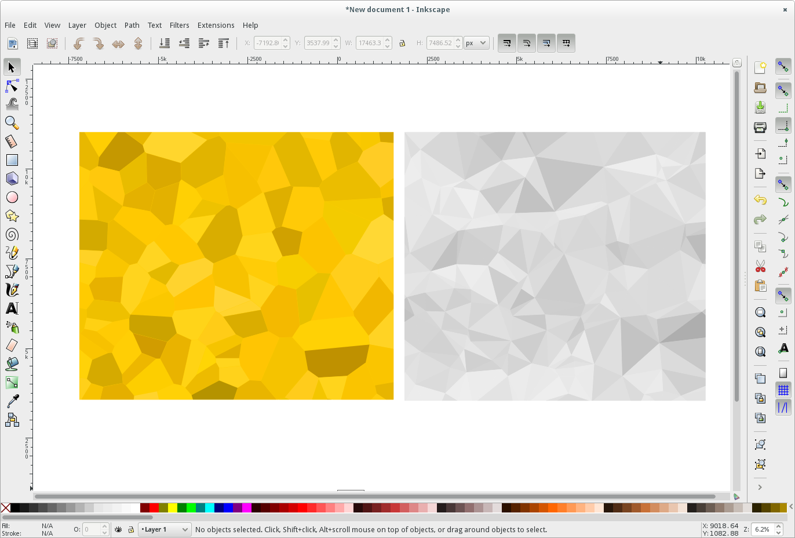
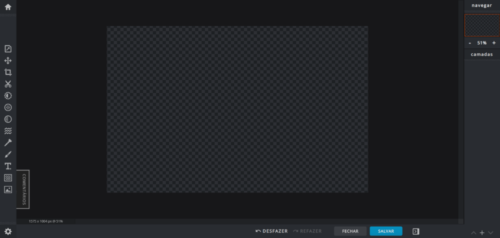
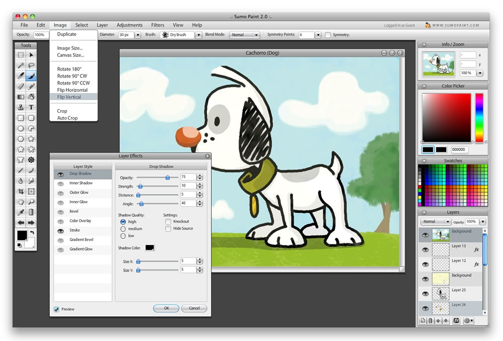

Adobe Photoshop es uno de los mejores programas disponibles para el diseño, su precio pero puede ser desalentador para usuarios o freelancers. Hay varias herramientas gratuitas que pueden reemplazar Photoshop, aunque no tienen exactamente las mismas características, pueden manejarlo.

1.  [Gimp](#gimp) - Disponible para Windows, Linux y Mac
2.  [Inkscape](#inkscape) - Disponible para Windows, Linux y Mac
3.  [Krita](#krita) - Windows, Linux y Mac
4.  [Pixlr x](#pixlr) - Versión Web
5.  [Sumopaint](#sumopaint)\- Versión Web, Windows, Linux y Mac

## 1\. [Gimp](https://www.gimp.org/downloads/)

[GIMP](https://www.gimp.org/downloads/), (abreviatura de GNU Image Manipulation Program), es una excelente alternativa a Photoshop para aquellos que necesitan funciones avanzadas de edición de imágenes, pero tienen un presupuesto ajustado.

Se puede utilizar desde un programa básico de pintura a un editor de fotos profesional. Ha ganado popularidad al ser una de las primeras alternativas a photoshop en Linux, hoy también está disponible para Mac y Windows.

Porque GIMP también puede obtener soporte para importar PSD, aunque no todas las capas y entidades pueden funcionar según lo esperado.

## 2\. [Inkscape](https://inkscape.org/release/inkscape-1.0/)

I[nkScape](https://inkscape.org/release/inkscape-1.0/) sería más un reemplazo para Illustrator que para Photoshop, está más orientado a diseñadores gráficos que quieren trabajar con vectores. Aún así, puede usarlo para realizar ajustes básicos de imagen en las mismas imágenes que en Photoshop, como recortar, pegar, cambiar el tamaño y editar. También es una gran herramienta para convertir fotos en imágenes vectoriales!

## 3\. [Krita](https://krita.org/en/download/krita-desktop/)

Krita es una alternativa perfecta de photoshop gratis, especialmente para los fotógrafos que necesitan un poco más de flexibilidad en su edición.

El proyecto vino de artistas que buscan ofrecer herramientas de edición accesibles para todos, por lo que desarro[llar](https://krita.org/en/download/krita-desktop/)on Krita, centrada en artistas conceptuales, pintores de texturas y mates, ilustradores e incluso creadores de cómics.

Cuando se trata de colorear sus fotos, puede utilizar la paleta de colores emergente única. Además, aprovecha el sistema de marcado único de Krita para cambiar los pinceles que se muestran. Además, accede a los colores más utilizados y establece todos los ajustes de color con solo unos clics.

Es muy extensible, se puede importar fácilmente paquetes de pinceles y texturas de otros artistas, hay una comunidad muy activa detrás del proyecto. Si necesitas ayuda, puedes acudir al foro de Krita, donde otros artistas siempre están dispuestos a compartir su mejor trabajo, ideas y ayuda.

## 4\. [Pixlr x](https://pixlr.com/br/x/)

[Pixlr](https://pixlr.com/x/) x es la última versión del editor Pixlr. Viene con características y mejoras mucho más avanzadas y busca convertirse en una de las mejores alternativas gratuitas de Photoshop en el mercado.

Desarrollado en HTML5, Pixlr x funciona bien en cualquier navegador moderno (incluidos los dispositivos móviles).

Pixlr x es un editor de fotos totalmente online, lo que significa que puedes usarlo con cualquier sistema operativo. Viene con todos los ajustes básicos que necesita para crear imágenes bien editadas y algunos extras, así, como las herramientas de descongelación y curvas.

## 5\. [Sumopaint, Año Nuevo](https://www.sumopaint.com/)

S[umopaint](https://www.sumopaint.com/home/) es una excelente alternativa gratuita a Photoshop, tanto en diseño (muy similar) como en funcionalidad.

Puede abrir archivos con extensiones como GIF, JPEG y PNG y guardar proyectos con los mismos formatos, así como el formato SUMO nativo.
