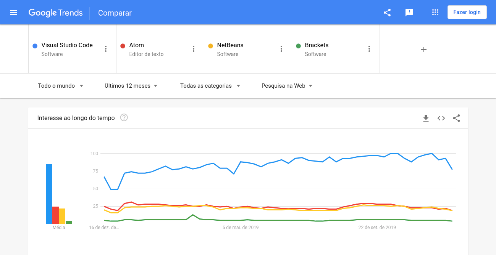

Creating your own lines of code can be done without any specific tools. Theoretically all you need is a simple text editor, but this probably won't be very productive, especially when it comes to web development. A good one **IDE** (Integrated development environment) aims to improve your productivity, help minimize errors (auto-complete, lint, etc.), facilitate the debug process, and much more.

*Check out: [**Optimized development in NodeJS with Typescript, Docker and ESlint**](http://marquesfernandes.com/2019/12/11/desenvolvimento-otimizado-em-nodejs-com-typescript-docker-e-eslint)*

I separated some of the best open source options available on the market, I didn't list any paid or platform-specific programs.

Like any good open source project, an active community behind it makes all the difference, we can see last year's interest under the topics of each of the listed IDEs:

[Google Trends - VS Code x Atom x NetBeans x Bracket](https://trends.google.com.br/trends/explore?q=%2Fm%2F0134xwrk,%2Fm%2F0_x5x3g,%2Fm%2F01fchg,%2Fm%2F0k2kj45) [s](https://trends.google.com.br/trends/explore?q=%2Fm%2F0134xwrk,%2Fm%2F0_x5x3g,%2Fm%2F01fchg,%2Fm%2F0k2kj45)

We can also analyze the numbers in their repository, we can find out if the project is healthy and being updated frequently by looking at the metrics of the [GitHub](http://github.com/shadowlik) as stars, issues and date of last commit:

<table class=""><tbody><tr><td><strong>Program</strong></td><td class="has-text-align-center" data-align="center"><strong>Google Trends (0 ~ 100)</strong></td><td class="has-text-align-center" data-align="center"><strong>GitHub Stars</strong></td><td class="has-text-align-center" data-align="center"><strong>GitHub Issues</strong></td></tr><tr><td><a href="https://github.com/microsoft/vscode" target="_blank" rel="noreferrer noopener" aria-label=" VS Code (abre numa nova aba)">VS Code</a></td><td class="has-text-align-center" data-align="center">85</td><td class="has-text-align-center" data-align="center">88.3k</td><td class="has-text-align-center" data-align="center">4,043</td></tr><tr><td><a href="https://github.com/atom/atom" target="_blank" rel="noreferrer noopener" aria-label="Atom (abre numa nova aba)">atom</a></td><td class="has-text-align-center" data-align="center">25</td><td class="has-text-align-center" data-align="center">50.6k</td><td class="has-text-align-center" data-align="center">454</td></tr><tr><td><a href="https://github.com/apache/netbeans">NetBeans</a></td><td class="has-text-align-center" data-align="center">22</td><td class="has-text-align-center" data-align="center">1.2k</td><td class="has-text-align-center" data-align="center">---</td></tr><tr><td><a href="https://github.com/adobe/brackets" target="_blank" rel="noreferrer noopener" aria-label="Brackets (abre numa nova aba)">brackets</a></td><td class="has-text-align-center" data-align="center">9</td><td class="has-text-align-center" data-align="center">30.6k</td><td class="has-text-align-center" data-align="center">2.441</td></tr></tbody></table>

Well, but numbers and popularity don't mean anything if you don't adapt to the tool, let's go into more detail and list the differentiating characteristics of each one:

## [Visual Studio Code](https://code.visualstudio.com/)

[Visual Studio Code](https://code.visualstudio.com/)

Visual Studio Code or VS Code for intimates is currently the most popular IDE for web development, it is maintained by Microsoft and developed by the community. If you've read any other tutorials of mine, you may have noticed that VS Code is my editor of choice.

VS Code runs on virtually all platforms like Windows, Mac and Linux, because it was developed on top of another open source project, the [electron](https://github.com/electron/electron) .

It has support for virtually all languages and because it is highly customizable, its wide range of extensions and plugins allows you to create a perfect development environment for any technology of choice, be it JavaScript, C++, C#, Python, PHP, etc.

*Check out:* [***Top 6 themes to use in VS Code in 2020***](http://marquesfernandes.com/2019/03/19/top-6-temas-para-usar-no-vs-code-em-2019)

The editor's performance is very good compared to its competitors, but don't expect an installation as fast as opening your notebook, all its excellent features and functionalities come at the cost of the machine...

## [atom](https://atom.io/)

[atom](https://atom.io/)

Atom is an opensource text editor developed by [GitHub](http://github.com/shadowlik) which was recently purchased by Microsoft.

It has a built-in package manager to install new packages or start creating your own extensions.

Atom comes pre-installed with four UI themes and eight syntax in a variety of tones. The rich and strong community also offers interesting topics for everyone, so you can find out what you're researching there.

Atom is available on most operating systems such as Windows, Linux and OS X. You can find, review and replace messages without much effort.

Because of intense community support and flexible design, this text editor has gained many supporters. It is for sure one of the best IDEs for web development.

## [NetBeans](https://netbeans.org/)

[NetBeans](https://netbeans.org/)

NetBeans is a consolidated editor, it has been around since I know myself as a programmer, very popular mainly among Java developers.

In addition to English, it is also available in many other languages, such as Japanese, Simplified Chinese, Russian, and **Brazilian Portuguese** .

NetBeans is available for Mac OS, Windows and Linux.

## [brackets](http://brackets.io/)

[brackets](http://brackets.io/)

Brackets is another amazing text editor widely used by web designers. Written in HTML, JavaScript and CSS, it is also an open source platform. With built-in support for the visual tool and pre-processors, it's easy and interesting to design websites.
