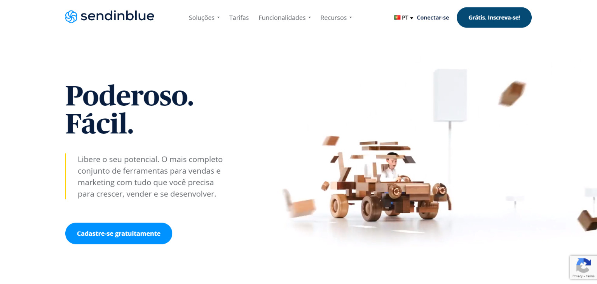
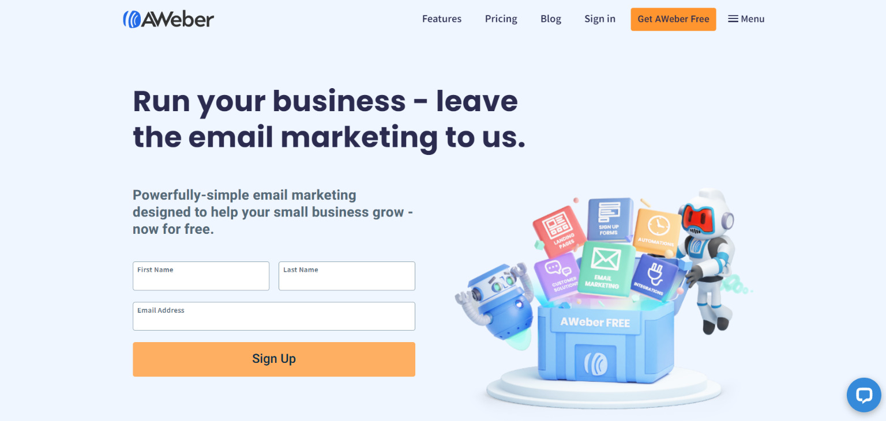
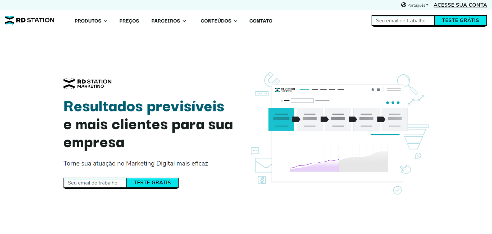

La elección de una herramienta de marketing por correo electrónico afecta directamente el rendimiento de sus campañas de correo electrónico. Estos servicios de marketing por correo electrónico existen desde hace décadas. Como parte del marketing online, el marketing por correo electrónico sigue siendo la estrategia de marketing más eficaz en la actualidad si se considera el retorno de la inversión (ROI).

Aproximadamente 3.900 millones de personas utilizaron el correo electrónico en todo el mundo en 2019. Según un estudi[o de Statista, se](https://www.statista.com/statistics/255080/number-of-e-mail-users-worldwide/) estima que este número crecerá a 4.480 millones para el año 2024. El ROI del marketing por correo electrónico es de 42 dólares por cada 1 dólar gastado, según la encuesta "State of Email 2020" de [Litmu](https://www.litmus.com/resources/state-of-email/)s.

## **Las mejores herramientas de marketing por correo electrónico**

La gran mayoría de las buenas herramientas de marketing por correo electrónico se pagan, excepto MailChimp, ConvertKit, SendInBlue y AWeber, que tienen planes gratuitos. Sin embargo, la mayoría de los servicios tienen períodos gratuitos para que pueda probar y aprender cómo funcionan las herramientas.

| Servicio | Plan gratuito | Precio | Devolución de dinero |
| --- | --- | --- | --- |
| [Mailchimp](#MailChimp) | si | $ 9,99 | No |
| [Contacto constante](#Constant-Contact) | No | $ 20 | Si, 30 dias |
| [SendinBlue](#SendinBlue) | si | $ 25 | No |
| [ConvertKit](#ConvertKit) | si | $ 9,99 | Si, 30 dias |
| [AWeber](#AWeber) | si | $ 16.15 | Si, 30 dias |
| [Obtener una respuesta](#GetResponse) | No | $ 10.50 | No |
| [Estación RD](#RD-Station) | No | 19,00 R $ | No |

### 1.[MailChimp](https://mailchimp.com/)

[MailChimp](https://mailchimp.com/) es probablemente la mejor herramienta disponible en el mercado, especialmente para usuarios legos. Toda la usabilidad de Mailchimp se ve muy fluida y natural, recibes orientación durante el proceso. 

### dos. [Contacto constante](https://www.constantcontact.com/global/home-page)

[Constant Contact](https://www.constantcontact.com/global/home-page) es también otro servicio muy poderoso y práctico. La experiencia del usuario es bastante simple, pero lleva un poco de tiempo acostumbrarse a navegar por la herramienta de administración de campañas.

### 3\. [SendinBlue](https://pt.sendinblue.com/)

[La usabi](https://pt.sendinblue.com/)lidad de SendinBlue es *m*uy intuitiva, pero el proceso de configuración de la cuenta y la primera campaña toman un tiempo.

### 4\. [ConvertKit](https://convertkit.com/)

[ConvertKit](https://convertkit.com/) es muy simplista, tal vez incluso muy básico.No tiene algunas funciones modernas, como una herramienta de edición de arrastrar y soltar o una selección más completa de plantillas, pero puede hacer el trabajo rápidamente. Por el contrario, su interfaz limpia puede ser un punto fuerte para los principiantes.

### 5\. [AWeber](https://www.aweber.com/)

[AWebe](https://www.aweber.com/)r es una buena alternativa, su interfaz podría ser mejor, pero una vez que te acostumbras al sistema, la navegación es más sencilla.

### 6\. [Obtener una respuesta](https://br.getresponse.com/)

[GetRespons](https://br.getresponse.com/)e tiene su proceso de principio a fin simplificado, es fácil de usar y tiene un montón de opciones en el camino.Sin embargo, la experiencia sería aún mejor con un editor de imágenes integrado.

### 7\. [Estación RD](https://www.rdstation.com/)

RD Station es una herramienta brasileña, va mucho más allá del simple lanzamiento del email marketing, es una completa herramienta de automatización de marketing. Con la herramienta de marketing de RD Station, puede organizar, comunicarse y comprender mejor a su público objetivo.
