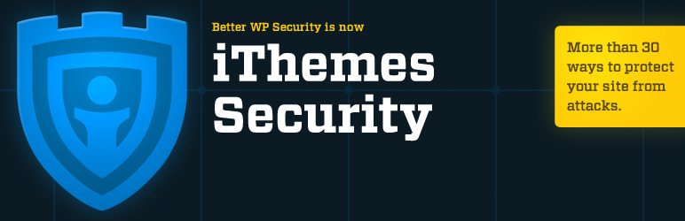
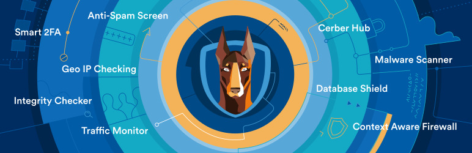

Mantener una instalación segura de WordPress es muy similar a una computadora normal, necesitas mantener el sistema, plugins y temas siempre actualizados para evitar riesgos de seguridad, además, puedes y debes agregar una capa adicional de seguridad, un antivirus.

En promedio, cada día se piratean 30.000 sitios nuevos y probablemente muchos de ustedes llegaron a este artículo después de notar un comportamiento extraño en su sitio, posiblemente causado por un atacante, hacker, virus o malware.

Si ese es tu caso, seguro que deberías instalar un antivirus en tu WordPress, y además aunque no hayas sufrido un ataque, más vale prevenir que curar. Estos programas pueden detener y eliminar elementos y archivos maliciosos que pueden dañar enormemente su sitio web de WordPress.

## 1\. [Todo en uno WP Security & Firewall (Gratis)](https://wordpress.org/plugins/all-in-one-wp-security-and-firewall/)

Un complemento de seguridad de wordpress completo, fácil de usar, estable y bien compatible.

-   Instalaciones activas: **800.000 +**
-   Valoración: ⭐⭐⭐⭐⭐ (997)
-   Traducción en portugués

El plugin All In One WordPress Security es uno de los plugins más populares y gratuitos disponibles, llevará la seguridad de su sitio web a un nivel completamente nuevo.

Este complemento fue diseñado y escrito por expertos y es fácil de usar y comprender.

Reduce el riesgo de seguridad al verificar las vulnerabilidades e implementar y hacer cumplir las últimas prácticas y técnicas de seguridad recomendadas de WordPress.

Algunas de las muchas funciones disponibles en este complemento son:

-   SEGURIDAD DE LA CUENTA DEL USUARIO
-   SEGURIDAD DE INICIO DE SESIÓN DEL USUARIO
-   SEGURIDAD DE REGISTRO DE USUARIOS
-   SEGURIDAD DE LA BASE DE DATOS
-   SEGURIDAD DEL SISTEMA DE ARCHIVOS
-   COPIA DE SEGURIDAD DE ARCHIVOS CLAVE Y RESTAURACIÓN DE ARCHIVOS
-   LISTA DE FUNCIONALIDAD IPS MALICIOSA BLOQUEADA
-   FUNCIONALIDAD FIREWALL
-   PREVENCIÓN DEL ATAQUE DE FUERZA DE INICIO DE SESIÓN SIN PROCESAR
-   ESCANEO DE SEGURIDAD
-   SEGURIDAD DE SPAM DE COMENTARIOS

## 2. [Wordfence Security: escaneo de firewall y malware (gratuito y de pag](https://wordpress.org/plugins/wordfence/)o)

-   Instalaciones activas: más **de 3 millones**
-   Valoración: ⭐⭐⭐⭐⭐ (3573)
-   Traducción en portugués

Wordfence es el complemento antivirus más popular para WordPress, hace que proteger su sitio web sea una tarea muy fácil. Analiza continuamente amenazas y virus recientes en su sitio web. Después de realizar este paso, crea conjuntos de protocolos de protección y detección para hacer frente a virus y amenazas. Básicamente, detecta y elimina cualquier tipo de virus, amenazas y malware que puedan dañar enormemente su sitio de WordPress.

Este complemento antivirus detecta y elimina amenazas en tiempo real. Por lo tanto, no tiene que detener su trabajo si su sitio es atacado por ellos. Puede filtrar y eliminar comentarios, correos electrónicos y direcciones IP no deseados que puedan estar intentando atacar su sitio web.

-   FIREWALL DE WORDPRESS
-   ESCANEO DE SEGURIDAD WORDPRESS
-   SEGURIDAD DE INICIO DE SESIÓN
-   PALABRA CENTRAL
-   HERRAMIENTAS DE SEGURIDAD

Wordfence tiene una versión gratuita de su complemento, que es suficiente para la mayoría de los casos, pero si desea funciones premium y soporte, puede comprar una licencia por 99 dólares.

## 3\. [Seguridad de iThemes (gratis y de pago)](https://wordpress.org/plugins/better-wp-security/)

La seguridad de Ithemes es el complemento de seguridad número uno de WordPress.

-   Instalaciones activas: **900.000 +**
-   Valoración: ⭐⭐⭐⭐⭐ (3831)
-   Traducción en portugués

IThemes Security ofrece más de 30 formas de proteger y proteger su sitio de WordPress. Mantenido por la empresa iThemes, que ha creado y admitido herramientas de WordPress desde 2008, como BackupBuddy, un popular complemento de respaldo.

IThemes Security lleva la protección contra ataques de fuerza bruta al siguiente nivel, prohibiendo a los usuarios que intentaron piratear otros sitios piratear el suyo. La red de protección contra ataques de fuerza bruta de IThemes informará automáticamente las direcciones IP de los intentos de inicio de sesión fallidos y las bloqueará durante el tiempo que sea necesario para proteger su sitio en función de la cantidad de sitios que hayan sufrido un ataque similar.

Además, ofrece varias otras características como:

-   Verifica su sitio web para informar instantáneamente dónde existen vulnerabilidades y corregirlas en segundos
-   Aplique contraseñas seguras para todas las cuentas con una función configurable mínima
-   Deshabilite la edición de archivos en el área de administración de WordPress
-   Detecta y bloquea varios ataques en su sistema de archivos y base de datos

-   Detecta bots y otros intentos de buscar vulnerabilidades.
-   Supervisa el sistema de archivos para detectar cambios no autorizados.
-   Ejecute un análisis de malware y lista negra en la página de inicio de su sitio web.
-   Reciba notificaciones por correo electrónico cuando alguien sea bloqueado después de muchos intentos fallidos de inicio de sesión o cuando cambie un archivo en su sitio.

-   Cambie las URL de las áreas del panel de WordPress, incluido el inicio de sesión, el administrador y más
-   Cambia el prefijo de la tabla de la base de datos de WordPress.
-   Cambiar la ruta del contenido de wp
-   Elimina los mensajes de error de inicio de sesión

-   Facilita que los usuarios que no utilizan WordPress recuerden las URL de inicio de sesión y de administrador al personalizar las URL de administrador predeterminadas
-   Detecta errores 404 ocultos en su sitio que pueden afectar su SEO, como enlaces incorrectos e imágenes faltantes

## 4\. [Cerber Security, Anti-spam & Malware Scan (gratis)](https://wordpress.org/plugins/wp-cerber/)

Defiende WordPress contra ataques de hackers, spam, troyanos y malware. 

-   Instalaciones activas: **100,000 +**
-   Valoración: ⭐⭐⭐⭐⭐ (469)
-   Traducción en portugués

Este complemento evita los ataques de fuerza bruta al limitar la cantidad de intentos de inicio de sesión mediante el formulario de inicio de sesión, solicitudes maliciosas o cookies de autenticación. Realiza un seguimiento de la actividad del usuario y del agente malintencionado con notificaciones flexibles por correo electrónico, dispositivos móviles y computadoras de escritorio. 

-   VERIFICADOR DE MALWARE
-   VERIFICADOR DE INTEGRIDAD
-   VERIFICACIONES PROGRAMADAS CON RECUPERACIÓN AUTOMÁTICA DE ARCHIVOS
-   AUTENTICACIÓN DE DOS FACTORES
-   REGISTRAR, FILTRAR Y EXPORTAR ACTIVIDADES
-   LIMITE LOS INTENTOS DE INICIO DE SESIÓN REINVENTADOS
-   MOTOR CERBER ANTI-SPAM
-   PROTECCIÓN ANTI-SPAM: RECAPTCHA INVISIBLE PARA WOOCOMMERCE
-   PROTECCIÓN ANTI-SPAM: RECAPTCHA INVISIBLE PARA WORDPRESS

## 5\. [Jetpack de Wordpress (Freemium)](https://wordpress.org/plugins/jetpack/)

Seguridad, rendimiento y gestión de sitios web: la mejor forma de utilizar WordPress es con Jetpack.

-   Instalaciones activas: más **de 5 millones**
-   Valoración: ⭐⭐⭐⭐ (1529)
-   Traducción en portugués

Jetpack no es realmente un complemento para antivirus, está más enfocado en hacer que su instalación sea más fácil de administrar y por tabla agrega algunas características de seguridad, como:

-   Protección contra ataques de fuerza bruta, filtrado de spam y monitoreo del tiempo de inactividad.
-   Copias de seguridad de todo su sitio, una vez al día o en tiempo real. (Funcionalidad de pago)
-   Inicio de sesión seguro, con autenticación de dos factores opcional.
-   Escaneo de malware, escaneo de código y resolución automatizada de amenazas.
-   Un registro de cada cambio en su sitio para simplificar la resolución de problemas.
