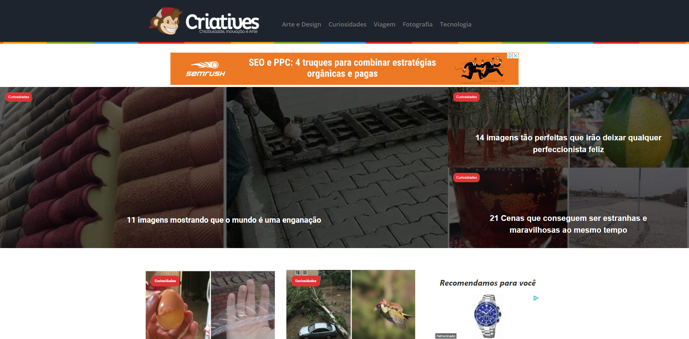
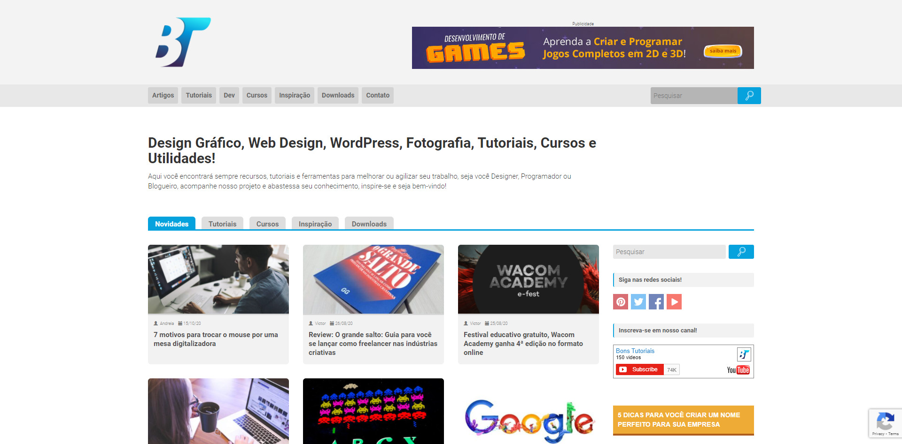
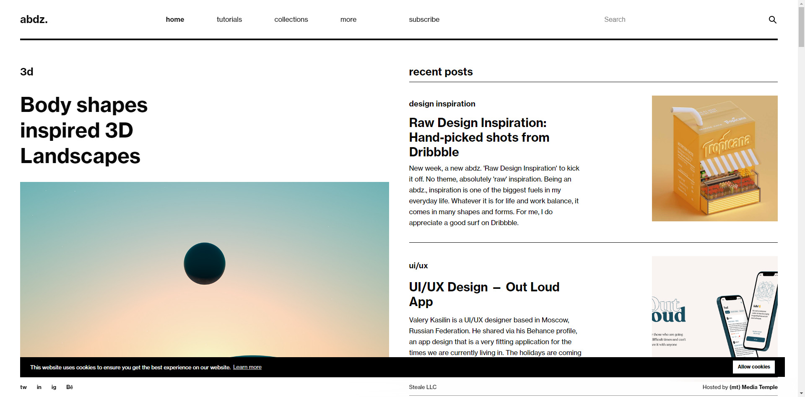
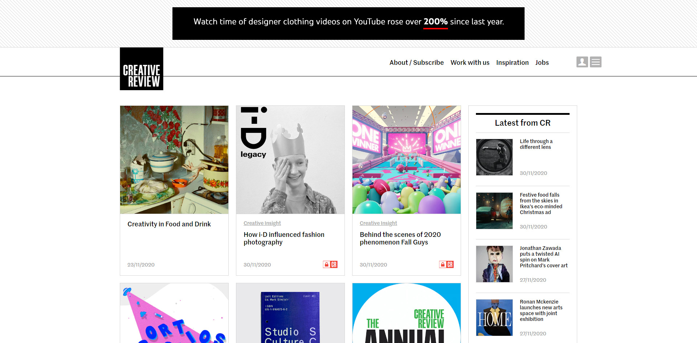
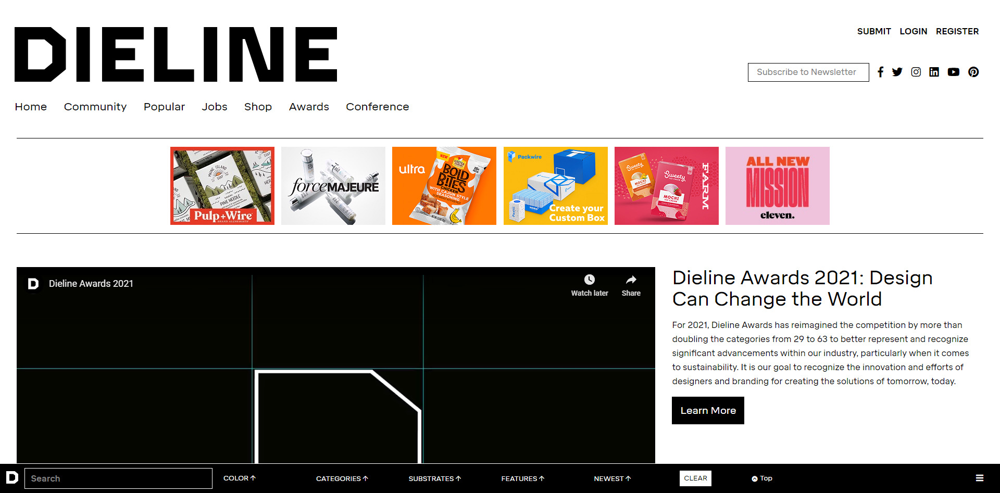
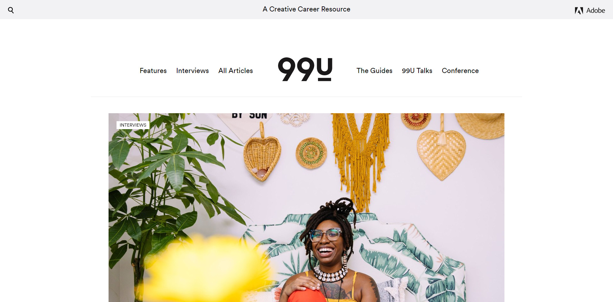
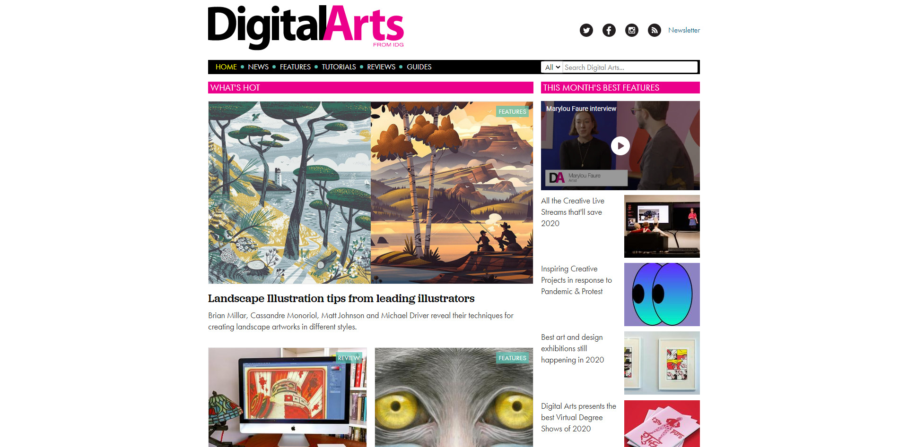

Encontrar inspiração e referências muitas vezes não é um trabalho fácil, estar atualizado com as últimas novidades e tendências também não. Por isso é importante estar sempre acompanhando sites e blogs referências de design, isso ajuda a manter nossa mente afiada e atualizada. Como eu venho de um histórico mais de desenvolvimento, para mim, é sempre uma dificuldade quando preciso me aventurar no mundo do design, por isso resolvi compartilhar com vocês uma lista com os melhores sites de design para você acompanhar.

## Melhores sites e blogs de design em Português

Começaremos a nossa seleção com os blogs brasileiros, afinal, precisamos exaltar a criatividade internacionalmente reconhecida do nosso povo.

### [Designerd](https://www.designerd.com.br/)

O Designerd nasceu de um projeto de faculdade e hoje é um dos melhores blogs de design do país. O blog conta em sua história com vários prêmios no Brasil e no exterior, reforçando a sua importância no segmento.

O blog conta com sessões de cursos, artigos, notícias e inspirações, definitivamente um acervo enorme de excelentes conteúdos sobre design que você deve acompanhar.

### [Brainstorm 9](https://www.b9.com.br/criatividade/)

Brainstorm 9 não é um blog exclusivo sobre design, ele abrange basicamente todos os segmentos de marketing, sendo importante para qualquer profissional que trabalhe com comunicação e publicidade. Nele você pode encontrar tudo sobre games, cinema, música, fotografia, mídias sociais e negócios. A B9 vem se destacado também com os seus conteúdos no formado de [podcast](https://www.b9.com.br/podcasts/), tratando sempre com bom humor, novidades e desafios desse mercado.

### [Criatives](http://www.criatives.com.br/)

O Criatives é um blog que, como o próprio nome diz, trata tudo sobre criatividade, seja sobre arte, inspiração e criatividade, notícia, sempre com uma ótica criativa, linguagem simples e fácil de compreender. Com certeza um blog que os designers não podem deixar de acompanhar.

### **[Bons Tutoriais](https://bonstutoriais.com.br/)**

Bons Tutoriais começou como um blog pessoal para anotar artigos e inspirações pessoais. Hoje, há 6 anos, o blog compartilhar artigos sobre design para a comunidade.

### [Behance](https://www.behance.net/)

Behance não é propriamente um site ou um blog, ele é uma rede de sites e serviços especializada na autopromoção, incluindo consultoria e sites de portfólio online. É de propriedade da Adobe. Nele você consegue encontrar inspirações do mundo inteiro, inclusive de designers brasileiros.

### [Dribbble](https://dribbble.com/)

Dribbble, seguindo a mesma linha do Behance, não é um site ou blog, e sim uma comunidade online para a exposição de conteúdo artístico. Funciona como uma plataforma de portfolios e networking para design gráfico, web design, ilustração, fotografia, e qualquer outra área criativa.

### [Pinterest](https://br.pinterest.com/)

Pinterest é uma rede social, primariamente para compartilhamento de fotos. Muitos usam como um quadro de inspirações, onde podemos compartilhar e gerenciar imagens temáticas, como de jogos, de hobbies, de roupas, de perfumes. Embora não específico para designer, é muito prático e fácil para encontrar inspirações criativas.

## Melhores sites e blogs de design em Inglês

Como em praticamente qualquer segmento, a maior variedade de conteúdo está em inglês, então separei uma lista com os melhores sites e blogs em inglês que você também deveria acompanhar.

### [Dropbox Design](https://dropbox.design/)

Você provavelmente já utilizou, ou pelo menos escutou falar do serviço de compartilhamento de arquivos Dropbox em algum momento de sua vida, mas você sabia que ele também possuí um blog? E é muito bom nisso, com uma série de artigos sobre o tema de UX, com tópicos que incluem pesquisa de usuário, gerenciamento de projetos e ferramentas de design.

### [Abduzeedo](http://abduzeedo.com/)

Abduzeedo é um blog coletivo de escritores individuais que compartilham artigos sobre arquitetura, design, fotografia e experiência do usuário. Fundada pelo designer brasileiro Fabio Sasso em 2006.

### [Design Week](https://www.designweek.co.uk/)

Fundada em 1986, a Design Week foi a principal revista de design do Reino Unido até 2011, quando abandonou o mundo offline e se tornou apenas online. Ele traz notícias e inspiração de alta qualidade e bem escritas em gráficos, marcas, interiores, conteúdo digital, produtos, móveis e muito mais.

### [Creative Boom](http://www.creativeboom.com/)

O site Creative Boom celebra, inspira e apoia a comunidade criativa e tem uma ótima seção sobre design gráfico para lhe dar muita inspiração.

### [Creative Review](https://www.creativereview.co.uk/category/cr-blog/)

Fundada em 1980, a Creative Review é a revista mensal líder mundial em publicidade e design. Conta com o mesmo jornalismo de alta qualidade em seu site, que traz uma série de notícias, resenhas e reportagens do mundo criativo.

### [The Dieline](http://www.thedieline.com/)

The Dieline é um site bem focado em design de produtos, um lugar onde a comunidade pode revisar, criticar e se manter informada sobre as últimas tendências do setor e conferir os projetos de design que estão sendo criados na área.

### [99U](https://99u.adobe.com/)

99U é um blog da Adobe que visa ajudar qualquer pessoa em uma profissão criativa a desenvolver suas carreiras. Está repleto de artigos de qualidade sobre liderança, produtividade e marketing.

### [Creative Bloq](https://www.creativebloq.com/)

Creative Bloq apresenta dicas, entrevistas e análises retiradas de quatro revistas impressas: Computer Arts (design gráfico e branding), net (web design), 3D World (animação / VFX) e ImagineFX (arte).

### [Masterpicks](http://www.themasterpicks.com/)

Procurando inspiração em projetos reais? Então você precisa conferir o Masterpicks. Este blog baseado em imagens apresenta a você um novo projeto de design escolhido a dedo todos os dias, em design de UX e UI, ilustração, animação, arte 3D, design gráfico, branding, design industrial e fotografia.

### [Digital Arts](https://www.digitalartsonline.co.uk/)

Digital Arts oferece inspiração, conselhos e tutoriais para criativos digitais em branding e design gráfico, ilustração, UX e design interativo, animação, VR e VFX.
