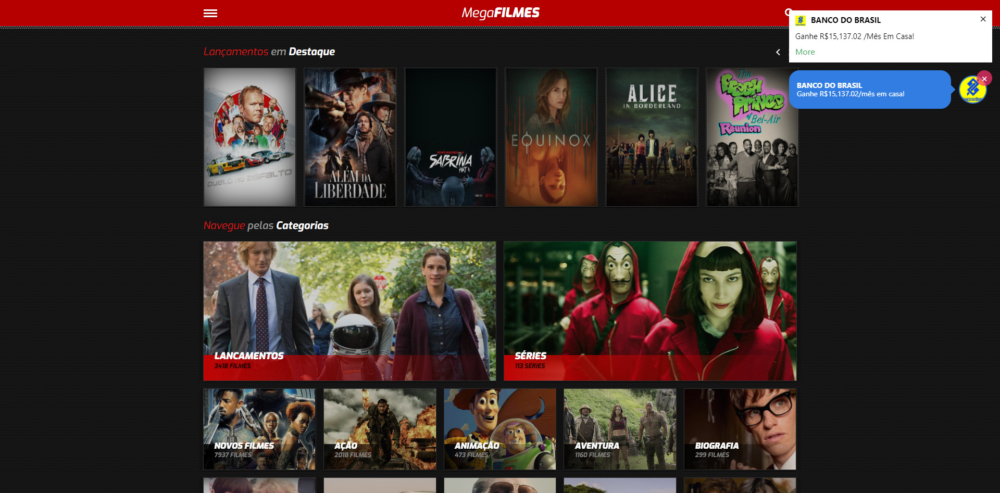

Existem diversas plataformas para assistir gratuitamente filmes online, sem nem precisar baixar nenhum programa. Se você procura sites com filmes atualizados e até alternativos, saiba que com certeza existe alguma plataforma que vai te interessar. Separei algumas plataformas populares para assistir filmes, series e até documentários online. 

Encontrar sites para assistir series e filmes em HD pode não ser uma tarefa fácil, existem diversos sites e muitos deles chegam a não ser seguros, pedindo para que você baixe e instale extensões duvidosas em seu computador. Por isso, separei uma lista com os melhores sites para você ver filmes e series online em HD gratuitamente.

## [AZMovies](https://azm.to/)

AZMovies é outro site de streaming popular e de longa data desta lista. Uma excelente coleção de filmes está disponível em grandes qualidades de streaming, incluindo 1080p e 720p.

O slogan do site diz “Assista aqui seus filmes favoritos sem limites, basta escolher o filme que você gosta e curtir! É livre e sempre será." Confira AZMovies hoje!

## [Popcornflix](https://www.popcornflix.com/pages/discover/d/movies)

Popcornflix é outro ótimo lugar para assistir filmes online grátis. Atuzliado constantemente com novos filmes da Screen Media Ventures.

Popcornflix tem mais de 1500 filmes que incluem comédia, drama, terror, ação, romance, família, documentários e filmes estrangeiros. Eles também apresentam originais da web e da escola de cinema.

Nenhuma conta é necessária no Popcornflix, basta clicar em **Play** no filme escolhido e desfrutar.

## [Vudu](https://www.vudu.com/content/movies/uxrow/Movies/5777)

O Vudu pode não ser sua primeira escolha ao procurar sites gratuitos para streaming de filmes, mas existem *milhares*  de filmes aqui que você pode assistir agora. Tudo que você precisa fazer é aguentar alguns comerciais. Algumas das mais novas adições deste site incluem *Slow Burn, Facing Ali, King Arthur, Frailty, Gordy* e *Tamara.*

Uma coisa excelente sobre os filmes do Vudu é que alguns deles estão em 1080p, então você não precisa sacrificar a qualidade apenas para assistir alguns filmes gratuitos.

## [Tubi](https://tubitv.com/)

Tubi se tornou um site muito popular para streaming de filmes e programas de TV gratuitos, sem a necessidade de assinatura. Tubi fornece milhares de filmes e séries de TV gratuitos, mas, como muitos outros nesta lista, é compatível com anúncios.

Tubi também está disponível como um aplicativo na Amazon App Store, Roku Channel list, Apple App Store e Google Play Store. Confira nosso tutorial para mais informações sobre Tubi.

Tubi tem milhares de filmes e programas de TV gratuitos que você pode transmitir agora mesmo. Alguns deles só podem ser alugados e não vistos de graça, mas muitos deles *são totalmente gratuitos* para transmitir.

Existem dezenas de gêneros que você pode escolher no Tubi, incluindo os regulares para romance, drama, documentário, crianças, comédia e filmes de terror, bem como gêneros exclusivos como *Casa e Jardim* , *Pré-escola* e *Espada e Feitiçaria.*

## [Stremio Web (Alpha)](https://app.strem.io/#/)

[Stremio](https://app.strem.io/#/) é uma plataforma muito conhecida para assistir vídeos por [to](http://marquesfernandes.com/tecnologia/como-faco-para-baixar-um-torrent/)[rrent](http://marquesfernandes.com/tecnologia/como-faco-para-baixar-um-torrent/). Possuí uma biblioteca extremamente completa, se o filme existe no formato torrent você consegue assistir por lá. Atualmente estão trabalhando em uma versão de navegador alfa, possuí diversos bugs para assistir, mas com certeza vale a pena conferir.

## [SuperFlix](https://www.superflix.net/)

[SuperFlix](https://www.superflix.net/) chegou até mim através dos comentários, não conhecia a plataforma e me surpreendi com a disponibilidade de filmes. A quantidade de propagandas é algo que incomoda bastante, de vez em quando, cliques pelo site abrem um popup para outro site de propaganda, mas nada de novidade em sites desse tipo. Conta com bastantes opções legendadas e dublados de filmes e séries. Com uma interface agradável e seu amplo catálogo, é uma boa opção para quem busca assistir séries e filmes gratuitamente online.

## [MegaFilmes](https://megafilmes.org/)

O [MegaFilmes](https://megafilmes.org/) é um site simples, totalmente em português e funcional. Todo o conteúdo é disponibilizado tanto legendado como dublado. Mas, se prepare, a quantidade de propagandas é irriante, você chega a precisar dar 5 cliques para conseguir acessar um link. Além de filmes, o site conta também com programas de televisão e séries.

**Ajude a melhorar a lista**

Estamos sempre atualizando a lista, se você utiliza algum outro site ou serviço para assistir series ou filmes online e gratuitamente, deixe sua recomendação nos comentários!
