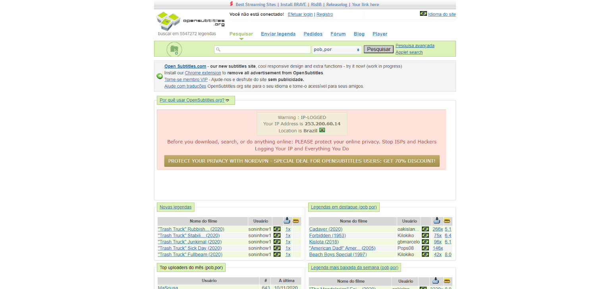
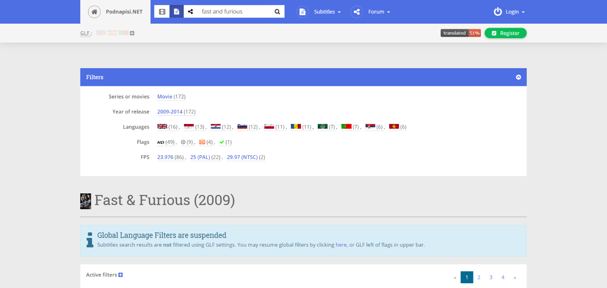
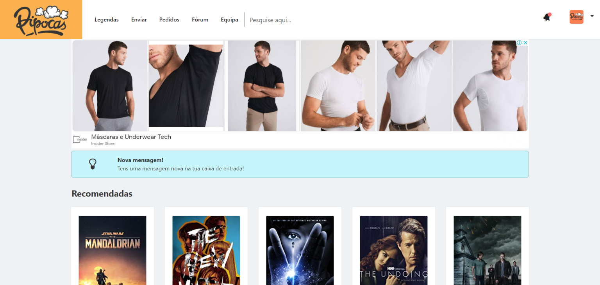

Si descargas una película extranjera, probablemente tu segundo paso será buscar dónde descargar los subtítulos gratis. Los subtítulos no son solo para personas con problemas de audición, sino que lo ayudan a comprender nuevos idiomas. 

Afortunadamente, hay varios sitios disponibles en línea, donde puede descargar archivos de subtítulos gratis para películas y series, desde películas populares hasta las más desconocidas.¡Esto le permite experimentar películas en un idioma completamente diferente al suyo!

## **[OpenSubtitles](https://www.opensubtitles.org/pb/search/subs)**

Con una de las colecciones más grandes de subtítulos de películas y series en Internet (más de cinco millones, según el propio [sitio web), O](https://www.opensubtitles.org/pb/search/subs)penSubtitles es probablemente el primer sitio al que desea acudir si está buscando subtítulos de calidad.

El sitio es una colección internacional, con más de 50 opciones de idioma diferentes para elegir, lo que le permite buscar en idiomas desde el aragonés hasta el vietnamita, y es el sitio con la mayor colección de subtítulos en portugués en Brasil y, en última instancia, en portugués. de Portugal si es necesario.

Cada carga viene con un nombre de película, fecha de carga, comentarios y una evaluación general de la calidad de los subtítulos proporcionados.Usando la barra de búsqueda resaltada en la parte superior, puede buscar subtítulos que hayan sido enviados por otros usuarios.Una barra de búsqueda avanzada le permite buscar por edad, clasificación, formato y más.

El sitio no solo incluye subtítulos para películas, también puedes participar en el foro de la comunidad, donde los usuarios ofrecen apoyo y consejos para encontrar los mejores subtítulos.

## [Adicto](https://www.addic7ed.com/)

[Addic7ed](https://www.addic7ed.com/) (que significa inglés, adicto) pretende ser el catálogo que proporciona subtítulos para los adictos al cine. Al igual que OpenSubtitles, es uno de los principales sitios para descargar subtítulos para películas y programas de televisión, y también tiene varios idiomas en su plataforma.

Necesita crear una cuenta en Addic7ed para descargar subtítulos. Después de iniciar sesión, puede buscar películas usando una barra de búsqueda o desplazarse por un menú desplegable. Los nuevos lanzamientos se muestran de forma destacada en una fuente RSS en la parte superior de la página.

El sitio también ofrece un programa que muestra los próximos lanzamientos de sus programas de televisión favoritos para mantenerse organizado (con enlaces relevantes a los subtítulos proporcionados).También ofrece un foro de soporte para hacer preguntas y páginas de tutoriales para explicar cómo usar los subtítulos descargados.

## [Podnapisi](https://www.podnapisi.net/)

[¡Podnapisi](https://www.podnapisi.net/) es uno de los más limpios y sencillos de usar!El sitio tiene más de 2 millones de subtítulos descargables, con más de 58,000 películas y más de 6,000 series de televisión disponibles.

Al igual que otros sitios importantes de subtítulos, Podnapisi le permite buscar utilizando una herramienta de búsqueda avanzada, con opciones para palabras clave, años, idioma y más.Si tiene problemas, un foro de soporte le permite hacer preguntas y discutir las últimas versiones.

## [Popcorn.tv](https://pipocas.tv/login)

[Pipocas.](https://pipocas.tv/login)tv fue una grata sorpresa en mi búsqueda, tiene una interfaz muy bonita, pero con muchos anuncios. Necesita registrarse en el sitio web para acceder a los subtítulos. Tiene una colección muy completa, una búsqueda sencilla pero eficaz. Puede ver las calificaciones de otros usuarios para el título si necesita consultar el foro e incluso enviar una solicitud de título.

## [YIFY subtítulos](https://yts-subs.com/)

Con el nombre del conocido grupo de piratería y sus lanzamientos en mente, YIFY [*Subtitles es ot*](https://yts-subs.com/)ro sitio web fácil de usar para descargar subtítulos.A diferencia de otros sitios importantes, YIFY Subtitles solo ofrece subtítulos de películas descargables.

No dejes que el enlace del grupo de piratería te desanime: los subtítulos YIFY son seguros y no pirateados, y ofrecen descargas en varios idiomas.La página de inicio ofrece una lista de películas populares y lanzadas recientemente, junto con categorías que separan las películas por cada idioma.

## [TVsubtitles.net](http://www.tvsubtitles.net/)

[TVsubtitles.net](http://www.tvsubtitles.net/) no es exactamente un sitio sólido para subtítulos en portugués, sin embargo, tiene algunos, puede ser una opción en el último caso.
