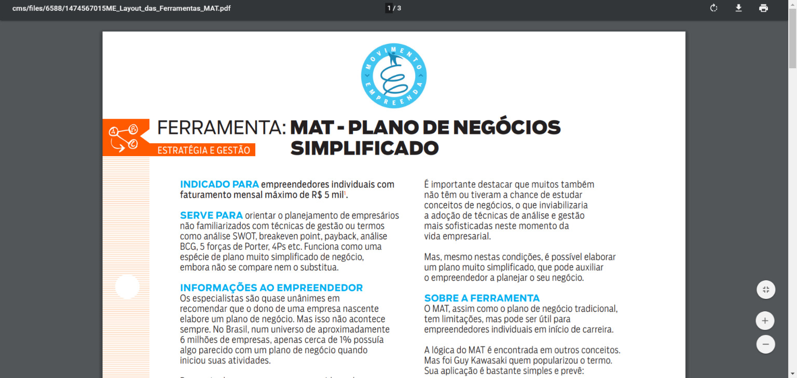
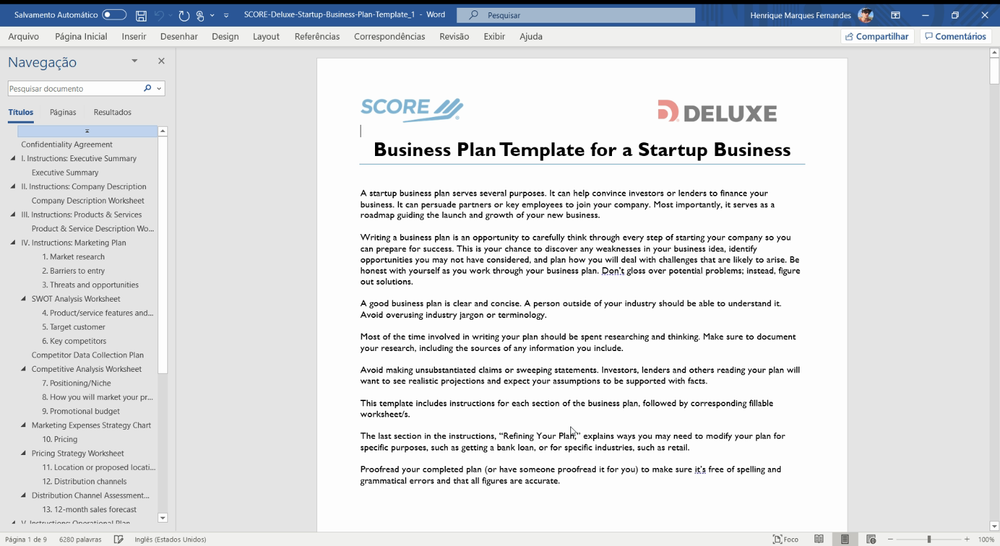
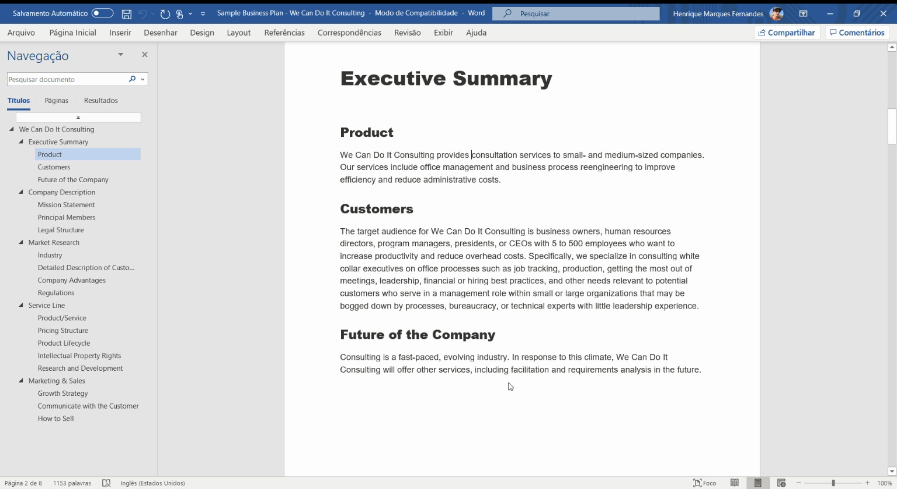
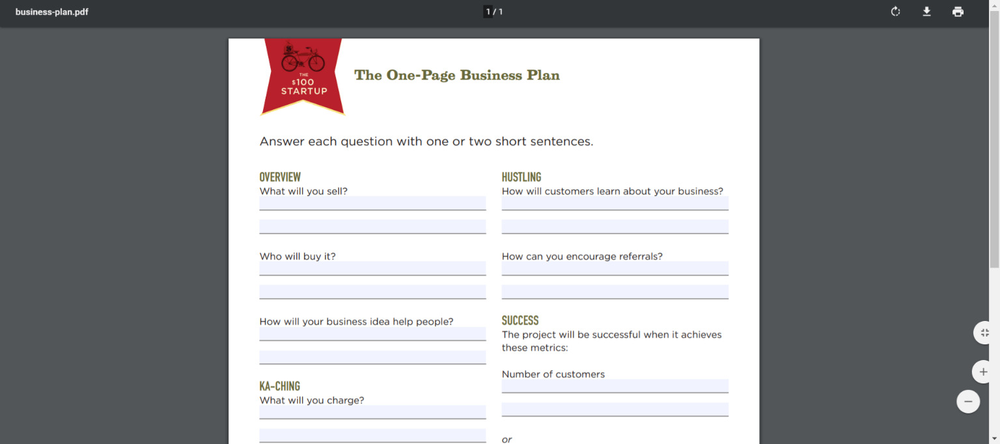

Criar um [plano de negócios](http://marquesfernandes.com/o-que-e-um-plano-de-negocios-business-plan/) definitivamente não é a parte mais fácil ou emocionante de começar, ou organizar uma empresa.

Criar seu plano de negócios é mais que apenas colocar suas ideias no papel para que os financiadores em potencial as vejam. É um processo exploratório no qual você pode avaliar suas opções, testar suas suposições sobre sua ideia e até descobrir novas oportunidades. Pode até levar você a eliminar aspectos e objetivos do seu negócio antes de investir tempo e dinheiro neles.

Isso não significa que você tem que quebrar a cabeça e começar um plano do zero. Existem modelos de plano de negócio que facilitam esse processo para você! Confira estes modelos de planos de negócios que você pode baixar gratuitamente para começar.

## Modelos de Plano de Negócios em Português

Separei alguns dos modelos de negócios que eu mais gostei, todos em português para facilitar ainda mais essa importante etapa de planejamento do seu negócio.

### Sebrae - Modelo Plano de Negócios (Excel)

Material objetivo e prático, para você aplicar imediatamente no seu negócio!

Criado em 1972, o Sebrae estimula o empreendedorismo e promove a competitividade e o desenvolvimento sustentável dos pequenos negócios no Brasil. Referência no setor de negócios do Brasil, o Sebrae disponibilizou um modelo de plano de negócios bem completo e intuitivo. Para baixar você precisa realizar um cadastro rápido.

[Clique aqui para baixar](https://www.sebraepr.com.br/gratuitos/plano-de-negocios-sebrae/).

### Dynamic Business Plan - Modelo Plano de Negócios (Word)

Este folheto é curto, concreto e objetivo!

Desde 1995, Mogens Thomsen, proprietário da Thomsen Business Information, tem ensinado e aconselhado os empresários da península escandinava, principalmente da Dinamarca. Ele disponibilizou um modelo de plano de negócios traduzido para o Português.

[Clique aqui para baixar](https://www.dynamicbusinessplan.com/download-plano-de-negocios).

### Endeavor - Modelo Plano de Negócios (PDF)

MAT: Metas, Ações, Tarefas

A Endeavor é uma organização global sem fins lucrativos com a missão de acelerar empreendedores que aceleram o crescimento do país. Apoiam milhares de empreendedores à frente de scale-ups, que são referência em performance e compromisso com a sociedade, e articulam mudanças para facilitar o crescimento de empresas no Brasil, nas bandeiras de Acesso à Capital, Simplificação Tributária e Desburocratização.

[Clique aqui para baixar](https://endeavor.org.br/estrategia-e-gestao/mat-plano-de-negocios-simplificado/).

### UOL - Modelo Plano de Negócios (PDF)

O UOL HOST é a unidade de hospedagem e serviços web do Grupo UOL e conta com a experiência de mais de 19 anos da marca que se consolidou como sinônimo de internet no Brasil. Eles contam com um setor chamado Meu Negócio, e por esse canal disponibilizaram um modelo de plano de negócios. Para baixar o arquivo você precisará deixar o seu e-mail, você pode inserir um e-mail inexistente apenas para conseguir ter acesso ao arquivo.

[Clique aqui para baixar.](https://meunegocio.uol.com.br/academia/downloads/e-books/modelo-de-plano-de-negocios.html)

## Modelos de Plano de Negócios em Inglês

Se você se sente confortável com o inglês, pegar alguns modelos e traduzir com certeza é uma boa opção. Existem muitos mais modelos disponíveis em inglês e com certeza algum se adequará a sua necessidade.

### [Score - Modelo de plano de negócios (PDF)](https://www.score.org/resources/business-plan-template-startup-business)

Score é uma organização sem fins lucrativos americana dedicada a ajudar os empreendedores a lançar suas empresas. Seu modelo, disponível para download em PDF ou Word, faz 150 perguntas e é genérico o suficiente para ser personalizado para a maioria dos tipos de negócios. O recurso Refining the Plan que o acompanha é útil, especialmente se esta for sua primeira tentativa de redigir um plano de negócios.

### [SBA - Administração de Pequenas Empresas dos EUA (PDF)](https://www.sba.gov/tools/business-plan/1)

O modelo do SBA está disponível para preenchimento online e download em PDF. Você pode voltar e editá-lo conforme necessário, então não se preocupe em ter tudo pronto na primeira vez que você se sentar para resolvê-lo. Mesmo dividido em seções, é um documento longo e um pouco trabalhoso para ser lido, mas produz um plano de negócios útil e com aparência profissional. Isso é particularmente útil se sua ideia não estiver totalmente desenvolvida e você souber que tem dever de casa a fazer - ela solicita informações.

### [100 Startup - Plano de negócios de uma página (PDF)](http://100startup.com/#resources)

Quem disse que um plano de negócios deve ser um documento longo e complicado? Alguns financiadores vão querer ver muitos detalhes, mas você pode fornecer isso nos apêndices. O 100Startup, o site do best-seller de mesmo nome, tem uma tonelada de recursos simplificados para empresários, incluindo este modelo de plano de negócios super simplificado.

### [LawDepot - Construtor de Plano de Negócios](http://www.lawdepot.com/contracts/business-plan/?ldcn=partnership-and-joint-venture)

Você apenas precisa responder a algumas perguntas simples e estará "pronto antes que você perceba!" Não acredite nisso. Um plano de negócios deve levar tempo e muito dever de casa, mas se você já fez isso, o modelo do LawDepot é uma escolha decente. Ele percorre os primeiros passos, marketing, produto, análise competitiva, SWOT e muito mais, com uma janela abaixo dos campos de entrada para mostrar o plano enquanto você o desenvolve. Você pode baixá-lo gratuitamente com uma assinatura de teste, mas deve se lembrar de cancelá-lo dentro de uma semana se não planeja continuar a usá-lo.
