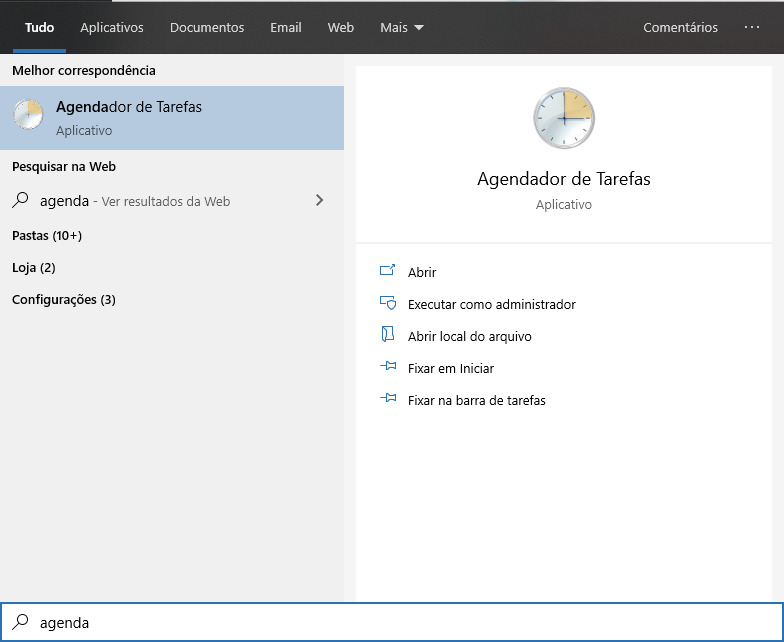

Se você tem uma banco de dados MySQL, muito provavelmente você já precisou ou vai precisar acessar um backup de seu banco. A melhor maneira de se prevenir é manter uma rotina diária (ou conforme sua necessidade) de backups, e exatamente isso que vamos aprender a fazer nesse artigo. Vamos aprender a criar rotinas de backups do MySQL no Windows e no Linux, nosso objetivo será criar um script que cria uma cópia de segurança do nosso banco em um arquivo zipado com marcação de data e uma rotina diaria para executar, nosso script também será capaz de deletar arquivos mais antigos que 7 dias.

-   [O que é MySQL?](#o-que-%C3%A9-mysql)
-   [Criando Backups do MySQL Diariamente no Windows](#criando-backups-do-mysql-diariamente-no-windows)
-   [Criando Backups do MySQL Diariamente no Linux](#criando-backups-do-mysql-diariamente-no-linux)

## O que é MySQL?

Não entrarei em muitos dados técnicos sobre a história do MySQL, você pode conferir nesse [link](https://www.hostinger.com.br/tutoriais/o-que-e-mysql/), mas resumidamente o MySQL é um sistema de gerenciamento de banco de dados (SGBD), que utiliza a linguagem SQL - Linguagem de Consulta Estruturada, do inglês *Structured Query Language*. Atualmente é mantida pela [Oracle Corporation](https://www.oracle.com/br/corporate/) e distribuida sob duas licenças: [GPL](https://pt.wikipedia.org/wiki/GNU_General_Public_License) e [Licença comercial](http://www.mysql.com/company/legal/licensing/commercial-license.html).

## Criando Backups do MySQL Diariamente no Windows

Vamos aprender como criar um script completo no Windows, para isso você precisa ter previamente instalado o MySQL e ter os dados do usuário com capacidade de leitura no banco de dados a ser copiado e vamos utilizar o [7zip](https://www.7-zip.org/) para compactar os nosso arquivos.

Primeiro vamos criar o arquivo que vai conter as nossas credenciais de acesso ao banco: `config.cnf`.

\# Configuracoes de usuario
\[mysqldump\]
 user=root
 password=senha

E agora o arquivo que vai realizar todo o processo de backup.

#Set-ExecutionPolicy -ExecutionPolicy Bypass 
$mysqlpath = "C:\\Program Files\\MySQL\\MySQL Server 5.5\\bin"  # Caminho para a instalção do MySQL
$backuppath = "C:\\backups\\"  # Caminho para armazenar os backups
$7zippath = "C:\\Program Files (x86)\\7-Zip"  # Caminho para a instalação do 7zip
$config = "C:\\config.cnf"  # Caminho para o arquivo com as credenciais
$database = "blog" # Nome do nosso banco de dados
$errorLog = "C:\\error\_dump.log"  # Caminho para o nosso arquivo de log
$days = 7 # Dias para manter os arquivos de backup
$date = Get-Date 
$timestamp = " " + $date.day + $date.month + $date.year + "\_" + $date.hour + $date.minute 
$backupfile = $backuppath + $database + "\_" + $timestamp +".sql" 
$backupzip = $backuppath + $database + "\_" + $timestamp +".zip" 
 
# Inicia o processo de backup 
CD $mysqlpath 
.\\mysqldump.exe --defaults-extra-file=$config --log-error=$errorLog  --result-file=$backupfile  --databases $database /c 

# Inicia o processo de compactacao com 7zip  
CD $7zippath 
.\\7z.exe a -tzip $backupzip $backupfile 
 
# Deleta o arquivo bruto
Del $backupfile 

# Deleta arquivos antigos
CD $backuppath 
$oldbackups = gci \*.zip\* 
 
for($i=0; $i -lt $oldbackups.count; $i++){ 
    if ($oldbackups\[$i\].CreationTime -lt $date.AddDays(-$days)){ 
        $oldbackups\[$i\] | Remove-Item -Confirm:$false 
    } 
}

O arquivo deve ser salvo com a extensão `.ps1` (PowerShell).

### Agendador de Tarefas - Criando o Agendamento

Para criar o agendamento no Windows você pode utilizar o Agendador de Tarefas.

## Criando Backups do MySQL Diariamente no Linux

Vamos aprender agora como criar um script completo no Linux, para isso você precisa ter previamente instalado o MySQL e ter os dados do usuário com capacidade de leitura no banco de dados a ser copiado. Também vamos utilizar o [bzip2](https://www.sourceware.org/bzip2/) para compactar os nosso arquivos, caso você não queira usar essa funcionalidade, comente as linhas 28 e 29.

#!/bin/bash

DB\_NAME='dbname' # Nome do banco de dados
DB\_USER='dbuser' # Usuario do banco
DB\_PASS='dbpass' # Senha do banco
DB\_PARAM='--add-drop-table --add-locks --extended-insert --single-transaction -quick' # Parametros para o backup https://dev.mysql.com/doc/refman/8.0/en/mysqldump.html

MYSQLDUMP=/usr/bin/mysqldump # Caminho para o binário do mysqldump
BACKUP\_DIR=/backup/mysql # Caminho para salvar os backups
DIAS=7 # Quantos dias de backups deseja manter

DATE=\`date +%Y-%m-%d\`
BACKUP\_NAME=mysql-$DATE.sql
BACKUP\_TAR=mysql-$DATE.tar
BACKUP\_BZ2=mysql-$DATE.tar.bz2

echo "Iniciando o processo de backup..."

#Gerando arquivo sql
echo "Gerando backup da base de dados $DB\_NAME em $BACKUP\_DIR/$BACKUP\_NAME"
$MYSQLDUMP $DB\_NAME $DB\_PARAM -u $DB\_USER -p$DB\_PASS > $BACKUP\_DIR/$BACKUP\_NAME

# Compactando arquivo em tar
echo "Consolidando arquivo em tar ..."
tar -cf $BACKUP\_DIR/$BACKUP\_TAR -C $BACKUP\_DIR $BACKUP\_NAME

# Compactando arquivo com bzip2
echo "  -- Compactando arquivo em bzip2 ..."
bzip2 $BACKUP\_DIR/$BACKUP\_BZ2

# Excluindo arquivos brutos
echo "  -- Excluindo arquivos desnecessarios ..."
rm -rf $BACKUP\_DIR/$BACKUP\_NAME

# Excluindo arquivos mais antigos
find /backup/mysql -name "\*.tar.bz2" -type f -mtime +$DIAS -exec rm -f {} \\;

Salve o arquivo como mysql\_backup.sh; De a ele permissão de execução com o comando `chmod +x mysql_backup.sh`; Agora execute o seu arquivo de backup com `./mysql_backup.sh`.

### Crontab - Criando o Agendamento

Para criar a rotina que execute diariamente o nosso backup no Linux, vamos usar a [Crontab](http://marquesfernandes.com/crontab-o-que-e-e-como-usar-no-ubuntu-debian/).

Abra a sua Crontab:

$ crontab -e

Agora vamos criar um agendamento que rode todos os dias às 00hs, para isso adicione a seguinte linha no final do arquivo:

0 0 \* \* \*  sh ~/mysql\_backup.sh
