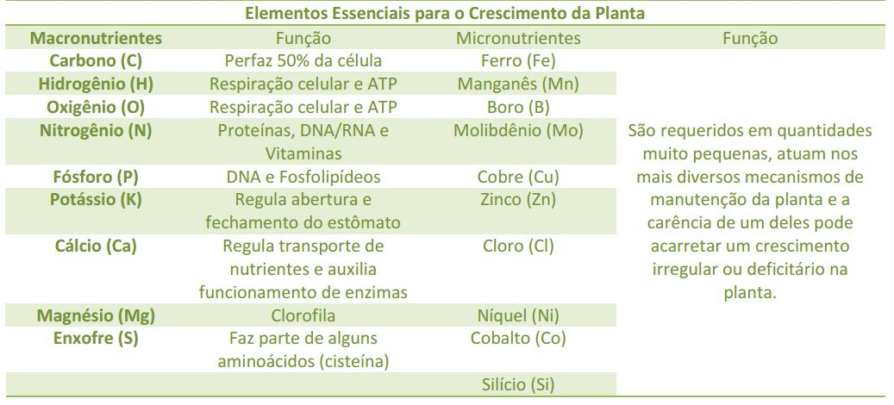
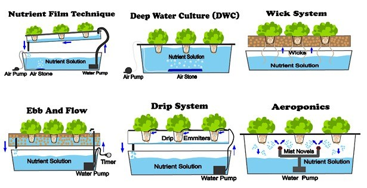
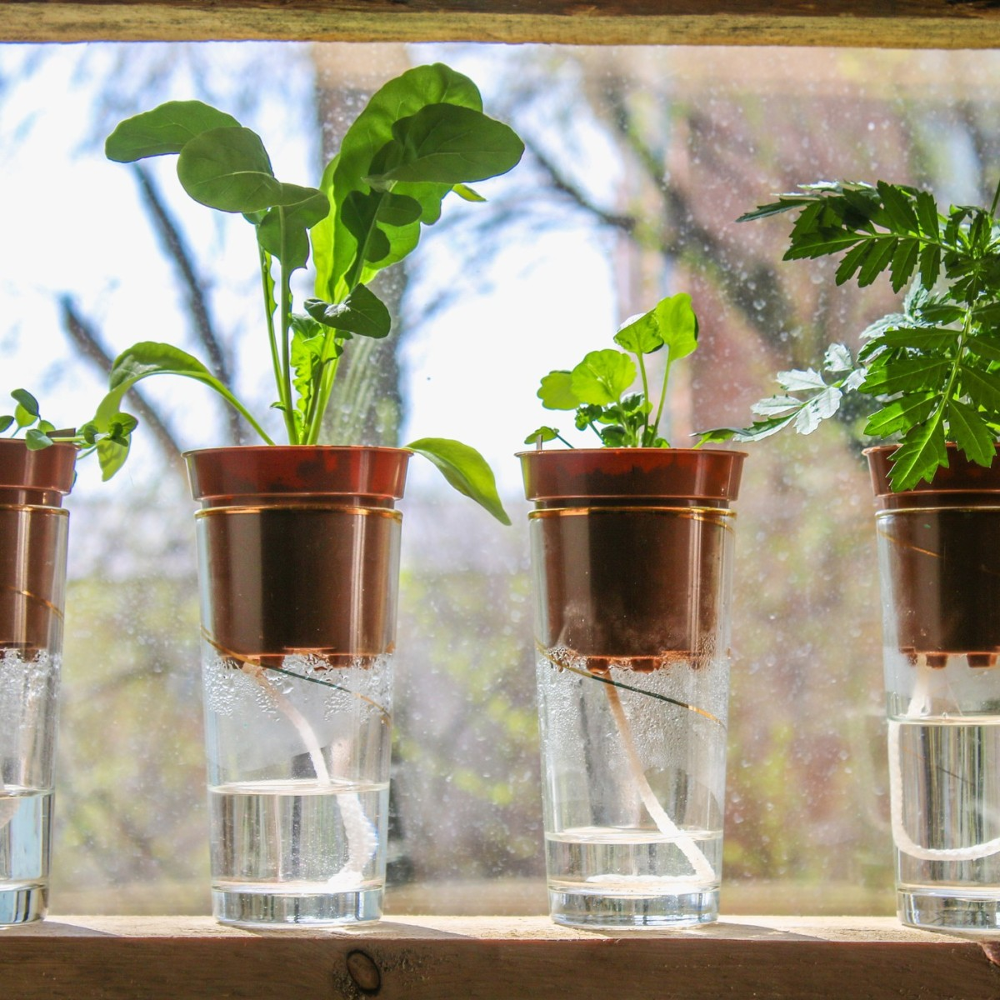
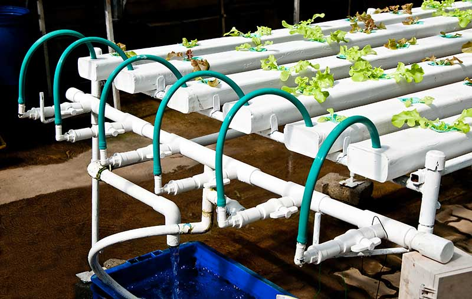
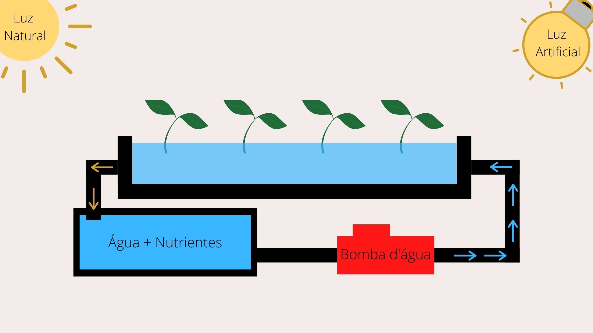
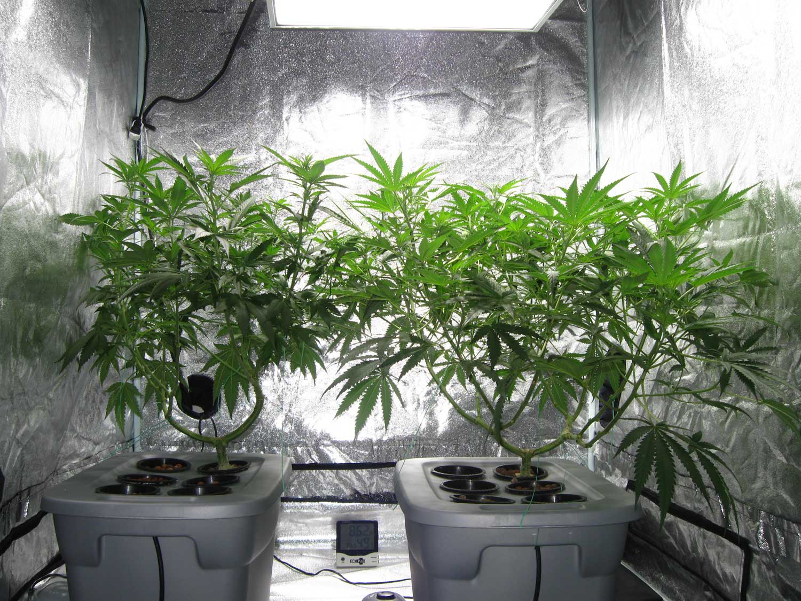
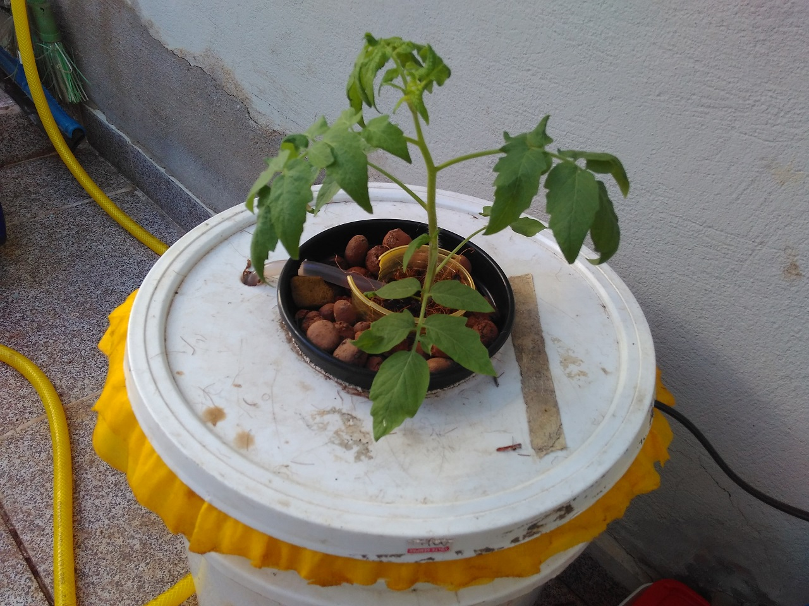

**La hidropon**ía, del agua griega *(hidro*eléctrica) y de *la man*o de obra (ponos), es el nombre dado al sistema de cultivo de plantas sin necesidad de suelo (tierra) como medio de crecimiento. Las plantas están en contacto directo con agua o aire extremadamente húmedo, que contiene el aditivo de nutrientes necesarios para el desarrollo de la planta.

Pero, ¿es posible crear plantas sin tierra? No sólo es posible, sino que las plantas también crecen mucho mejor y más rápido dentro de esta metodología. Muchos de los alimentos que consumimos en nuestra vida diaria ya se cultivan hidropónicamente.

## Historia del cultivo hidropónico

Muchas civilizaciones pasadas han utilizado técnicas de cultivo hidropónico a lo largo de su historia.  Los jardines colgantes de Babilonia, los jardines flotantes de los aztecas de México y los de los chinos son ejemplos de cultivo hidropónico exitoso. Registros jeroglíficos egipcios que datan de varios cientos de años antes de Cristo describir el crecimiento de las plantas en el agua. Como se ha señalado, la hidroponía es un método antiguo para el cultivo de plantas, pero recientemente se han hecho avances gigantescos en esta área "innovadora" de la agricultura.

Jardines Colgantes de Babilonia

Una de las aplicaciones que impulsó la adopción e investigación de la hidroponía que impulsó fue el cultivo de productos frescos en lugares inhóspitos del mundo, con poco o ningún suelo fértil para el cultivo. La hidroponía fue ampliamente utilizada durante la Segunda Guerra Mundial para abastecer a las tropas asignadas a las islas del Pacífico, que tienen poca o ninguna tierra para la siembra, por lo que a través de sistemas hidropónicos fue posible cultivar productos frescos en estos lugares.

Invernaderos lunares diseñados para imitar los cultivos de la Tierra - NASA

La hidroponía también se integró en el programa espacial, durante la carrera espacial, la NASA vio en hidroponía un ajuste perfecto y fácil para sus planes de sostenibilidad de la vida en el espacio. Así que ya en la década de 1970, ya no eran sólo científicos y analistas que estaban involucrados con la hidroponía, los agricultores tradicionales y los entusiastas de la afición comenzaron a ser atraídos por las virtudes del cultivo hidropónico. 

Muchas personas cuando escuchan el tema hidroponía, se asocian rápidamente con el cultivo de Cannabis, porque esto es lo que popularizó esta técnica en los tiempos modernos. Debido a que es una planta todavía prohibida en varios lugares, la hidroponía era el medio perfecto, fácil y "oculto" de cultivar plantas en interior y lejos de los ojos de las autoridades.

## ¿Cómo funciona la hidroponía?

Antes de entender cómo funciona la hidroponía necesitamos entender cómo crecen y se desarrollan las plantas. Las plantas crecen a través del proceso llamado fotosíntesis, en el que utilizan la luz solar y una clorofila (sustancia química presente en las hojas) para convertir el dióxido de carbono y el agua en glucosa (fuente de energía) y oxígeno. Además necesita nutrientes no minerales (hidrógeno, oxígeno, ...), macronutrientes (fósforo, calcio, magnesio, azufre, ...) y micronutrientes (cloro, manganeso, hierro, ...).

En un sistema de plantación de tierra macro y micronutrientes están presentes en el suelo y llegan a la raíz de las plantas, los no minerales están presentes en el agua y el aire atmosférico. En un sistema hidropónico se añaden macronutrientes directamente al agua, que a su vez está en contacto con la raíz de las plantas, sirviendo como medio para tomar todos los no minerales y minerales necesarios para la planta.

Con la hidroponía también existe la posibilidad de cultivar plantas sin necesidad de sol, popularmente llamado cultivo "interior", a través de lámparas especiales se proporciona la luz necesaria a las plantas.

Un sistema hidropónico básicamente necesita la fuente de luz, ya sea natural o artificial, de nutrientes mezclados en agua y una manera de llevar estos nutrientes a la raíz.

## Ventajas de la hidroponía

La hidroponía tiene varias ventajas sobre el cultivo del suelo, podemos enumerar algunas de las principales:

-   Reduce drásticamente los residuos de agua en comparación con las plantaciones de suelo (ha**sta un 90% menos de uso de agu**a).
-   Elimina la necesidad de un uso masivo de pesticidas y fertilizantes (mientras que la mayoría de las plagas viven en el suelo), haciendo que el aire, el agua, el suelo y los alimentos sean más limpios.
-   La capacidad de producir a menor costo que la agricultura tradicional en el suelo.
-   Capacidad de cultivo en zonas del mundo que no tienen espacio ni suelo fértil.
-   El tiempo de cosecha, en la mayoría de los tiempos, es más corto en sistemas hidropónicos porque es un sistema optimizado de entrega de nutrientes con menos resistencia a las raíces/plantas.

## Tipos de Sistemas Hidropónicos

Hay varios medios de cultivo hidropónico, vamos a hablar de todos ellos con más detalle pronto, por ahora vamos a ver el sistema más simple y más popular:

Tipos de Sistemas Hidropónicos

### Sistema de absorción cerrado (si*stemas de Wickin*g)

Sistema de absorción cerrado (sistemas de Wicking)

Un sistema de absorción es el tipo más básico de sistema hidropónico que se puede construir. Este es el sistema utilizado durante miles de años, como los jardines de Babilonia.

Se conoce como hidroponía pasiva, lo que significa que no necesitas bombas de aire o agua para usarlo. Los nutrientes y el agua se mueven a la zona radicular de la planta por medio de una mecha, que suele ser algo tan simple como una cuerda o un trozo de fieltro.

La clave del éxito en el sistema de absorción es utilizar un medio de cultivo que transporte bien agua y nutrientes, como el coco, la perlita o la vermiculita.

Estos sistemas son buenos para plantas más pequeñas que no consumen mucha agua o nutrientes. Las plantas más grandes pueden tener dificultad para obtener suficiente a través de este sistema.

### Sistem*a NFT (Nutrie*nt Film Technique)

El Jardín Hidropónico Orgánico de Vegetales

La técnica de película nutritiva se utiliza a menudo para cultivar plantas más pequeñas y de rápido crecimiento, como diferentes tipos de lechugas. Además de la lechuga, los productores comerciales también utilizan este sistema para cultivar hierbas y fresas para niños.

Sistema NFT

Hay varias maneras de diseñar un sistema de técnica de película nutritiva; sin embargo, todos siguen el diseño de una solución nutritiva muy superficial que fluye a través del tubo. Las raíces desnudas de las plantas absorben nutrientes de las soluciones cuando entran en contacto con el agua. 

Este sistema consiste en un depósito con agua y nutrientes, una bomba de agua responsable de circular en el sistema, un medio donde las plantas serán suspendidas, generalmente una tubería o una bandeja, donde las plantas suspendidas con raíces expuestas entran en contacto con este pequeño flujo de agua + nutrientes. Las plantas absorben lo que necesitan y luego hay una gota de agua de vuelta en el depósito y que también es responsable de la oxigenación del agua.

### **Sistema *DWC (Cultura* de Aguas Profundas**)

Sistema de cultura DeepWater

En un sistema DWC, se utiliza un depósito para contener la solución de agua y nutrientes. Las raíces de las plantas se sumergen en esta solución para que reciban el suministro constante de agua, oxígeno y nutrientes.

Para oxigenar el agua, se utiliza una bomba de aire con una piedra de aire que bombea burbujas en la solución nutritiva. Las plantas se alojan generalmente en macetas perforadas con algunos medios para acomodar las plantas, por lo general piedras de arcilla, espuma fenólica o cáscara de coco.

### Sistemas de goteo

Sistemas de goteo

Los sistemas de goteo son muy similares al sistema NFT, la única diferencia es que en lugar del suministro de agua se apodera del flujo constante de agua, la solución nutritiva y se bombea directamente en la base de cada sistema de planta.

## Aeroponia

Aeroponia

Un sistema aeropónico es similar a un sistema NFT en el que las raíces se suspenden en el aire. La diferencia es que en un sistema aeropónico la solución nutritiva se lleva a las plantas a través de una niebla, un sistema de pulverización crea esta niebla humidificando las raíces con la solución nutritiva.

**Conclusión**

-   
    
    Jardín de Verduras NFT
    
-   
    
    Jardín de Verduras NFT
    
-   
    
    Jardín DWC
    

Jardín de verduras DIY

Bueno, aprendimos un poco más sobre la hidroponía y sus ventajas, algunos pueden estar preguntándose ¿qué tiene que ver esto con un blog de tecnología? Bueno, este es el primer artículo de una serie que quiero mostrar de un huerto hidropónico que construí en la casa de mis padres, además de toda la tecnología detrás del cultivo, con la ayuda de la [automatización](http://marquesfernandes.com/category/iot/) logré crear un huerto prácticamente 100% automatizado y decidí compartir esta experiencia contigo.
