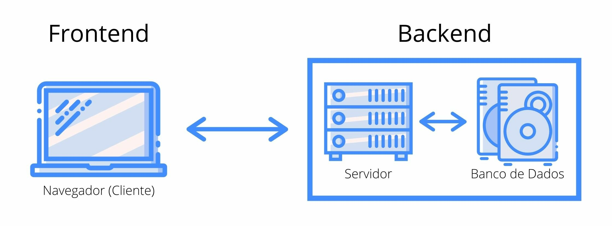
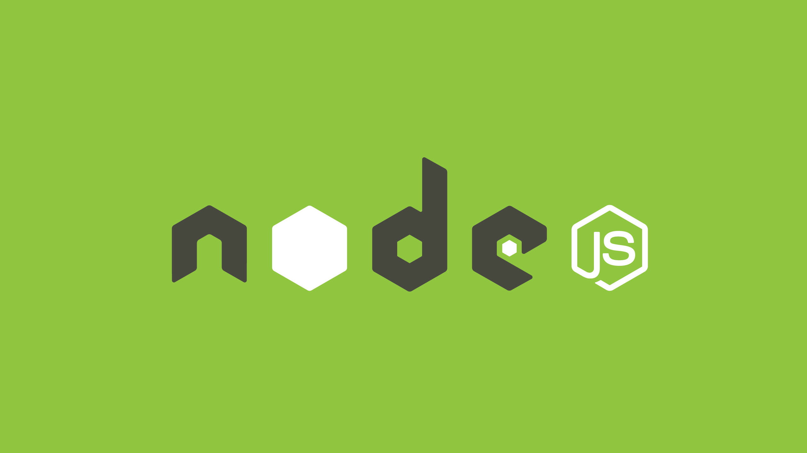
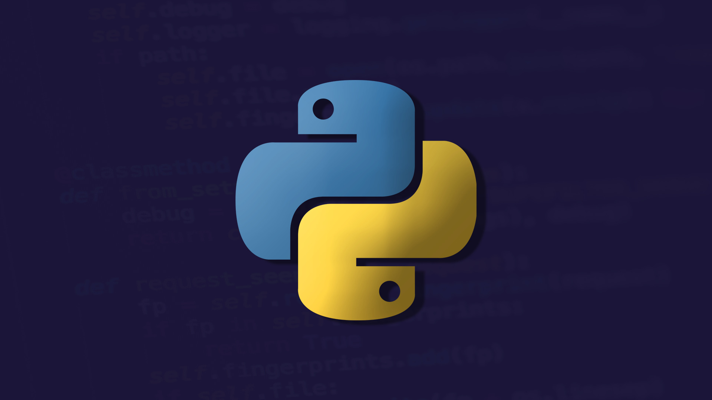

Desenvolvimento back-end é o desenvolvimento no lado do servidor. É o termo usado para o desenvolvimento que acontece por de trás dos bastidores, não vistos pelos usuários. Em outras palavras, os desenvolvedores de back-end criam a regra de negócio, a lógica para fazer um sistema web funcionar corretamente e fazem isso por meio do uso de linguagens de programação específicas para o lado do servidor, como [NodeJS](http://marquesfernandes.com/tecnologia/afinal-o-que-e-nodejs/), [PHP](http://marquesfernandes.com/tecnologia/o-que-e-php-e-para-que-serve/) ou [Python](http://marquesfernandes.com/desenvolvimento/o-que-e-python-e-pra-que-serve/).

* * *

Para entender melhor o conceito de backend precisamos analisar a outra ponta de um sistema web, o [frontend](http://marquesfernandes.com/tecnologia/o-que-e-um-desenvolvedor-frontend-e-o-que-ele-faz/).

Fluxo Web Simples

O desenho acima representa um fluxo simples de um site ou sistema web, temos a ponta que chamamos de cliente, quem solicita alguma informação para o lado do servidor. Nesse caso nosso cliente é um navegador web solicitando alguma página de algum site.

A parte do cliente, quem exibe as informações de um jeito estruturado é desenvolvido pelo desenvolvedor frontend enquanto a parte que responde às informações desejadas, fazendo consultas no banco de dados e aplicando outras regras de negócio, quem cuida é o desenvolvedor backend. A comunicação entre essas duas pontas é normalmente feita através de [APIs](http://marquesfernandes.com/tecnologia/o-que-e-uma-api-e-para-que-serve/) (protocolos e padrões de comunicação na internet).

Exitem casos de [desenvolvedores full-stack](http://marquesfernandes.com/tecnologia/o-que-e-e-o-que-faz-um-desenvolvedor-full-stack/), que conseguem desenvolver nas duas pontas.

## Linguagens de Programação Populares para Backend

Existem diversas linguagens de programação específicas para o backend, e a constantemente novas linguagens são criadas e novas versões são lançadas. É um setor muito dinâmico que requer constante atualização. Dentro das principais linguagens podemos citar:

### [NodeJS](http://marquesfernandes.com/tecnologia/afinal-o-que-e-nodejs/)

O ambiente [**node**](http://marquesfernandes.com/tecnologia/afinal-o-que-e-nodejs/) possuí tudo o que se precisa para executar scripts em javascript, onde até então\* era possível apenas nos navegadores. Ele permite utilizar o javascript como linguagem backend e utiliza a *V8 javascript engine* desenvolvida pela Google para o Chrome.

### [Python](http://marquesfernandes.com/desenvolvimento/o-que-e-python-e-pra-que-serve/)

[Python](http://marquesfernandes.com/desenvolvimento/o-que-e-python-e-pra-que-serve/) é uma linguagem de programação interpretada de uso geral, muito popular e que pode ser usada para desenvolver uma ampla variedade de aplicativos. Possuí estruturas de dados de alto nível, módulos, exceções, tipagem dinâmica, vinculação dinâmica e muitos recursos.

### [PHP](http://marquesfernandes.com/tecnologia/o-que-e-php-e-para-que-serve/)

**[PHP](http://marquesfernandes.com/tecnologia/o-que-e-php-e-para-que-serve/)** (um acrônimo recursivo para *“**P**HP: **H**ypertext **P**reprocessor”*) é uma linguagem interpretada de código aberto, usada principalmente no desenvolvimento do lado do servidor (backend) de aplicações web.

### [Java](https://rockcontent.com/br/blog/o-que-e-java/)

**[Java](https://rockcontent.com/br/blog/o-que-e-java/) é um** **tipo de linguagem de programaçãocriada** e comercializada pela Sun Microsystems desde 1995. É definida como uma linguagem orientada a objetos.  
Sua intenção é permitir que os desenvolvedores escrevam o programa apenas uma vez e o executem por meio de qualquer dispositivo.

## Responsabilidades de um Desenvolvedor Backend

As responsabilidades de um desenvolvedor de back-end podem incluir trabalhar com:

-   Armazenar dados e também garantir que sejam exibidos para o usuário
-   Criação, integração e gerenciamento de banco de dados
-   Gerenciar recursos de APIs que funcionam em vários dispositivos
-   Entender estruturas e arquiteturas de desenvolvimento back-end
-   Integração com servidor e nuvem
-   Integração com sistemas de terceiros
-   Configurações de segurança e prevenção de ataques

-   Pode estar envolvido na arquitetura de um sistema e nas análises de ciência de dados.
-   Construção de estruturas ou na arquitetura para torná-la mais fácil de programar.
-   Implementar algoritmos otimizados e resolver problemas relacionados ao sistema.

## Quanto Ganha um Desenvolvedor Backend

A área de tecnologia é conhecida por possuir um ambiente de trabalho e remuneração muito atrativo. O salário de um desenvolvedor backend pode variar muito, tanto por empresa como por região. Segundo sites especializados em empregos a média salarial do [desenvolvedor backend no Brasil](https://neuvoo.com.br/salario/?job=Desenvolvedor+Back+End) está em **R$ 4.200**. Desenvolvedores mais experientes podem chegar a ganhar mais de **R$10.000**, sem contar os fartos benefícios que as empresas de tecnologia fornecem.
