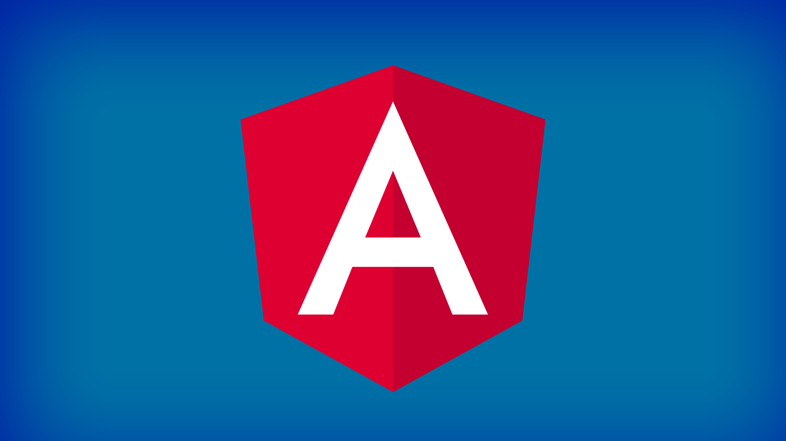

Um desenvolvedor front-end é responsável pelo desenvolvimento front-end da interface gráfica de aplicações web. Trabalham principalmente com as tecnologias [HTML](http://marquesfernandes.com/tecnologia/o-que-e-html-e-para-que-serve/), [CSS](http://marquesfernandes.com/tecnologia/o-que-e-css-e-para-que-serve/) e [JavaScript](http://marquesfernandes.com/desenvolvimento/javascript-o-que-e-como-funciona-e-para-que-serve/). Diferente do [backend](http://marquesfernandes.com/tecnologia/o-que-e-um-desenvolvedor-backend-e-o-que-ele-faz/), que possuí muitas linguagens de programações diferentes, o dinamismo de tecnologia do frotend está principalmente nos [frameworks](http://marquesfernandes.com/tecnologia/framework-x-biblioteca-x-toolkit-o-que-sao-e-qual-a-diferenca/), que são bibliotecas otimizadas para o desenvolvimento web.

O frontend trabalha em conjunto com o backend, responsáveis por enviar as informações necessárias para que o frontend consiga construir a interface gráfica para um site ou sistema.

Veja a ilustração abaixo para entender melhor a relação entre as duas camadas:

Fluxo Web Simples

## Tecnologias Utilizadas no Frontend

Como explicado acima, o desenvolvimento frontend gira em torno de 3 tecnologias prinipais.

### [HTML](http://marquesfernandes.com/tecnologia/o-que-e-html-e-para-que-serve/)

> **HTML** não é uma linguagem de programação, embora muita gente confunda, é uma linguagem de marcação que define estruturalmente um conteúdo. O **HTML** consiste em uma série de elementos pré-definidos, chamadas de tags, que são utilizadas para separar, organizar e exibir o conteúdo conforme programado. As tags permitem criar um hiperlink; uma imagem; um título; aumentar ou diminuir a fonte e muito mais.
> 
> [O que é HTML - Marques Fernandes](http://marquesfernandes.com/tecnologia/o-que-e-html-e-para-que-serve/)

### [CSS](http://marquesfernandes.com/tecnologia/o-que-e-css-e-para-que-serve/)

> **C**ascading **S**tyle **S**heets (**CSS**) é uma linguagem de design feita para simplificar a apresentação e customização de páginas na internet (**[HTML](http://marquesfernandes.com/o-que-e-html-e-para-que-serve/)**). Podemos pensar no CSS como a pele ou até mesmo a roupa, ele é responsável por aplicar todas as customizações visuais como, tamanho e cor da fonte, cor de fundo, e muito mais. 
> 
> [O que é CSS - Marques Fernandes](http://marquesfernandes.com/tecnologia/o-que-e-css-e-para-que-serve/)

### [JavaScript](http://marquesfernandes.com/desenvolvimento/javascript-o-que-e-como-funciona-e-para-que-serve/)

> **JavaScript,** ou **JS** para os íntimos, é uma das linguagens de programação mais populares e usadas no mundo. Ela é uma linguagem interpretada, de alto nível e multi-paradigma (orientado a objeto, funcional, imperativo e, protótipos). Com ela, é possível desenvolver desde páginas dinâmicas, aplicativos para smartphones, sistemas complexos e até jogos eletrônicos.
> 
> [O que é JavaScript - Marques Fernandes](http://marquesfernandes.com/desenvolvimento/javascript-o-que-e-como-funciona-e-para-que-serve/)

## Frameworks Frotend Populares

> Um framework é uma estrutura genérica que fornece uma arquitetura padrão, um esqueleto com a qual podemos desenvolver um software específico. Essa abstração permite que padrões de design comuns sejam facilmente reutilizados, enquanto ainda permite que os detalhes de regra de negócio sejam deixados para os desenvolvedores. 
> 
> [Frameworks - Marques Fernandes](http://marquesfernandes.com/tecnologia/framework-x-biblioteca-x-toolkit-o-que-sao-e-qual-a-diferenca/)

O processo de desenvolvimento no frontend vem passado por uma melhoria exponencial, hoje é possível programar facilmente aplicações web complexas e organizadas graças ao desenvolvimento de novos frameworks. Veja abaixo os principais e populares frameworks atualmente.

### ReactJS

**React** (também conhecido como **React.js** ou **ReactJS** ) é uma biblioteca JavaScript de código aberto para construir interfaces de usuário ou componentes de IU. É mantido pelo Facebook e uma comunidade de desenvolvedores individuais e empresas. React pode ser usado como base no desenvolvimento de aplicativos de página única ou móveis. 

### VueJS

Vue (pronuncia-se / vjuː /, como **view** ) é uma **estrutura progressiva** para construir interfaces de usuário. Ao contrário de outras estruturas monolíticas, o Vue foi projetado desde o início para ser adotado de forma incremental. A biblioteca central concentra-se apenas na camada de visualização e é fácil de selecionar e integrar com outras bibliotecas ou projetos existentes.

### AngularJS

**AngularJS** é um framework front-end de código aberto baseada, mantido principalmente pelo Google e por uma comunidade de indivíduos e corporações para lidar com muitos dos desafios encontrados no desenvolvimento frontend.

## Responsabilidades de um Desenvolvedor Frontend

Um desenvolvedor frontend pode ter diversas responsabilidades diferentes, podendo incluir:

-   Obter feedback continuamente de usuários, clientes e colegas
-   Monitorar o desempenho do aplicativo e problemas relacionados a usabilidade do site
-   Escrever documentos e guias de requisitos funcionais
-   Criar maquetes e protótipos de qualidade, garantindo padrões gráficos de alta qualidade e consistência de marca 
-   Transformar designs UI/UX em protótipos
-   Escrever código reutilizável e bibliotecas
-   Otimizar aplicativos para velocidade e escalabilidade máxima
-   Colaborar com desenvolvedores de back-end e web designers para melhorar a usabilidade

## Quanto Ganha um Desenvolvedor Frontend

A área de tecnologia é conhecida por possuir um ambiente de trabalho e remuneração muito atrativo. O salário de um desenvolvedor frontend pode variar muito, tanto por empresa, como por região. Segundo sites especializados em empregos a média salarial do [desenvolvedor frontend no Brasil](https://neuvoo.com.br/salario/?job=Programador+Front+End) está em **R$ 3.000**. Desenvolvedores mais experientes podem chegar a ganhar mais de **R$10.000**, sem contar os fartos benefícios que as empresas de tecnologia fornecem.
