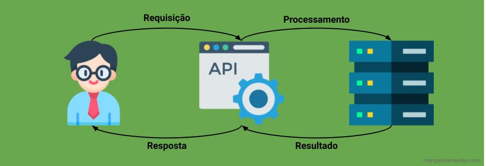

**AP**I es un acrónimo de la "***Interfaz de Programación de Apl***ica**ciones" en inglés, que significa un** conjunto de funciones y procedimientos preestablecidos que permiten la creación de aplicaciones que acceden a recursos o datos desde otra aplicación, servicio o sistema operativo.

## Descomplicar el término API

¿Aún no lo entiendes? Imaginen u*na* API como restaurante, proporcionan un menú para sus clientes (funcione*s y procedimientos) con* opciones y descripciones de los platos, obviamente predefinidos. Cuando un cliente solicita un pla*to (solicit*ud), puede proporcionar información relevante *(datos - insum*os) para que se logre el resultado esperado, como el punto de la carne o si desea eliminar cualquier ingrediente. Al final el cliente no sabe exactamente cómo el restaurante preparó su comida allí en la cocina, sólo obtiene el resultado (*respuest*a).

Es más o menos en este flujo que funciona una API, por ejemplo, un desarrollador quiere usar la API de Facebook para automatizar las publicaciones de su empresa, no necesita y no sabrá cómo Facebook implementó la regla de negocio. Facebook sólo proporciona al desarrollador una serie de características, en forma de una API web, que se pueden utilizar para lograr el resultado esperado, sólo tiene que proporcionar los datos necesarios para ello.

Imaginemos otro escenario, un desarrollador quiere crear una aplicación de escritorio para Windows, esta aplicación necesita abrir un cuadro de diálogo para seleccionar archivos, sólo tiene que tener a mano la documentación del lenguaje que se está desarrollando y encontrar la función API de Windows para abrir ese cuadro. No le importa cómo suceda esto, sólo necesita que suceda.

Por lo tanto, las API simplifican cierta programación para los desarrolladores al abstraer la implementación de bajo nivel y exponer solo objetos o acciones de alto nivel que el desarrollador necesita.

En el primer ejemplo vimos el escenario de usar una API web, mientras que en el segundo ejemplo tenemos una API en el nivel de aplicación. Hay varios tipos y usos de API, los más famosos son las API web, vamos a hablar más sobre ellos.

## API por política de acceso

Las API suelen clasificarse por su nivel de acceso:

-   **Privado:** la API solo está disponible para uso interno de la empresa.
-   **Socios: so**lo los socios tienen acceso a las API. Por ejemplo, Nubank solo permite a ciertas empresas utilizar sus API para conectarse con sus aplicaciones. Esto permite a la empresa controlar y seleccionar proporcionar la API, dándoles más control sobre quién está accediendo a sus recursos.
-   **Público:** Las API públicas están disponibles para uso público, cualquier persona puede tener acceso a. Por ejemplo, Microsoft lanza las A[PI de Windows p](https://docs.microsoft.com/en-us/windows/win32/apiindex/windows-api-list)ara que cualquier desarrollador pueda desarrollar una aplicación para su sistema operativo, o LinkedIn que proporciona una API públ[ica para q](https://developer.linkedin.com/docs/rest-api#)ue cualquier usuario se conecte con su aplicación.

## API Web

Ahora que entendemos que una API es cualquier conjunto de funciones que permiten el acceso a la información desde una aplicación de una manera preestablecida, ya sea acceso remoto (web) o programado. Hablemos de las API más populares, las API web.

Son la forma en que Internet se comunica hoy en día, varios protocolos de comunicación se han desarrollado y se utilizan diariamente para que ese meme de su amigo llegue a su móvil. Una API remota le permite a usted, o a su aplicación, acceder dinámicamente a los recursos de una manera simplificada y automatizada. Normalmente usan métodos de autenticación para la seguridad y la auditoría, se comunican mediante la implementación de especificaciones, como [HTTP](http://marquesfernandes.com/o-que-e-http/), para las solicitudes y un patrón de datos para la respuesta, como [JS](http://marquesfernandes.com/o-que-e-json-e-para-que-serve/)[O](http://marquesfernandes.com/o-que-e-json-e-para-que-serve/)N.
