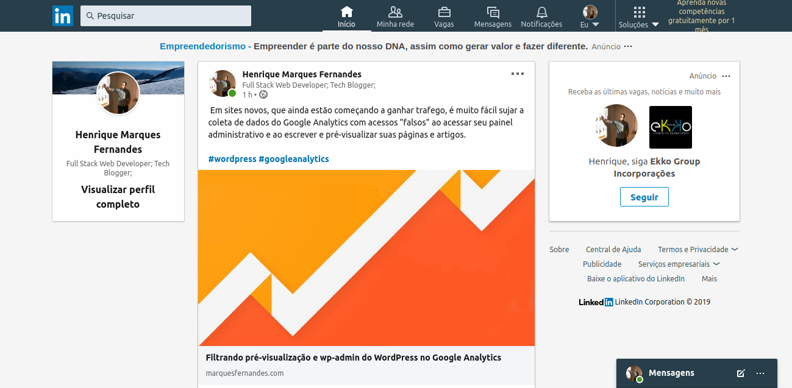
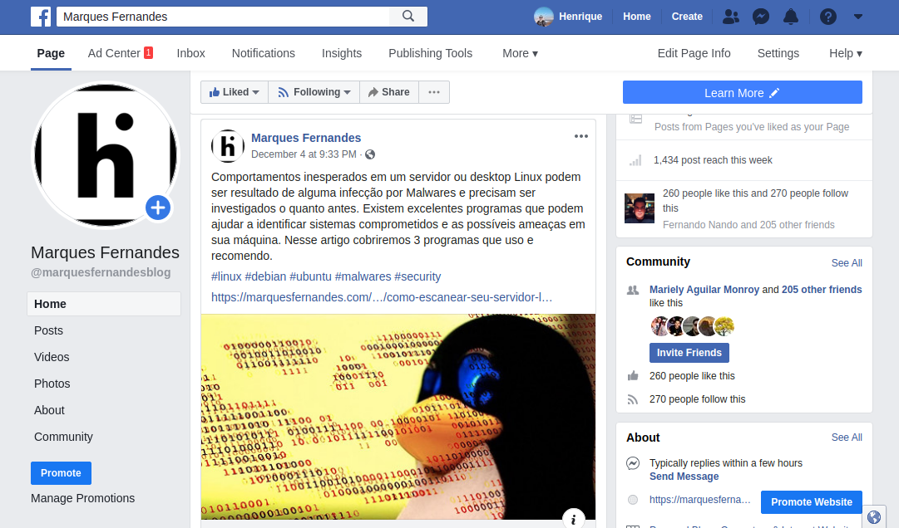
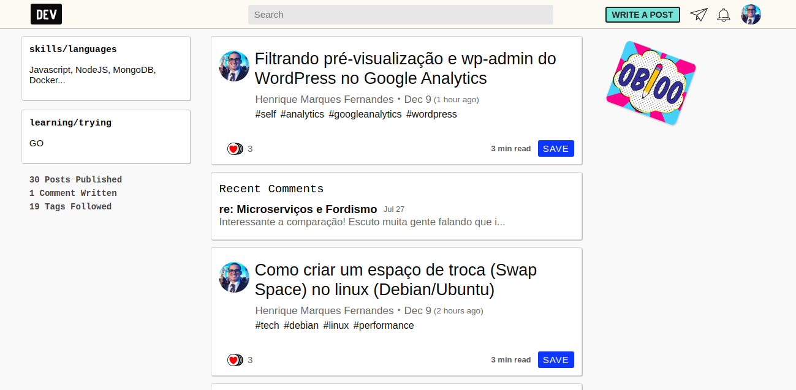

Creo que es una duda muy común en bloggers novatos como yo. He estado tratando de encontrar la mejor manera de difundir mis artículos de una manera saludable y orgánica. Como todavía no tengo un amplio alcance en las redes sociales, dependo mucho de nuestros queridos motores de búsqueda (Google básicamente), he estudiado algunas tácticas SEO y he hecho suficiente investigación y pruebas de los lugares que generan más retorno a mi blog, tanto en el tema del tráfico y la const[rucción de enlace](https://rockcontent.com/blog/link-building/)s.

Voy a compartir con ustedes un tablero de muestra que utilizo e[n Trell](https://trello.com/b/OUj4FMH0/blog-planejamento)o para organizar y recordar todo lo que tengo que hacer al escribir un nuevo artículo, este tablero se está actualizando constantemente, si tiene algún comentario o consejo, por favor no dude en comentar.

Blog - Planificación

Las redes enumeradas para la difusión se centran en el nicho de mi blog, después de algunas pruebas excluyen algunas redes que no me trajeron de vuelta.

## Redes sociales

### [LinkedIn](https://www.linkedin.com/in/henriquemf28/)

Linkedin es una excelente herramienta para amplificar tu red profesional, y muy buena también para difundir tus artículos con seguidores. Recuerda usar #hashtags relacionados con tu contenido, esto ampliará el alcance de tu publicación.

### [Facebook](https://www.facebook.com/marquesfernandesblog)

Tener un[a página profesiona](https://www.facebook.com/marquesfernandesblog)l para tu blog es una gran manera de anunciar tus artículos, crear una página y empezar llamando a todos tus amigos a gustar, también aprovechar las promociones de publicaciones patrocinadas para ampliar tu audiencia.

### [Twitter](https://twitter.com/hmarques28)

[Twitter](https://twitter.com/hmarques28) sigue siendo una de las redes más utilizadas para seguir y consumir noticias y artículos, se necesita una imagen y un texto llamativos para atraer la atención y aumentar su alcance.

## Redes de contenido

### [Medio, Nuevo](https://medium.com/@shadowlik)

[Medium](https://medium.com/@shadowlik) te permite volver a publicar tus artículos, te recomiendo usar la herramienta de importación, en este modo se añade automáticamente una etiqueta rel-canonical, evitando que Google y otras herramientas marquen tu contenido como duplicado.

### [Dev.to](https://dev.to/shadowlik)

[Dev.to](https://dev.to/shadowlik) es una red de contenido centrada en el mundo de la tecnología, puedes escribir artículos usando el formato de reducción, pero no te preocupes, puedes configurar fácilmente tu perfil para buscar automáticamente tus artículos a través de tu [feed rs](http://marquesfernandes.com/feed)s.

### [Tumblr](https://www.tumblr.com/blog/shadowlik)

Tumblr es una plataforma de blogs que permite a los usuarios publicar textos, imágenes, vídeo, enlaces, citas, audio y "diálogos". La mayoría de los posts realizados en Tumblr son textos cortos, pero la plataforma no es un sistema de microblogging, estando en una categoría intermedia entre los blogs convencionales de formato wordpress o blogger y el microblog de Twitter.

### [Reddit](https://www.reddit.com/user/shadowlik/)

R[eddit](https://www.reddit.com/user/shadowlik/) puede ser una plataforma que vale la pena considerar para compartir contenido, pero debe hacerse de la manera correcta. Los redditors son muy conscientes de que las marcas intentan "spam" subreddits con su propio contenido. A continuación, sus artículos deben ser cuidadosamente elegidos y proporcionar valor real a los usuarios.

## Conclusión

Hay varias tácticas, herramientas y lugares para difundir tus artículos y empezar a generar tráfico para tu blog. Algo que noté es que esta no es una receta de pastel igual a muchos sitios y cursos SEO venden, varias tácticas gravadas infalibles no funcionó conmigo, incluso después de mucho esfuerzo e insistencia, por lo que te recomiendo que promuevas tus propias pruebas y no gastes demasiado esfuerzo en tácticas que no traen retornos a ti, siempre concéntrate en la mayor parte de tu esfuerzo produciendo materiales de calidad , eso es infalible. Voy a actualizar este post según corresponda mis pruebas y tácticas.
