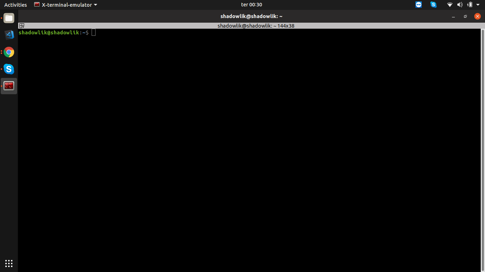
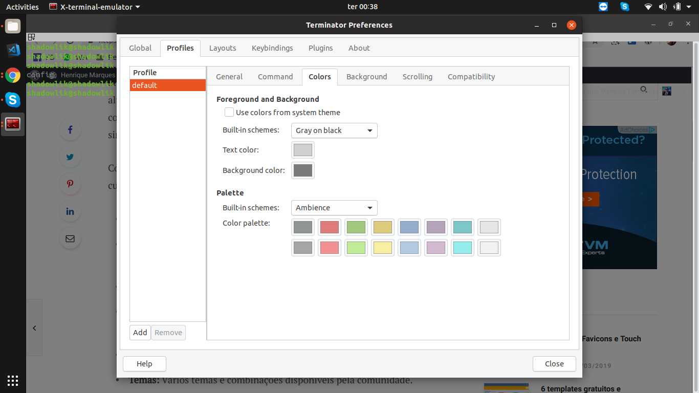

Si usted está cansado de su chusma terminal en linux; Cansado de dar alt + pestaña entre los terminales en el mismo proyecto; Cansado de perderse al intentar pegar un comando; Conozca **[Terminator](https://terminator-gtk3.readthedocs.io/en/latest/),** un [emulador de terminal](https://en.wikipedia.org/wiki/Terminal_emulator) más robusto, organizado y personalizable:

-   **Múltiples pestaña**s: Múltiples pestañas de terminal en la misma ventana.
-   **Cuadrícula de termina**les: Divida una pestaña en varios terminales, horizontal y vertical.
-   **Registros automáticos: g**uarde los registros de sesión automáticamente por parte de los usuarios.
-   **Arrastrar y so**ltar: Arrastra y suelta texto, URLs y comandos directamente en el terminal.
-   **Examinar**: Busque y resalte textos mediante expresiones Regex.
-   **Temas:** Varios temas y combinaciones disponibles por la comunidad.
-   **Y mucho más...**

-   
    
-   
    
-   
    
-   
    
-   
    

## Instalación de Terminator

Terminator se puede instalar fácilmente utilizando el administrador de paquetes en la mayoría de las distribuciones linux.

### Debian/Ubuntu

$ sudo add-apt-repository ppa:gnome-terminator
$sudo actualización apt-get
$sudo terminador de instalación apt-get

### Fedora

terminador de instalación dnf de $sudo

### CentOS/RHEL

terminador de instalación yum de $sudo

## Instalación de temas

Puede instalar o crear su propio tema en Terminator. Ve al [enlace](https://github.com/mbadolato/iTerm2-Color-Schemes) y elige el tema que más te guste, abre el archivo ".config" del tema deseado y copia tu contenido. Después de eso, haga clic con el botón derecho en Terminator, navegue a las preferencias y cree un nuevo perfil para generar un nuevo archivo de tema, vaya a .config/terminator/ y edite el archivo para el nuevo perfil creado y pegue el contenido del tema al final.

## Métodos abreviados de teclado

Una lista de los accesos directos predeterminados y más utilizados en Terminator:

-   `**F11**` : Alterna en pantalla completa.
-   `**Ctrl+Mayús+O**` : Divide la pestaña en terminales horizontales.
-   `**Ctrl+Mayús+E**` : Divide la pestaña en terminales verticales.
-   `**Ctrl+Mayús+W**` : Cierra el terminal activo.
-   `**Ctrl+Mayús+T**` : Abre una nueva pestaña.
-   `**Mayús+Ctrl+s :**` Muestra/oculta la barra de desplazamiento.
-   `**Ctrl+Mayús**`+f : Busca texto en el terminal activo.
-   `**Ctrl+Mayús+R**` : Borra el terminal activo.
-   `**Super+g**` : Agrupa todos los terminales en una sola pestaña.
-   `**Ctrl+Mayús+q**` : Sale del terminador, cerrando todas las pestañas.
