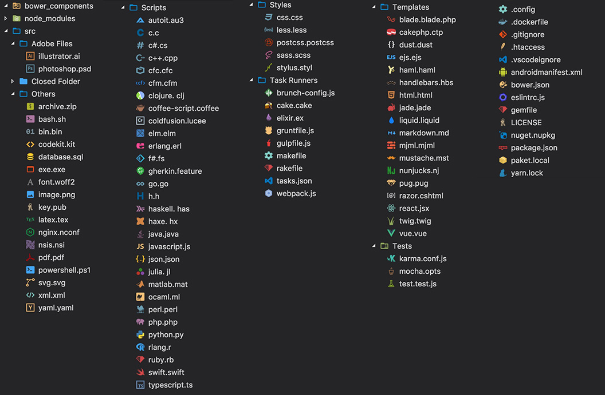
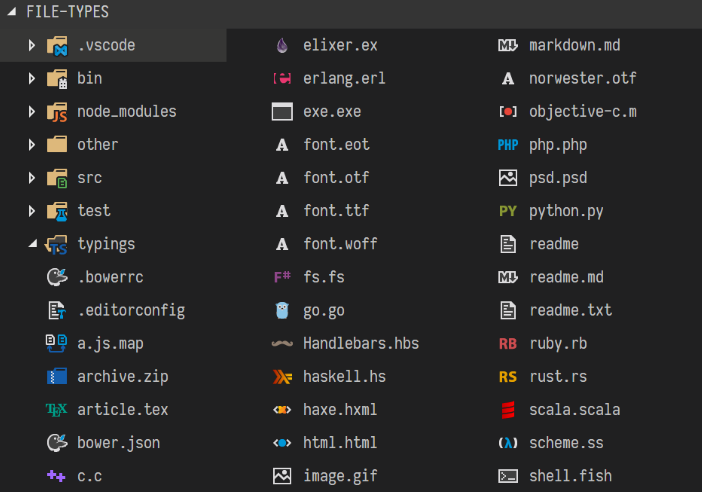

¿Cansado de ese tedioso y feo paquete de iconos de su código VS? Echa un vistazo a una lista de los mejores paquetes para personalizar los iconos de archivos y carpetas en su VS Code!

***También echa un v**is[tazo: Top 6 temas para usar en VS Code](http://marquesfernandes.com/2019/03/19/top-6-temas-para-usar-no-vs-code-em-2019)*

## [Tema del icono del material](https://marketplace.visualstudio.com/items?itemName=PKief.material-icon-theme)

**Instalacione**s: +2.5 mill  
**ionStars:** 4.9

[Material Icon Theme](https://marketplace.visualstudio.com/items?itemName=PKief.material-icon-theme) es el paquete de iconos que más me gusta y uso, tiene una amplia selección de iconos propietarios además de identificar y personalizar varias carpetas predeterminadas, como la carpeta "src/".

## [vscode-iconos](https://marketplace.visualstudio.com/items?itemName=vscode-icons-team.vscode-icons)

**Instalaciones**: +3.7 millo  
**nesStars:** 4.8

vscode-icons es el paquete más descargado, con más de 3,7 millones de descargas y 341 estrellas, tiene una amplia variedad de iconos.

## [VSCode Grandes Iconos](https://marketplace.visualstudio.com/items?itemName=emmanuelbeziat.vscode-great-icons)

**Instalacione**s: +560,  
**000Stars:** 4.9

VSCode Great Icons tiene más de 100 iconos diferentes, en el top 3 paquetes más descargados es una buena alternativa a sus iconos!

## [Nomo Dark Icon Theme](https://marketplace.visualstudio.com/items?itemName=be5invis.vscode-icontheme-nomo-dark)

**Instalacione**s: +117,  
**000Stars:** 4.8

[Nomo Dark Icon Them](https://marketplace.visualstudio.com/items?itemName=be5invis.vscode-icontheme-nomo-dark)e no es tan famoso como los otros, pero su estilo de iconos agrada mucho.

## [Tema de icono neutral agudo](https://marketplace.visualstudio.com/items?itemName=keenethics.keen-neutral-icon-theme)

**Instalacion**es: +7,4  
**00Stars:** 5

[El tema de icono neutro agu](https://marketplace.visualstudio.com/items?itemName=keenethics.keen-neutral-icon-theme)do es un tema de icono minimalista, ideal para aquellos que disfrutan de golpes y objetivos limpios.
