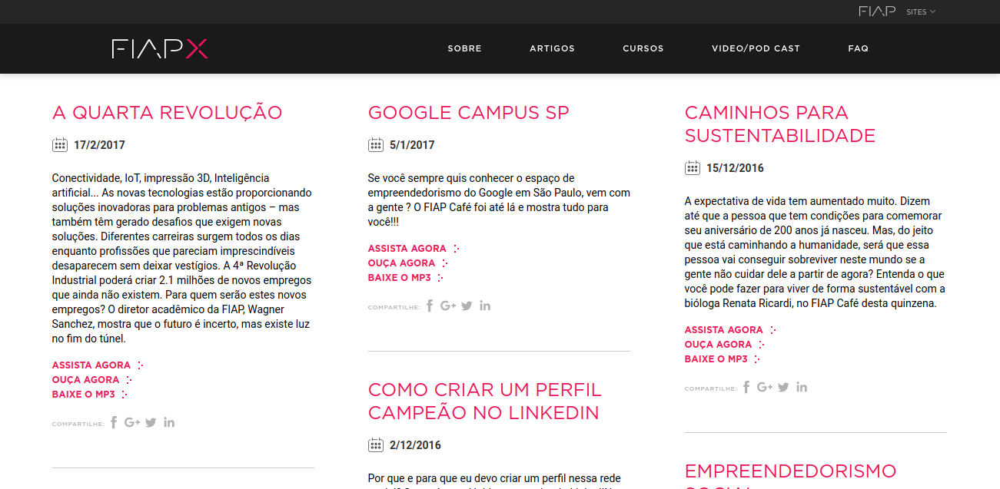

Os Podcasts vem ganhando muita popularidade nos últimos tempos e tomando conta da rotina diária dos brasileiros. Podcasts são uma evolução do rádio, alinhando tecnologia e praticidade, se tornaram o meio perfeito para ficar antenado ou até mesmo pra relaxar nos mais diversos assuntos. Durante o trânsito, se exercitando ou até mesmo trabalhando, um oceano de conteúdo apenas a um fone de ouvido de distância, o podcast é uma ótima opção para otimizar seu tempo e se manter informado.

Eu tenho uma certa dificuldade para encontrar novos conteúdos, mesmo no [Spotify](https://open.spotify.com/user/12142144766?si=3pJxPV5oTj-Ox5eueBglDw), e por isso separei uma lista com todos os canais que costumo escutar, desde os mais técnicos focados em desenvolvimento e inovação, até conteúdos de desenvolvimento pessoal e do mundo corporativo. Se você gosta de se manter antenado nas novidades do mercado não perca essa lista!

*Manterei esta lista atualizada e colocarei aos poucos minha opinião sobre todos os canais listados. Lembrando que estou sempre buscando novos conteúdos então, por favor, deixe sua sugestão nos comentário*s!

**Confira também:** [Top aplicativos para organizar suas listas de tarefas – ToDo](http://marquesfernandes.com/2020/01/26/top-aplicativos-para-organizar-suas-listas-de-tarefas-todo)

Atalho :: Sumário

-   [Hipster Ponto Tech](#hipster-ponto-tech)
-   [Loop Matinal](#loop-matinal)
-   [Braincast](#braincast)
-   [Dentro do Ringue](#dentro-do-ringue)
-   [Canal Tech](#canal-tech)
-   [Tecnocast](#tecnocast)
-   [DEVNAESTRADA](#devnaestrada)
-   [Lambda3](#lambda3)
-   [PodProgramar](#podprogramar)
-   [Cabeça de Labs](#cabe%C3%A7a-de-labs)
-   [Naruhodo](#naruhodo)
-   [FIAP Café](#fiap-caf%C3%A9)
-   [Podcasts em Inglês](#podcasts-em-ingl%C3%AAs)

-   [Modern CTO](#modern-cto)
-   [Wired](#wired)
-   [The Changelog](#the-changelog)
-   [UX Podcast](#ux-podcast)
-   [The Longcut](#the-longcut)
-   [Mind & Machine: Future Tech + Futurist](#mind-amp%3B-machine-future-tech-futurist)
-   [Fintech Insider](#fintech-insider)
-   [The Twenty Minute VC](#the-twenty-minute-vc)
-   [TechStuff](#techstuff)
-   [The Future of Everything](#the-future-of-everything)
-   [The Vergecast](#the-vergecast)

## [Hipster Ponto Tech](https://open.spotify.com/show/2p0Vx75OmfsXktyLBuLuSf)

https://open.spotify.com/show/2p0Vx75OmfsXktyLBuLuSf?si=pZrw5P1WQCK9TmgVa9vqiw

O Hipsters Ponto Tech é o podcast onde o pessoal da [Caelum](http://www.caelum.com.br/) e da [Alura](http://www.alura.com.br/) entra em discussões acaloradas sobre programação, design, ux, gadgets, startups e as últimas modinhas em tecnologia.

## [Loop Matinal](https://loopmatinal.com)

https://open.spotify.com/show/4sKgJqaCEQdUECeCViknr5?si=U-xz2GVlSTOHGERYuxat9Q

O Loop Matinal é um podcast do Loop Infinito que traz as notícias mais importantes do mundo da tecnologia para quem não tem tempo de ler sites e blogs de tecnologia. Marcus Mendes apresenta um resumo rápido e conciso das notícias mais importantes, sempre com bom-humor e um toque de acidez.

## [Braincast](https://www.b9.com.br/podcasts/braincast/)

https://open.spotify.com/show/0LvIvCZfntBuZOpOEhTU0K?si=rmx5jrOCQMqrvSX8uc49-w

*Braincast* é o podcast do B9.com.br, que debate a intersecção entre a criatividade, tecnologia, cultura digital, inovação e negócios.

## [Dentro do Ringue](https://podcast.vindi.com.br/)

https://open.spotify.com/show/5g2pJ4ojTp90f8HccAa0NL

Podcast *Dentro do Ringue* - Startups e tecnologia. O podcast oficial da *Vindi*, plataforma de pagamentos online líder na Economia da Recorrência.

## [Canal Tech](https://canaltech.com.br/podcast/podcast-canaltech/)

https://open.spotify.com/show/0LS0nKZRq1Ot94PLqw1CXE?si=Xc7vyf8aSYykT31H6jxwug

Com o Canaltech News, em pouco mais de 5 minutos você fica por dentro dos produtos lançados do mercado, da movimentação das principais empresas do segmento, novidades das redes sociais, curiosidades, cultura geek, e muito mais.

## [Tecnocast](https://tecnoblog.net/categoria/podcast/)

https://open.spotify.com/show/084hQAwpMi4PcidWPsO2fY?si=QohVLp2TR5K5U40I6Nx6Cw

Tecnologia, negócios, inovação e futuro. No Tecnocast gostamos de conversar não sobre especificações técnicas, mas sobre como a tecnologia está mudando a forma como vivemos e nos relacionamos com o mundo ao nosso redor. Tecnocast – o podcast de tecnologia do Tecnoblog.

## [DEVNAESTRADA](https://devnaestrada.com.br/)

https://open.spotify.com/show/1yQ2qrscxoTmdUvZgMoY4a?si=tYde9HExSwqoxsArERxbEA

Toda sexta-feira um novo episódio sobre tecnologias, entrevistas com profissionais na área, tudo com muito humor e alegria.

## [Lambda3](https://www.lambda3.com.br/lambda3-podcast/)

https://open.spotify.com/show/3JaY0FNeylfy86nFG8qbfi?si=NIx86OxPRsyNMPD3r2CGXA

A Lambda3 é uma empresa de consultoria em processos de produção, treinamento e desenvolvimento de softwares focada em conceitos e metodologias ágeis, buscando o máximo de retorno sobre o investimento do cliente.

## [PodProgramar](https://podprogramar.com.br/)

https://open.spotify.com/show/16ZtU9p6Pja5H87W35owjY?si=bmtIYxf5Q0OT5ohOWIZEZQ

Podcast apresentado por desenvolvedoras focado em programação, notícias e histórias, tudo com o toque feminino numa área dominada por homens.

## [Cabeça de Labs](https://www.cabecadelab.com.br/)

https://open.spotify.com/show/6jYjcj4oQ31J85jGhbiRkK?si=2gcL7Ha7RdGxatndCOHpxw

*Cabeça de Lab* é o podcast do LuizaLabs, o laboratório de inovação e tecnologia do Magalu.

## [Naruhodo](https://open.spotify.com/show/1EAAAOIGupWaGwidmMTTi0)

https://open.spotify.com/show/1EAAAOIGupWaGwidmMTTi0

Naruhodo! é o podcast pra quem tem fome de aprender. Ciência, senso comum, curiosidades, desafios e muito mais. Com o leigo curioso, Ken Fujioka, e o cientista PhD, Altay de Souza.

## [FIAP Café](https://www.fiap.com.br/fiapx/podcast)

O podcast FIAP Café é um bate-papo no qual, a cada quinze dias, um profissional altamente especializado é convidado para falar sobre as últimas novidades em tecnologia, ciência, empreendedorismo e inovação.

## Podcasts em Inglês

Que o mundo da tecnologia é dominado pelo inglês não é nenhuma novidade, e na podosfera não poderia ser diferente. Com muito conteúdo de qualidade disponível em inglês, vale a pena dar uma conferida também no que os gringos estão falando.

### [Modern CTO](https://moderncto.io/)

https://open.spotify.com/show/62mwuSUjmcRQ9KAsPlkrKT?si=5UdvYohPSZWJO3wuJKDcxg

ModernCTO é o lugar onde os CTOs passam o tempo. Ouça nosso podcast semanal enquanto participamos de interessantes CTOs da Fortune 500 nos setores aeroespacial, inteligência artificial, robótica e muito mais. Temos 72k ouvintes, somos incrivelmente gratos a todos e cada um de vocês.

### [Wired](https://www.wired.co.uk/podcasts)

https://open.spotify.com/show/0SH5lhsW8vV6OgmrXRQXAD?si=zfIpHBolQhi0BZqrp1HMpQ

O premiado WIRED UK Podcast com James Temperton e o resto da equipe. Ouça todas as semanas um resumo informado e divertido das últimas notícias sobre tecnologia, ciência, negócios e cultura. Novos episódios toda sexta-feira.

### [The Changelog](https://changelog.com/podcast)

https://open.spotify.com/show/5bBki72YeKSLUqyD94qsuJ?si=G-KRyhY9QJSPlgIPUOoQ9A

Conversas com hackers, líderes e inovadores do desenvolvimento de software.

### [UX Podcast](https://uxpodcast.com/)

https://open.spotify.com/show/0eFh7xIEdxgSV8ymW0I1Qz?si=JQTt\_j9DQXm0Gc0vvmG3GQ

O UXPodcast™ é um podcast de design digital duas vezes por mês, que compartilha idéias sobre negócios, tecnologia e pessoas desde 2011. Queremos ampliar os limites de como a experiência do usuário é percebida e aumentar sua confiança no trabalho que você faz.

### [The Longcut](https://thelongcut.fm/)

https://open.spotify.com/show/6i0Cr3VgOSpN7lMZHV9eJR?si=BOJ04R6KSmuuXD976ZYMoA

O Longcut quebra a ilusão do sucesso da noite para o dia compartilhando as histórias daqueles que criaram, lançaram e cresceram com sucesso empresas de software para resolver um problema. No mundo ferozmente competitivo do SaaS, Ryan apresenta as mentes brilhantes por trás dos negócios que admiramos. Você ouvirá perigos e armadilhas, histórias de sucesso impressionante, conversas francas e o que impulsiona esses proprietários, empreendedores e inovadores. Os principais temas que exploraremos incluem a validação do produto, obtenção de seus primeiros clientes, quanto de MVP a desenvolver, como saber quando vale a pena seguir uma idéia, como administrar uma empresa SaaS, idéias táticas para criar um MVP, o que fazer se você não tiver um cofundador técnico e outras perguntas relacionadas ao SaaS. Se você gosta de Akimbo de Seth Godin, Tropical MBA, SaaStr, Startups para o resto de nós, Retrabalho ou Chat de inicialização, você adorará The Longcut

### [Mind & Machine: Future Tech + Futurist](https://www.mindandmachine.io/)

https://open.spotify.com/show/49pMjBuQRYiAI06jXHAL6V?si=D-9gk\_IpSHqGLU9gnGK0ow

O MIND & MACHINE é um programa semanal de entrevistas com pessoas na vanguarda das tecnologias transformacionais, pesquisas científicas e novas idéias ousadas que permitem que os humanos funcionem em níveis mais altos - mais capazes de alcançar o que cada pessoa valoriza na vida.

### [Fintech Insider](https://fi.11fs.com/)

https://open.spotify.com/show/1rlLsh2Ekm1fOQJWvp0uIi?si=Z4LvLXT8QA6tJ1dJZIqrgQ

O Fintech Insider by 11: FS é um podcast quinzenal dedicado a todos os serviços fintech, bancário, tecnológico e financeiro. Hospedados por uma rodada de especialistas do 11: FS, incluindo David Brear, Simon Taylor, Jason Bates, Leda Glyptis e Sarah Kocianski e reunidos semanalmente por uma variedade de convidados fantásticos, eles discutem as últimas notícias, desenvolvimentos e tendências do setor.

### [The Twenty Minute VC](http://www.thetwentyminutevc.com/)

https://open.spotify.com/show/3j2KMcZTtgTNBKwtZBMHvl?si=QEHUOYLoQRmR8gWriLVcyw

  
O Twenty Minute VC leva você ao mundo do capital de risco, financiamento de startups e The Pitch. Junte-se ao nosso anfitrião, Harry Stebbings e descubra como você pode obter financiamento para seus negócios, ouvindo o que os investidores mais proeminentes estão procurando diretamente em startups, fornecendo dicas e truques facilmente acionáveis que podem ser implementados para aumentar suas chances de ser financiado.

### [TechStuff](https://open.spotify.com/show/57wZcoxW8oNs5Mq7WZfTs7)

https://open.spotify.com/show/57wZcoxW8oNs5Mq7WZfTs7?si=vWOJp4dIRd2QXHO0r7R0UQ

TechStuff é um programa sobre tecnologia. E não é apenas como a tecnologia funciona. Junte-se ao anfitrião Jonathan Strickland como ele explora as pessoas por trás da tecnologia, as empresas que a comercializam e como a tecnologia afeta nossas vidas e cultura.

### [The Future of Everything](https://open.spotify.com/show/2KICk2MxwEn9csPnvDQt6Q)

https://open.spotify.com/show/2KICk2MxwEn9csPnvDQt6Q?si=P-UlPwupR1qxPtVb2Bm2TQ

Descubra o que vem a seguir com este olhar aprofundado sobre como a ciência e a tecnologia estão revolucionando a maneira como vivemos, trabalhamos e nos divertimos. Junte-se à nossa equipe premiada de jornalistas enquanto cruzamos o país para entrevistar os líderes e luminares que estão remodelando nosso mundo.

### [The Vergecast](https://www.theverge.com/podcasts)

https://open.spotify.com/show/08zQP2peZmM9GrcKShLZvC?si=862fAbNuTIeCR\_HInkr4Gw

Apresentado por Nilay Patel, Dieter Bohn e Paul Miller, com participações do restante da diversificada e abrangente equipe do The Verge, o Vergecast é o único programa que você precisa para entender a semana em notícias de tecnologia.
