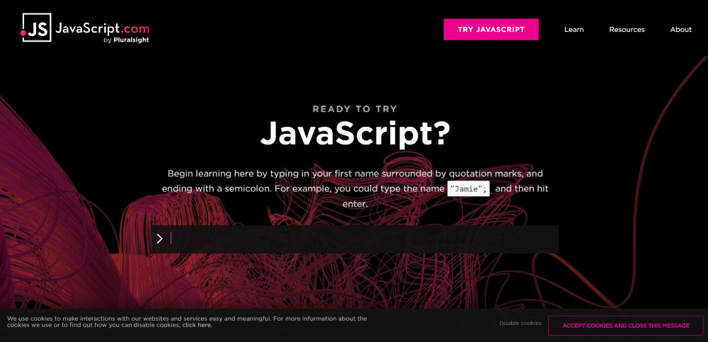
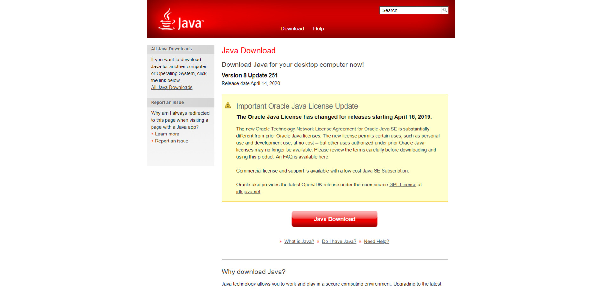
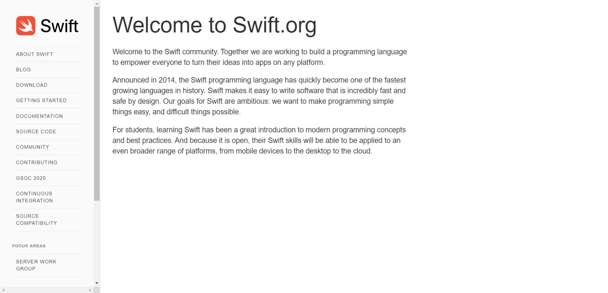

Esa es una pregunta que a menudo recibo de personas que están empezando o pensando en migrar al mundo del desarrollo. Esta pregunta no es fácil de responder, hay varias variables que pueden cambiar la respuesta, sé que eso no es lo que te gustaría estar leyendo. Las preguntas personales, tanto las que preguntan como las respuestas, pueden cambiar la respuesta. Asumo que la mayoría de los lectores son personas que están entrando o entrando en el mercado de la tecnología, más específicamente en el desarrollo. Con esto en mente, sabemos que la curva de aprendizaje es probablemente uno de los factores más importantes, seguido de la compensación y el número de vacantes disponibles. En la siguiente lista explicaré por qué elegí idiomas y qué personalmente me hacen creer que son las ideas para que empieces a aprender.

## Diagrama de flujo: Qué idioma aprender primero

Durante mi búsqueda de otras fuentes y opiniones, me encontré con un diagrama de flujo muy interesante que ayuda a decidir qué idioma elegir. Tiene puntos de partida y preguntas basadas exactamente en cuestiones personales, que pueden interferir con su decisión. Desafortunadamente está en inglés, voy a tratar de traducir al portugués pronto.

Créditos: [carlcheo](http://carlcheo.com/startcoding)

## Qué lenguajes de programación aprender primero

Bueno, no más estancamiento, vamos a la lista de lenguajes de programación que creo que deberías elegir como tu primer idioma. Como referencia, usaré dos encuestas de popularidad de idiomas, PY[PL y](http://pypl.github.io/PYPL.html) St[ack Overflow Insights (OS)](https://insights.stackoverflow.com/survey/2019#most-popular-technologies).

### 1\. [Javascript](http://marquesfernandes.com/javascript-o-que-e-como-funciona-e-para-que-serve/), [HTML](http://marquesfernandes.com/o-que-e-html-e-para-que-serve/) y [CSS](http://marquesfernandes.com/o-que-e-css-e-para-que-serve/)

-   *Popularidad (PYPL): **#3***
-   *Popularidad (SO): **#1***
-   *Most loved (OS): **#11***
-   *[Sueldo medio: R$ 5500](https://neuvoo.com.br/salario/?job=Programador+Javascript#:~:text=O%20sal%C3%A1rio%20m%C3%A9dio%20de%20Programador%20Javascript%20em%20Brasil%20%C3%A9%20de,a%20ganhar%20R%2499.006%20anuais.)*

Me gusta especialmente aprender cosas nuevas que tienen un retorno visual práctico, por lo que mi recomendación siempre sería comenzar por Frontend, aprender HTML, CSS y JavaScript. Debido a que es un lenguaje que desarrolla aspectos visuales más comunes a un principiante (páginas web), creo que esta retroalimentación visual alienta y motiva a más a los que están empezando en este mundo. JavaScript, o JS para lo íntimo, es un lenguaje que comenzó a ser utilizado en los navegadores, para dar dinamismo a las páginas web, y hoy en día, se utiliza para crear aplicaciones web, aplicaciones móviles y más.

El mercado laboral también está bien calentado para este lenguaje, ya que es un lenguaje con aplicaciones diversificadas, ya sea en el frontend, backend, desarrollo móvil e incluso IoT, su campo de operación se vuelve muy completo y con más oportunidades.

http://marquesfernandes.com/como-e-onde-aprender-a-programar-javascript-cursos-e-tutoriais-gratuitos/

### 2\. [Python](https://www.python.org/)

-   *Popularidad (PYPL): **#**1*
-   *Popularidad (SO): **#**4*
-   *Most loved (OS): **#**2*
-   *[Sueldo medio: R$ 3500](https://neuvoo.com.br/salario/?job=Programador+Python)*

Python es un lenguaje que ha vuelto a ser popular en los últimos años gracias a la evolución y difusión del campo de la ciencia de datos y la inteligencia artificial.

Python es un lenguaje versátil, potente y de propósito general. Se puede utilizar para casi cualquier cosa, desde el desarrollo web a los juegos, por lo que muchas personas lo eligen como su primer idioma.  
Si solo tienes curiosidad por el desarrollo, puedes empezar con Python. Es muy fácil de aprender. Sus paquetes y bibliotecas facilitan el trabajo con grandes cantidades de datos. Puede crear visualizaciones con Matplotlib, analizar datos tabulares con Numpy y Pandas ... y así sucesivamente.  
Python tiene documentación sólida. Si hay algo que necesitas buscar, puedes encontrar la respuesta rápidamente. Esta es una consideración importante para aquellos que están aprendiendo de forma independiente.

Tiene mucho mercado laboral, y con la creciente demanda de científicos de datos la tendencia es el crecimiento de este lenguaje.

### 3\. [Java](https://www.java.com/en/download/)

-   *Popularidad (PYPL): **#**2*
-   *Popularidad (SO): **#**5*
-   *Most loved (OS): **#**18*
-   *[Sueldo medio: R$ 4500](https://neuvoo.com.br/salario/?job=Programador+java)*

Si quieres crear aplicaciones Android, Java es tu idioma. También se puede utilizar para aplicaciones web, de escritorio e incluso juegos. Java solía ser uno de los idiomas más enseñados en las facultades de ciencias de la computación, pero Python ha estado superando en los últimos años. Java sigue siendo bastante popular, pero Python y Javascript son sin duda más fáciles de aprender.

En Brasil hay una demanda descabellada para los desarrolladores de Java, las empresas más consolidadas y antiguas suelen tener aplicaciones heredadas que necesitan mantenimiento.

### 4\. [Php](http://marquesfernandes.com/o-que-e-php-e-para-que-serve/)

-   *Popularidad (PYPL): **#**6*
-   *Popularidad (SO): **#**8*
-   *Most loved (OS): **#**24*
-   *[Sueldo medio: R$ 3000](https://neuvoo.com.br/salario/?job=Programador+Php)*

PHP es un lenguaje de scripting y es algo subestimado (por una buena razón), pero teniendo en cuenta el hecho de que el 80% de la web es impulsada por PHP, incluyendo este blog.

Puedes hacer mucho con PHP. Parece un lenguaje extraño recomendar como el primero, porque probablemente no será suficiente para satisfacer todas sus necesidades de programación. PHP tiene sus limitaciones, pero en realidad es muy fácil para un principiante aprender y probablemente en algún momento cruzará su camino con Javascript, HTML y CSS.

http://marquesfernandes.com/como-e-onde-aprender-a-programar-php-cursos-e-tutoriais-gratuitos/

### 5\. [veloz](https://swift.org/)

-   *Popularidad (PYPL): **#**9*
-   *Popularidad (SO): **#**16*
-   *Most loved (OS): **#**6*
-   *[Sueldo medio: R$ 6500](https://neuvoo.com.br/salario/?job=Programador+ios)*

Si quieres ser desarrollador de iOS, tendrás que aprender el idioma de Swift. Swift es un lenguaje relativamente nuevo, pero es extremadamente fácil de aprender, incluso enseñando a los niños, fue creado literalmente para el desarrollo de aplicaciones iOS. Y como era de esperar, como todo de Apple es caro, es uno de los idiomas con el salario promedio más alto del mercado.

* * *

**Referencias:  
**[https://medium.com/coding-in-simple-english/which-programming-language-should-i-learn-dddee919edb6](https://medium.com/coding-in-simple-english/which-programming-language-should-i-learn-dddee919edb6)  
[https://www.freecodecamp.org/news/what-programming-language-should-i-learn-first-19a33b0a467d/](https://www.freecodecamp.org/news/what-programming-language-should-i-learn-first-19a33b0a467d/)  
[https://towardsdatascience.com/top-10-in-demand -programming-languages-to-learn-in-2020-4462eb7d8d3](https://towardsdatascience.com/top-10-in-demand-programming-languages-to-learn-in-2020-4462eb7d8d3e)  
[ehttps://www.fullstackacademy.com/blog/nine-best-programming-languages-to-lear](https://www.fullstackacademy.com/blog/nine-best-programming-languages-to-learn)  
[nhttps://insights.stackoverflow.com/survey/2019-most-popular-technologie](https://insights.stackoverflow.com/survey/2019#most-popular-technologies)  
[shttp://pypl.github.io/PYPL.html](http://pypl.github.io/PYPL.html)
