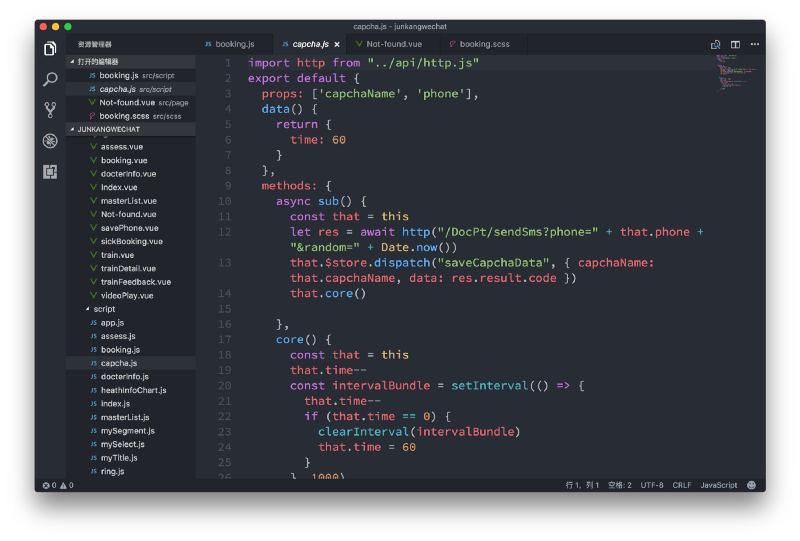
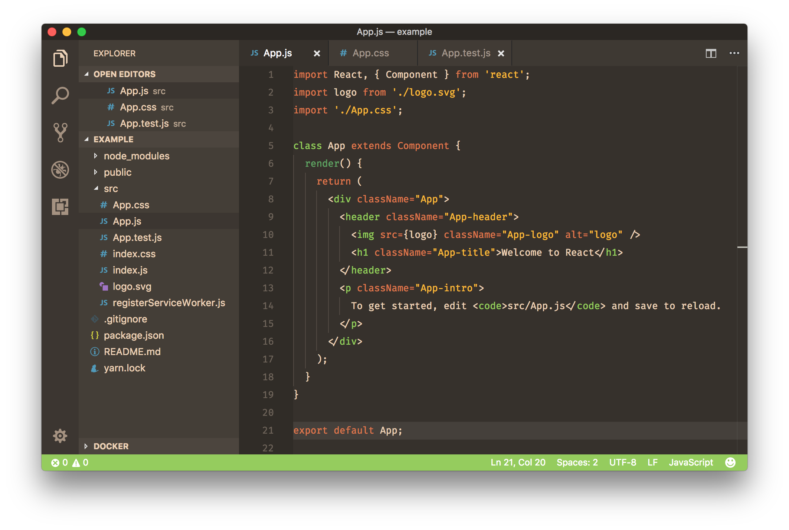
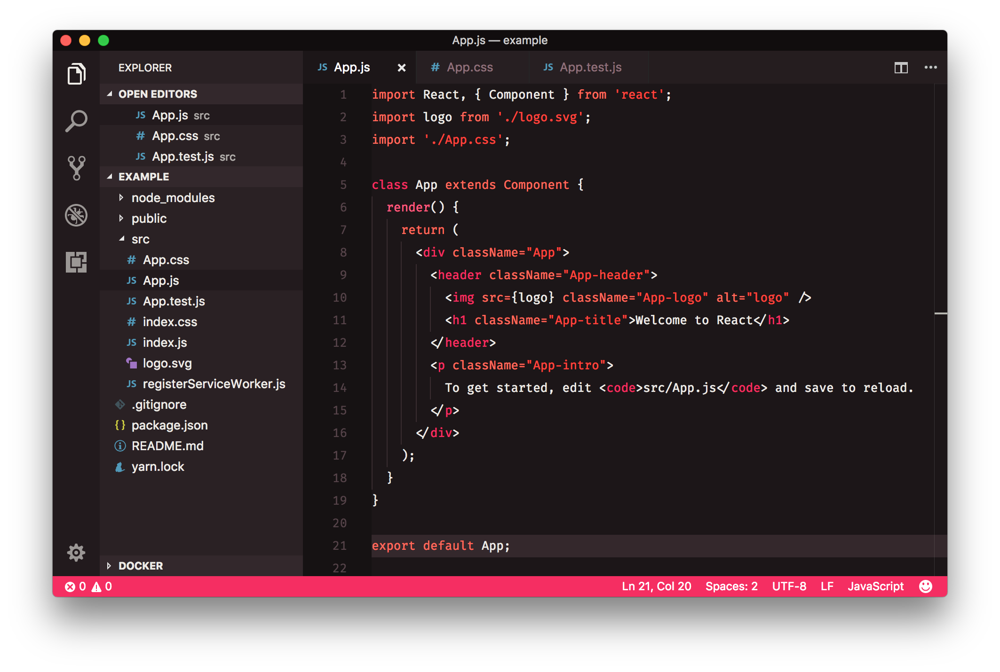
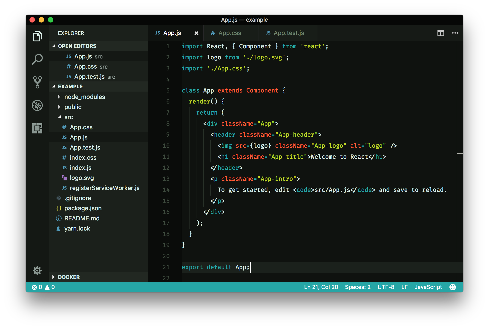
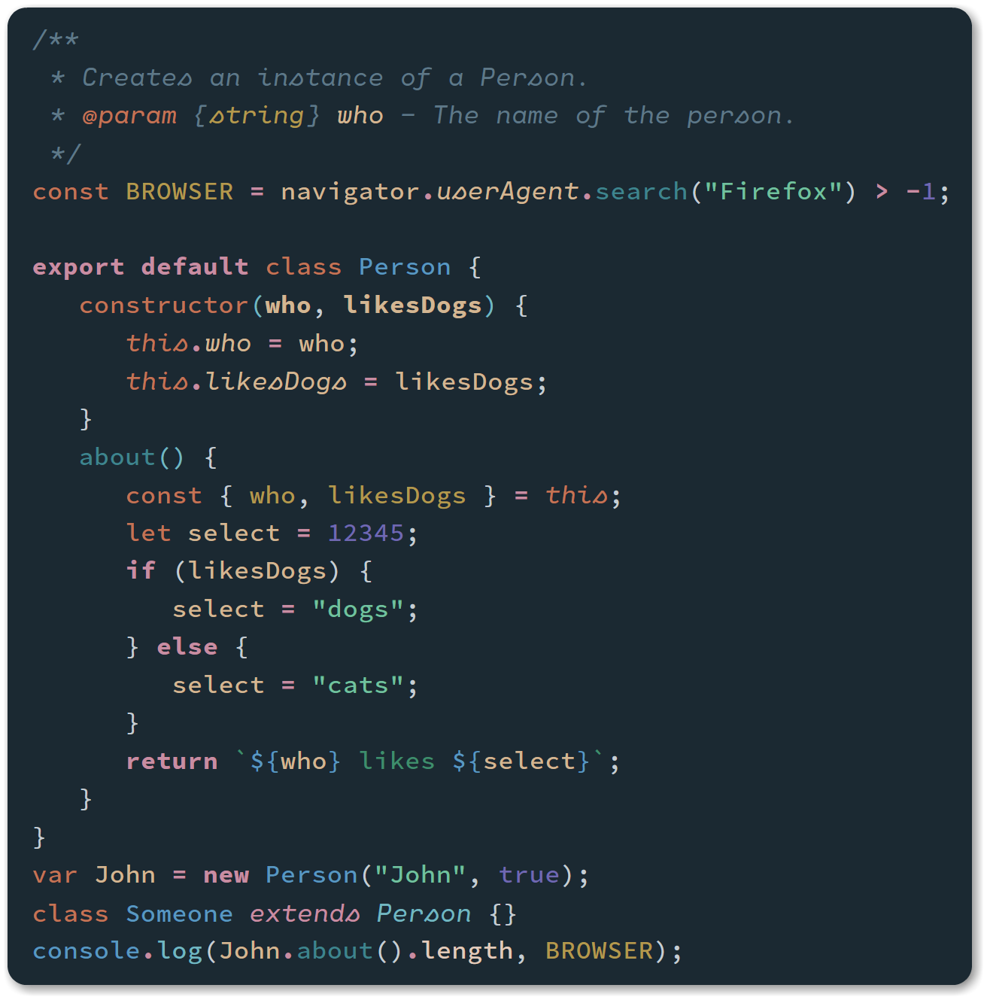

[VS Code](https://code.visualstudio.com/) é meu editor queridinho da vez: Open source, cross-platform, leve, altamente customizável e com uma comunidade incrível. Se você ainda não experimentou, experimente!

***Confira também:*** [*Pacotes de Ícones para VS Code*](http://marquesfernandes.com/2019/10/07/pacotes-de-icones-para-vs-code-2019)

Separei uma lista com 6 temas que já usei e aprovei:

## [0\. Night Owl](https://marketplace.visualstudio.com/items?itemName=sdras.night-owl)

Um dos queridinhos da comunidade, o tema Nigh Owl foi desenvolvido pela [Sarah Drasner](https://github.com/sdras) e possuí cores otimizadas para quem gosta de trabalhar no escuro.

## [1\. Dracula](https://marketplace.visualstudio.com/items?itemName=dracula-theme.theme-dracula)

Outro queridinho da comunidade e atualmente o meu tema de escolha. Um tema escuro com combinações e contrastes fortes porém agradáveis. Possuí pacotes para quase todas as IDEs de mercado além de estar disponível também para terminais, aplicativo de mensagens e muito mais.

## [2\. One Dark Pro](https://marketplace.visualstudio.com/items?itemName=zhuangtongfa.Material-theme)

Para aqueles que estão migrando do [Atom,](https://ide.atom.io/) One Dark Pro te fará sentir em casa.

## [3\. Rainglow](https://marketplace.visualstudio.com/items?itemName=daylerees.rainglow)

Se você procura variedade, **Rainglow** é a sua escolha: Uma coletânea com 320+ temas de combinações de cores.

-   
    
-   
    
-   
    
-   
    

## [4\. Noctis](https://marketplace.visualstudio.com/items?itemName=liviuschera.noctis)

Com combinações suave esse é um tema para quem busca descansar os olhos. Possui variações claras e escuras.

-   
    
-   
    

## [5\. One Monokai Theme](https://marketplace.visualstudio.com/items?itemName=azemoh.one-monokai)

[Joshua Azemoh](https://github.com/azemoh) resolveu cruzar seu tema One Dark Pro com o tema [Monokai](https://www.monokai.pro/), dando vida ao One Monokai Theme.

## [6\. Monokai Pro](https://marketplace.visualstudio.com/items?itemName=monokai.theme-monokai-pro-vscode)

[Monokai Pro](https://marketplace.visualstudio.com/items?itemName=monokai.theme-monokai-pro-vscode) é um esquema de cores, interface customizada e também uma coleção bem completa de ícones para o Visual Studio Code.

## [7\. Shades of Purple](https://marketplace.visualstudio.com/items?itemName=ahmadawais.shades-of-purple)

Um tema profissional com diversos e vibrantes tons de roxo escolhidos a dedo para o seu editor e terminal VS Code.

