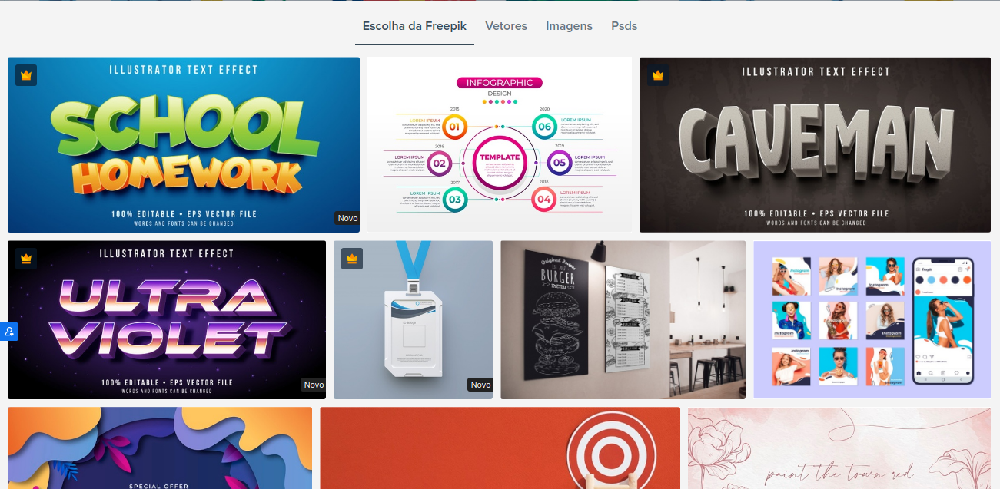
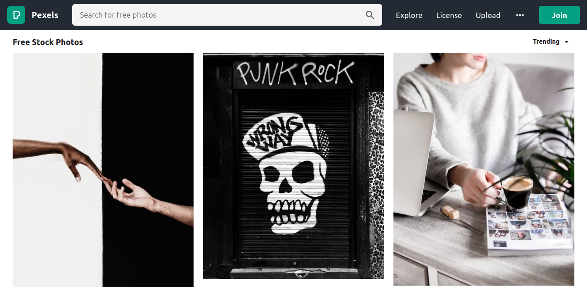
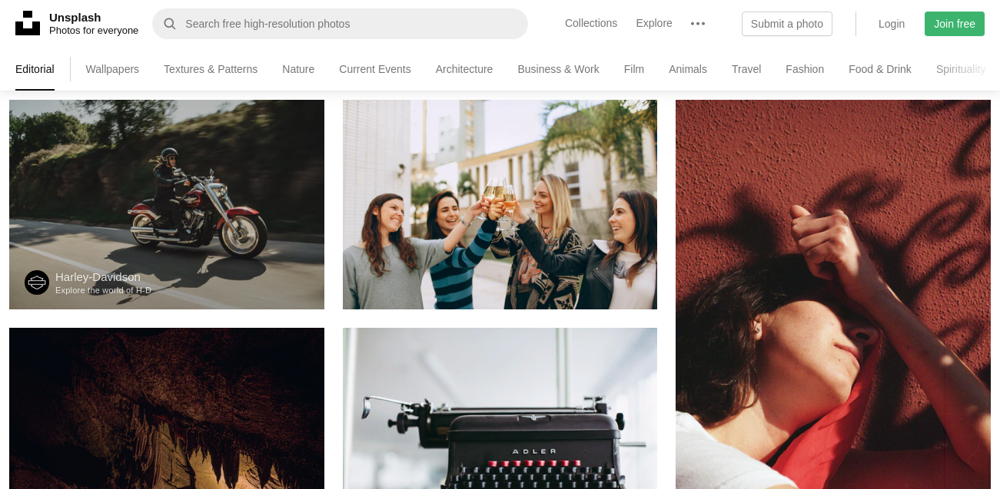
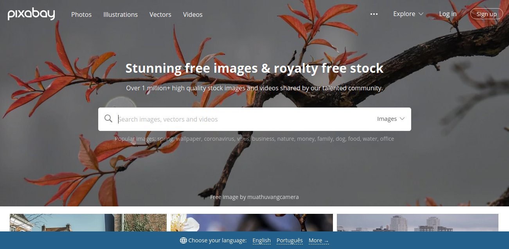
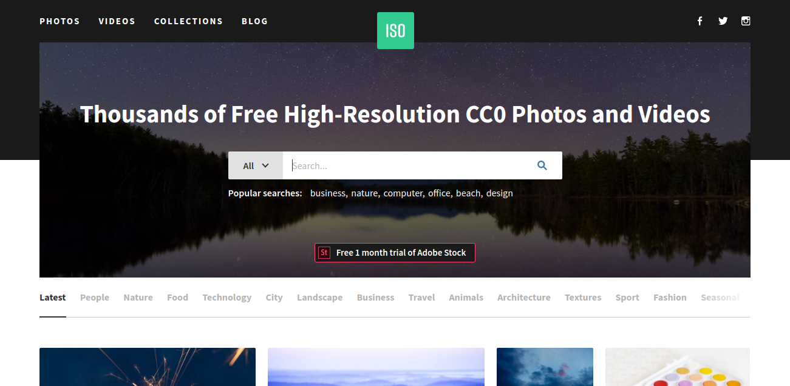

Si usted ~ti~ene el hábito de tomar imágenes de Google, despreocupado con los derechos de autor o cualquier riesgo de imagen, tengo malas noticias: Recientemente pasé por una situación en la que una empres[a especializada en derechos de autor de imagen s](https://picrights.com/)e puso en contacto conmigo con respecto a una imagen de un cliente de ellos, además de la notificación para la retirada, para mi sorpresa adjunta fue un resguardo bancario con un "fino" para evitar cualquier proceso en la corte.

Lo peor es que son más que seguros, hay un trabajo detrás de buenas fotos y no debemos hacer mal uso de estas imágenes, sino como un buen servidor de Internet, donde todo parece gratis, nunca se había detenido a pensar lo equivocado que estaba siendo. Así que si usted tiene un blog o ejecutar algún sitio web corporativo o personal, estar atento! Incluso con bajo acceso se encuentra en el punto de mira de estas empresas, la evolución de los bots y las técnicas de reconocimiento de imágenes han traído en el punto de mira todos los sitios, pequeños o grandes.

Así que para evitar que tenga el mismo dolor de cabeza, separé una lista con los mejores sit**ios de imágenes** de **alta resolución gratuitos** que se pueden utilizar en silencio. Incluso en estos sitios vale la pena recordar que es importante que analice el modelo de licencia de la imagen, algunos pueden no permitir el uso comercial o cambios, por ejemplo.

En el pasado había un cierto prejuicio con el uso de famosas fotos **[de stock (s](https://support.99designs.com/hc/pt/articles/115004164106-O-que-%C3%A9-Stock-Image-ou-Banco-de-Imagens-)**tock de imágenes), con imágenes forzadas y modelos claramente gringos, limitado y mucho el uso de imágenes en nuestra vida cotidiana. Afortunadamente han estado surgiendo varios nuevos sitios, con imágenes en alta resolución y con una amplia gama de categorías. Echa un vistazo a continuación una lista de los **8 mejores sitio**s gratuitos con im**ágenes de alta re**solución para obtener su imagen perfecta:

## [1\. Freepik, Año Nuevo](https://br.freepik.com/)

[Freepik, Año Nuevo](https://br.freepik.com/)

Freepik entra en la parte superior de la lista por su versatilidad, utilizar mucho en la vida cotidiana tanto para buscar imágenes de alta calidad, iconos (y más iconos, tienen una gigantesca colección de iconos) y también plantillas PSD para que usted pueda crear escaparates!

## [2\. Pexels, Año Nuevo](https://www.pexels.com/)

[Pexels, Año Nuevo](https://www.pexels.com/)

Pexels ofrece fotos de alta calidad y completamente gratuitas bajo licencia Creative Commons Zero (CC0). Todas las fotos están bien categorizadas y su búsqueda funciona maravillosamente lo que hace que sea muy fácil encontrar la imagen perfecta.

## [3\. Unsplash, Año Nuevo](http://unsplash.com/)

[Unsplash, Año Nuevo](http://unsplash.com/)

Unsplash ofrece una gran colección de fotos gratuitas de alta resolución y se ha convertido en una de las mejores fuentes de imagen disponibles en la actualidad. En tu página de inicio encontrarás las mejores imágenes enviadas especialmente seleccionadas por el equipo de Unsplash. Todas las fotos se publican de forma gratuita bajo la licencia Unsplash.

## [4\. Pixabay](https://pixabay.com/)

[Pixabay](https://pixabay.com/)

Pixabay ofrece una gran colección de fotos, vectores e ilustraciones de arte gratis. Todas las fotos se publican bajo Creative Commons CC0.

## [5\. Sello](https://focastock.com/)

[Sello](https://focastock.com/)

Foca es una colección de fotos de alta resolución proporcionadas por Jeffrey Betts. Jeffrey se especializa en el espacio de trabajo y fotos de la naturaleza. Todas las fotos se publican bajo Creative Commons CC0.

## [6\. Picjumbo, Año Nuevo](http://picjumbo.com/)

[Picjumbo, Año Nuevo](http://picjumbo.com/)

Picjumbo es una colección de fotos completamente gratuitas para su trabajo comercial y personal. Nuevas fotos se añaden diariamente de una amplia variedad de categorías, incluyendo abstracto, moda, naturaleza, tecnología y más.

## [7\. Nuevo stock antiguo](http://nos.twnsnd.co/)

[Nuevo stock antiguo](http://nos.twnsnd.co/)

Si usted está buscando esa foto antigua para algún artículo o incluso para ese trabajo escolar suyo sobre los inmigrantes de las últimas décadas, este sitio fue hecho para usted. Una colección de fotos vintage de archivos públicos y libre de restricciones de derechos de autor conocidas.

## [8\. República ISO](https://isorepublic.com/)

[República ISO](https://isorepublic.com/)

ISO Republic ofrece una amplia variedad de fotos; añaden nuevas imágenes todos los días de forma gratuita bajo la licencia CCO.

## Conclusión

Se hace más fácil y más fácil encontrar la imagen perfecta, de forma gratuita y sin correr ningún riesgo con los derechos de autor. Si conoce cualquier otro sitio que debería estar en esta lista, ¡deje en los comentarios!
