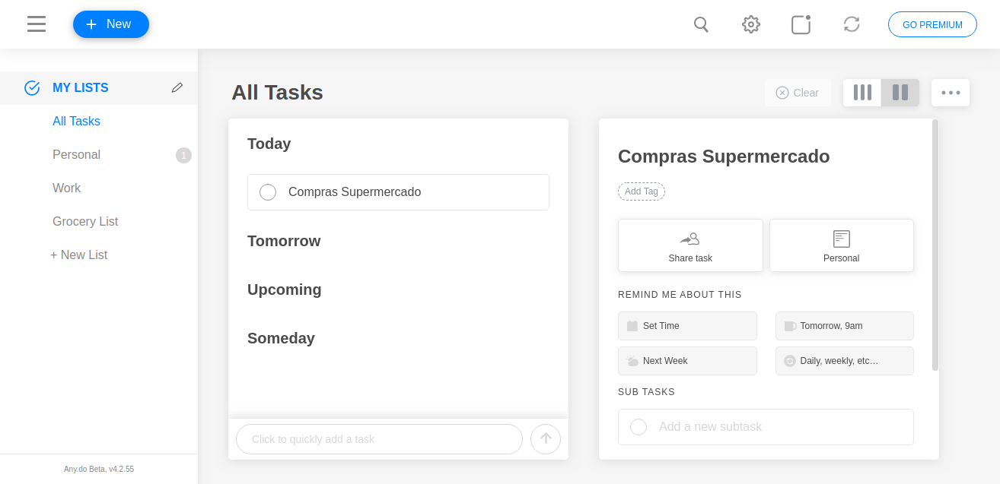
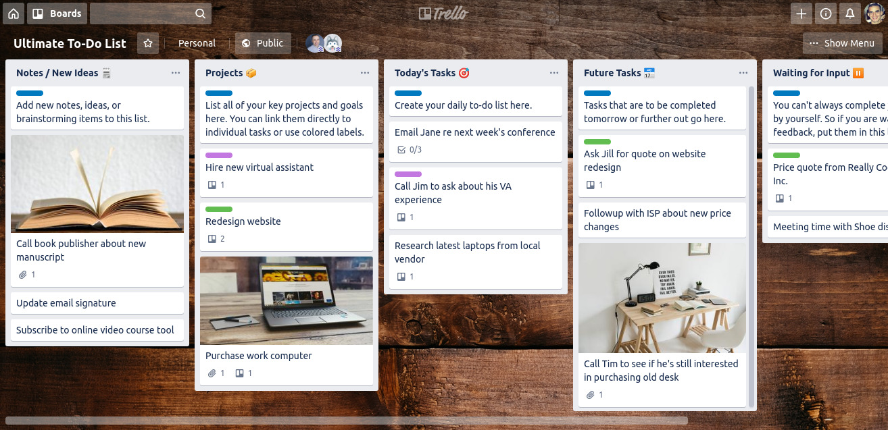

¿Alguna vez sientes que estás perdiendo el control de todo lo que tienes que hacer en el día a día? Si confías sólo en tu memoria, probablemente terminarás estresado y frustrado al olvidarte de hacer alguna tarea.

Pero no te preocupes, ¡hay una solución! Cuando organizas tus listas de tareas pendientes y encuentras la aplicación que mejor se adapte a tu estilo de vida, terminas preocupándote menos por recordar todo lo que necesitas hacer y más sobre las tareas en sí. 

Elegir la aplicación adecuada para usted es una tarea muy personal, pero no tiene que ser complicado, mucha gente todavía utiliza el método de lápiz y papel, ahora si usted está buscando algo más moderno, que está disponible en todos sus dispositivos y en realidad cumple el papel activo de recordar tareas:

## #1 [Todoista](https://todoist.com/)

[Todoist](https://todoist.com/) tiene una interfaz bastante minimalista, pero todavía tiene muchas características avanzadas e incluso recomendaciones basadas en IA. Es mi aplicación diaria, tiene una integración efectiva con el calendario de Google, es simple y eficaz, cumpliendo bien su papel de organizar tus tareas.

La adición de tareas es muy rápida gracias en parte al procesamiento en IA (tipo "comprar cerveza martes" y la tarea "comprar cerveza" se añadirá con el próximo martes establecido a la fecha de vencimiento). Puede colocar nuevas tareas en su Bandeja de entrada y, a continuación, moverlas a proyectos relevantes.

Todoist es lo suficientemente flexible como para adaptarse a la mayoría de los flujos de trabajo, pero no tan complicado como para sobrecargar.

### Plataformas

[Navegador](https://todoist.com/) ? Ma[c ?](https://todoist.com/downloads/mac?lang=en) Ven[tanas de W](https://todoist.com/downloads/windows?lang=en)i[ndows And](https://play.google.com/store/apps/details?id=com.todoist&hl=en_US)roi[d ?](https://itunes.apple.com/us/app/todoist-organize-your-life/id572688855?mt=8) iOS [? Extensión de Chrome](https://chrome.google.com/webstore/detail/todoist-to-do-list-and-ta/jldhpllghnbhlbpcmnajkpdmadaolakh?hl=en)

## #2 los [trabajos pendientes de Microsoft](https://todo.microsoft.com/pt-br)

En 2015, Microsoft compró Wunderlist y puso a ese equipo a trabajar en una nueva aplicación de lista de tareas pendientes. M[icrosoft To-Do](https://todo.microsoft.com/pt-br) es el resultado de esto, y puede encontrar Wunderlist DNA (todavía faltan algunas características) a lo largo del proyecto. La interfaz principal es limpia y fácil de usar, agregar tareas es rápido, pero hay mucha flexibilidad debajo de la superficie.

Pero lo más destacado aquí es la integración con el ecosistema de Microsoft. Los usuarios de Outlook pueden sincronizar sus tareas desde esta aplicación a Microsoft To Do, lo que significa que finalmente hay una manera de sincronizar las tareas de Outlook con dispositivos móviles. Los usuarios de Windows pueden agregar tareas mediante Cortana o escribiendo en el menú Inicio (por ejemplo, puede escribir "añadir cerveza a mi lista de compras" y la cereza se agregará a una lista llamada "compras").

Me gustaron especialmente las características incorporadas y el nuevo aspecto de la aplicación, pero para mí la falta de integración con el calendario de Google fue algo decisivo en la opción de Todoist, pero quién sabe cuando deciden hacer la integración no vuelvo a echar un vistazo.

### Plataformas

[Navegador](https://todo.microsoft.com/pt-br) [?](https://todo.microsoft.com/pt-br) Ma[c ?](https://apps.apple.com/us/app/microsoft-to-do/id1274495053?mt=12) Vent[anas de W](https://www.microsoft.com/en-us/p/microsoft-to-do-list-task-reminder/9nblggh5r558)ind[ows Andro](https://play.google.com/store/apps/details?id=com.microsoft.todos&hl=en_US)id ? [Ios](https://itunes.apple.com/us/app/microsoft-to-do/id1212616790?mt=8)

## #3 [Tareas d](https://support.google.com/tasks/answer/7675772?co=GENIE.Platform%3DDesktop&hl=pt)[e Google](https://gsuite.google.com/learning-center/products/apps/keep-track-of-tasks/)

Google Tasks es una gran solución si quieres una aplicación sencilla y sin lujos que funcione sin problemas en el ecosistema de Google (especialmente Gmail y Google Calendar). Pero no esperes demasiadas características avanzadas, es una herramienta simple.

Si eres el tipo de persona que siempre está abierta con Gmail, es muy probable que la integración directa del navegador sea muy útil, además de aplicaciones móviles que te permiten acceder rápidamente a las tareas.

### Plataformas

[Navegad](https://gsuite.google.com/learning-center/products/apps/keep-track-of-tasks)or [? Andro](https://play.google.com/store/apps/details?id=com.google.android.apps.tasks&hl=en_US)id [? i](https://itunes.apple.com/us/app/google-tasks-get-things-done/id1353634006?mt=8)OS [? Cromo](https://chrome.google.com/webstore/detail/google-tasks/dmglolhoplikcoamfgjgammjbgchgjdd?hl=en)

## #4 [Any.do](https://www.any.do/)

An[y.do pr](https://www.any.do/)oporciona una aplicación fácil de usar que facilita la adición de tareas, la organización a las listas y la fecha de vencimiento de la tarea. Pero lo que realmente destaca en la Any.do es la función diaria "Planificar mi día", que te obliga a programar cuándo realizarás varias tareas, para que recuerdes hacer las cosas. Any.do también se integra con los calendarios de Google y Outlook, lo que le permite ver sus citas y tareas en un solo lugar.

### Plataformas

\-ERR:REF-NOT-FOUND-Navegador-ERR:REF-NOT-FOUND- ? Ma-ERR:REF-NOT-FOUND-c ? Vent-ERR:REF-NOT-FOUND-anas de Wind-ERR:REF-NOT-FOUND-ows Android ?-ERR:REF-NOT-FOUND- Ios

## Tre[llo #5](https://trello.com/)

[Trello](https://trello.com/b/AwYSWOyt/ultimate-to-do-list) es una excelente herramienta para aquellos que les gusta Kanban, y se puede adaptar a un tablero de lista de tareas como e[n este ejempl](https://trello.com/b/AwYSWOyt/ultimate-to-do-list)o. Aunque no está específicamente destinado a ser una aplicación de tarea, si estás acostumbrado a trabajar en este modelo puede ser algo muy útil, hay numerosos plugins de integraciones con los más diversos servicios, por lo que es una herramienta muy versátil.

### Plataformas

\-ERR:REF-NOT-FOUND-Navegador-ERR:REF-NOT-FOUND- ? Ma-ERR:REF-NOT-FOUND-c ? Vent-ERR:REF-NOT-FOUND-anas de Wind-ERR:REF-NOT-FOUND-ows Android ?-ERR:REF-NOT-FOUND- Ios

## #6 [Asana](https://asana.com/pt)

As[ana s](https://asana.com/pt)igue la línea Trello, siendo una herramienta hecha básicamente para gestionar proyectos, pero con un poco de imaginación y ajuste se convierte en una herramienta útil para organizar tus tareas.

### Plataformas

[Navegador](https://asana.com/pt) ? [Android](https://play.google.com/store/apps/details?id=com.trello) ? [Ios](https://itunes.apple.com/us/app/asana-mobile/id489969512?mt=8)

Espero que algunos de estos servicios te ayuden a organizar, te recomiendo que pruebes todas las plataformas hasta que encuentres la que mejor se adapte a tu gusto y estilo de vida. Te garantizo que tan pronto como organices (y te mantengas organizado) todas tus tareas, tu vida será mucho más fácil.
