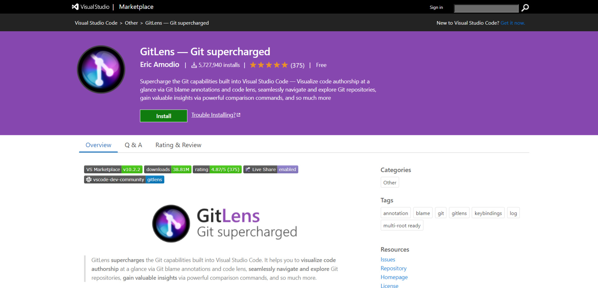
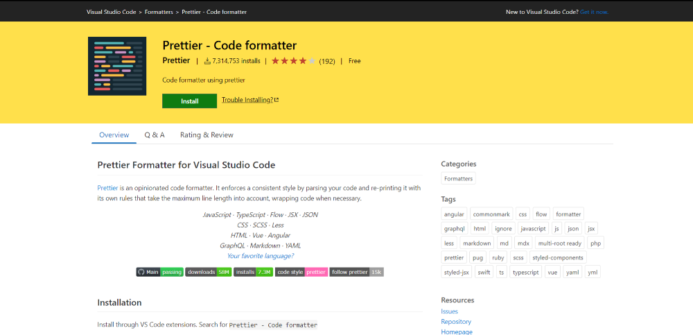
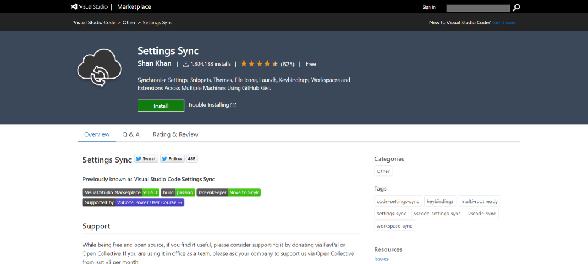
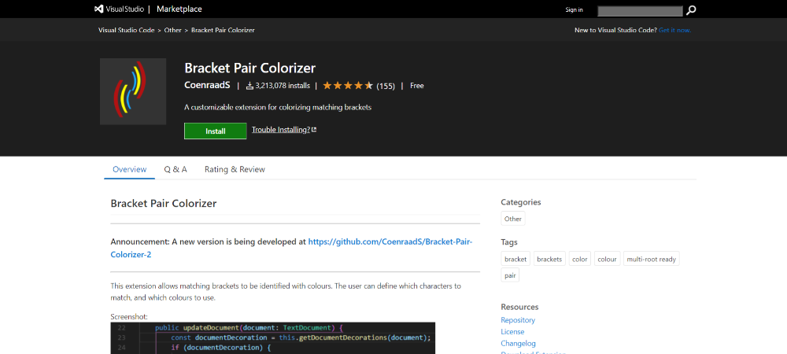
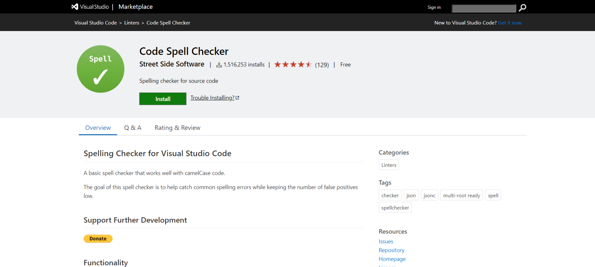

Que VSCode se ha conv[erti](http://marquesfernandes.com/melhores-editores-de-texto-ides-para-desenvolvimento-web-em-2020/)do en el IDE favorito de la comunidad no es nada nuevo, hace que la vida de muchos desarrolladores diariamente. Podemos optimizar aún más nuestro proceso de desarrollo utilizando algunas extensiones súper útiles. He separado una lista con las extensiones que utilizo y recomiendo mejorar su productividad.

## 1. [GitLens, Año Nuevo](https://marketplace.visualstudio.com/items?itemName=eamodio.gitlens)

GitLens amplía las características de Git de Visual Studio Code. Le ayuda a visualizar rápidamente al autor del código a través de las "notas culpables" de Git, navegar y explorar sin problemas los repositorios de Git, obtener información valiosa con comandos de comparación potentes y mucho más.

Esta extensión es ideal para que usted descubra que ese código que está maldiciendo fue hecho por usted mismo.

## 2. [Más bonita, Año Nuevo](https://marketplace.visualstudio.com/items?itemName=esbenp.prettier-vscode)

Más bella es un formateador de código opinado. Aplica un estilo coherente al analizar el código y volver a imprimirlo con sus propias reglas que tienen en cuenta la longitud máxima de la línea, agrupando el código cuando sea necesario. Muy útil para formatear ese JSON gigante que copió de Internet y está tratando de entender.

## 3. [Compartir en vivo](https://marketplace.visualstudio.com/items?itemName=MS-vsliveshare.vsliveshare)

Visual Studio Live Share le permite editar y depurar de forma colaborativa con otros usuarios en tiempo real, independientemente de los lenguajes de programación que esté utilizando o de los tipos de aplicaciones que está creando. Le permite compartir instantáneamente (y de forma segura) su proyecto actual y, según sea necesario, compartir sesiones de depuración, instancias de terminal, aplicaciones web locales, llamadas de voz y mucho más! Los desarrolladores que se unen a sus sesiones reciben todo el contexto de publicador de su entorno (por ejemplo, servicios de lenguaje, depuración), lo que garantiza que pueden empezar a colaborar de forma productiva de inmediato, sin necesidad de clonar ningún repositorio o instalar SDK.

## 4. [Remoto - SSH](https://marketplace.visualstudio.com/items?itemName=ms-vscode-remote.remote-ssh)

La extensión Remoto - SSH le permite utilizar cualquier máquina remota con un servidor SSH como entorno de desarrollo. Esto puede simplificar en gran medida el desarrollo y la solución de problemas en una amplia variedad de situaciones.

-   Desarrolle en el mismo sistema operativo que implemente o use una infraestructura más grande, rápida o más especializada que la máquina local.
-   Cambie rápidamente entre diferentes entornos de desarrollo remoto y realice actualizaciones de forma segura, sin preocuparse por afectar a su máquina local.
-   Acceda a un entorno de desarrollo de varios equipo o sitio existente.
-   Depurar una aplicación que se ejecuta en otro lugar, como un sitio cliente o en la nube.

## 5. [Configuración Sincronización](https://marketplace.visualstudio.com/items?itemName=Shan.code-settings-sync)

Si te ves constantemente en nuevas instalaciones de VSCode y estás cansado de tener que recordar e instalar tus extensiones, configuraciones y temas, tus problemas han terminado. Settings Sync le permite sincronizar el estado de su VSCode entre varias instancias.

## 6\. [Recarga, Año Nuevo](https://marketplace.visualstudio.com/items?itemName=natqe.reload)

Esta extensión me encantaría no tener que usar, pero constantemente veo la necesidad de reiniciar vscode para coger alguna pelusa o autocompletar. Añadirá un botón de recarga al VSCode en la barra de estado en la parte inferior derecha. Esta es una extensión simple, para volver a cargar rápidamente la ventana cuando tiene problemas .. o desea que el editor surta efecto.

## 7\. [Par de soporte colorear](https://marketplace.visualstudio.com/items?itemName=CoenraadS.bracket-pair-colorizer)

Esta extensión permite identificar los corchetes correspondientes con colores. El usuario puede definir qué caracteres coincidir y qué colores utilizar.

## 8\. [Comprobador de ortografía de código](https://marketplace.visualstudio.com/items?itemName=streetsidesoftware.code-spell-checker)

Si usted, como yo, no tiene inglés como su primer idioma y se ve constantemente en duda si se perdió algo en sus comentarios o documentación, esta extensión es para usted!

Un corrector ortográfico básico que funciona bien con código camelCase. El propósito de este corrector ortográfico es ayudar a detectar errores ortográficos comunes manteniendo el número de falsos positivos bajo.

## 9\. [EditorConfig](https://marketplace.visualstudio.com/items?itemName=EditorConfig.EditorConfig)

Este plugin intenta reemplazar la configuración de usuario/espacio de trabajo con la configuración que se encuentra en el archiv`o .editorconfi`g. Básicamente permite en crisis un archivo que se puede versionar y compartir con ajustes útiles como el espaciado (pestaña o espacio) del proyecto, si desea que represente los espacios en blanco, y más.

* * *

Estas extensiones ayudan mucho en mi productividad, ¿y tú? ¿Tiene alguna extensión que utilice y encuentre útil? ¡Deja en los comentarios!
