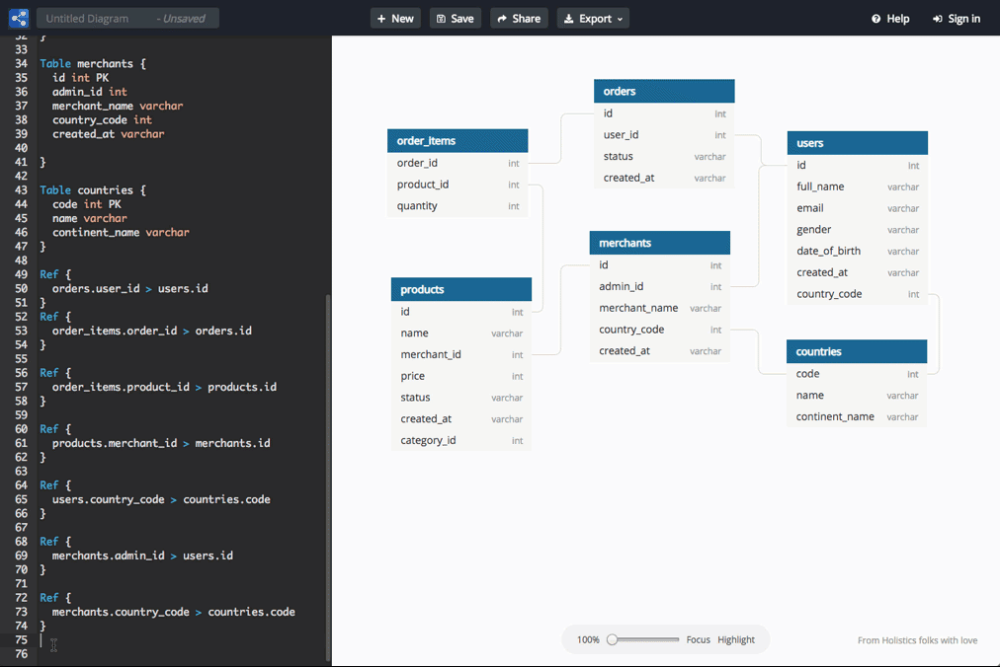

Diseñar su base de datos es uno de los pasos más importantes cuando comienza a desarrollar una nueva aplicación y elegir la herramienta adecuada para esto puede hacer su vida mucho más fácil. La diagrama de su banco le ayuda a comprender mejor cómo se almacenarán sus datos y entidades y comunicarse entre sí. Muchos proyectos sufren a largo plazo porque han descuidado este importante paso, ya que su aplicación cobra vida y masa de datos, cada vez más, cualquier cambio estructural se vuelve más complicado y requiere mucho tiempo.

La buena noticia es que hay excelentes herramientas para ayudar en esta tarea, separé una lista para ayudarle a elegir una herramienta de diagramación gratuita.

*También echa un vis[tazo: 4 herramientas gratuitas para administrar MongoDB](http://marquesfernandes.com/ferramentas-gratuitas-para-gerenciar-mongodb/)*

## Las mejores herramientas para dibujar/diagramar una base de datos

-   [dbdiagram.io](#dbdiagram.io)
-   [draw.io](#draw.io)
-   [Lucidchart, Año Nuevo](#lucidchart)
-   [MySQL Workbench](#mysql)

## 1\. -ERR:REF-NOT-FOUND-dbdiagram.io

[dbdiagram.io](https://dbdiagram.io/home?utm_source=marquesfernandes&utm_medium=blog_post) es una herramienta en línea que permite fácilmente la creación rápida de prototipos de entidades y relaciones. Lo puse en primer lugar porque es mi herramienta de visita en el día a día cuando necesito estructurar alguna relación. Tiene integración con github, que le permite versionar fácilmente su trabajo.

## 2\. [diagrams.net (draw.io)](https://www.diagrams.net?utm_source=marquesfernandes&utm_medium=blog_post)

[diagrams.net](https://www.diagrams.net?utm_source=marquesfernandes&utm_medium=blog_post) es una excelente herramienta para diseñar la base de datos y la relación entre entidades. Tiene integración con OneDrive y Google Drive para guardar automáticamente tus proyectos. Debido a que es una herramienta más completa, también puede diagramar su banco, dibujar diagramas de flujo, organigramas y mucho más.

## 3\. [Lucidchart, Año Nuevo](https://www.lucidchart.com/pages/landing?utm_source=marquesfernandes&utm_medium=blog_post)

[Lucidchar](https://www.lucidchart.com/pages/landing?utm_source=marquesfernandes&utm_medium=blog_post)t sigue la misma línea que diagrams.net, una herramienta completa y versátil que permite la diagramación de bases de datos, entitades relación, etc. Hay una limitación de 100 plantillas básicas en el plan gratuito, pero para proyectos simples esto no debería ser un obstáculo.

## 4\. [MySQL Workbench](https://www.mysql.com/products/workbench?utm_source=marquesfernandes&utm_medium=blog_post)

[MySQL Workbench](https://www.mysql.com/products/workbench?utm_source=marquesfernandes&utm_medium=blog_post) es una herramienta desarrollada por Oracle centrada en la administración y construcción de bases de datos en MySQL, sin embargo, su herramienta de diagramación es muy práctica y completa, y se puede utilizar para diagramar entidades y principalmente bases de datos SQL, convirtiéndose en una potente alternativa fuera de línea.
