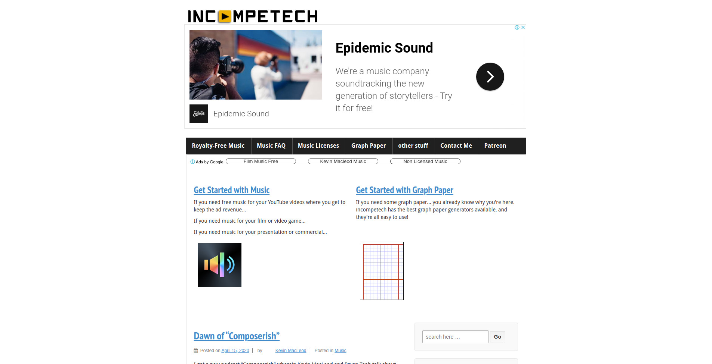
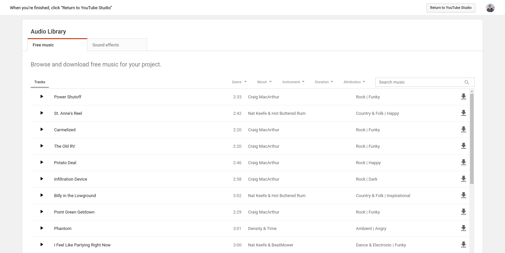
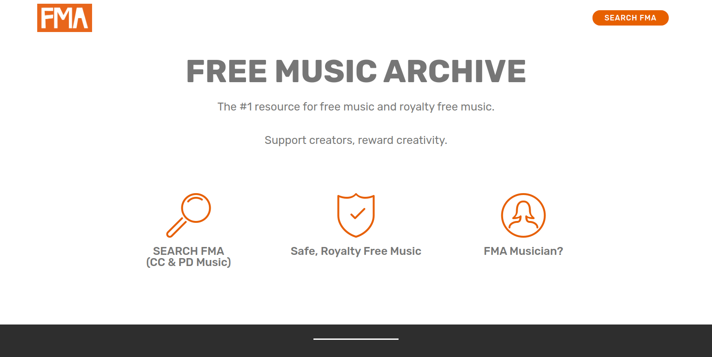
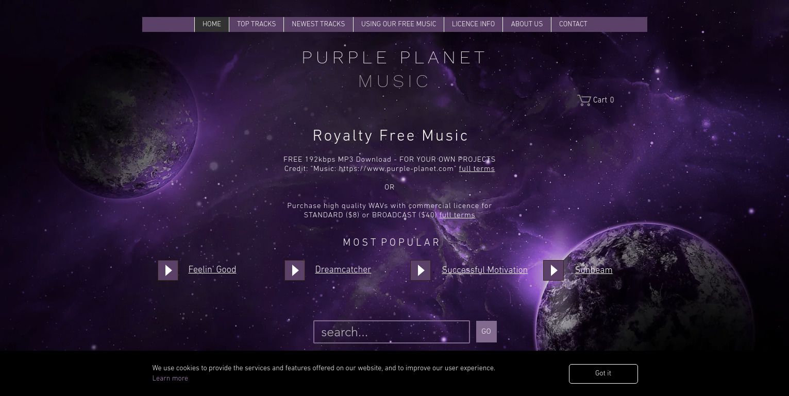
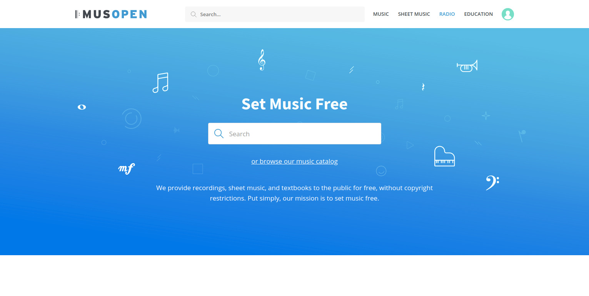

Colocar músicas em seus podcasts e vídeos pode fazer toda a diferença para o resultado final, dando uma cara mais profissional ao seu conteúdo. O problema é encontrar músicas de qualidade, gratuitas e que não infrinjam direitos autorais.

Ao mesmo tempo, muitas músicas "royalty-free" são muito usadas por diversos criadores de conteúdo, fazendo com que fique difícil e repetitivo o seu uso. Se você busca músicas de fundo para seus podcasts e vídeos essa pode ser uma tarefa cansativa, mas não se preocupe, existem diversos sites que disponibilizam músicas de qualidade e gratuitamente! Separei alguns desses sites para facilitar sua vida.

## 1\. **[Incompetech.com](https://incompetech.com/)**

**[Incompetech](https://incompetech.com/)**

**Incopetech** é talvez um dos sites mais antigos desse nicho. Não deixe se enganar por sua aparência simplista e talvez um pouco antiquada, esse site é um poderoso arsenal de músicas! Ele requer que você de crédito ao autor da música em troca de seu uso, um custo baixo não é mesmo? 

Se você navegar por um tempinho na plataforma provavelmente vai se deparar com muitas músicas conhecidas e já usadas por vídeos e podcasts pelo mundo.

## 2\. [Youtube Audio Library](https://www.youtube.com/audiolibrary/music?nv=1)

[Youtube Audio Library](https://www.youtube.com/audiolibrary/music?nv=1)

O **Youtube Audio Library** é um serviço do Youtube conhecido por poucos. Conta com uma ampla seleção de músicas para uso direto e gratuito na criação de seus conteúdos.

## 3\. [FMA - Free Music Archive](https://freemusicarchive.org/)

[FMA - Free Music Archive](https://freemusicarchive.org/)

**Free Music Archive** conta com seleção de músicas grauitas e de qualidade fenomenal. Possui diversas categorias para facilitar sua busca. Vale a pena conferir os termos de uso específicos para cada música disponível na plataforma.

## 4\. [Purple Planet](https://www.purple-planet.com/)

**Purple Planet** é um site mantido por Geoff Harvey and Chris Martyn na Inglaterra. Eles cuidam desde a composição, produção e gravação das músicas. Além de gratuitas, as músicas são de qualidade, e segundo eles, utilizam preferencialmente instrumentos reais para dar uma sensação de natural.

## 5\. [Musopen](https://musopen.org/)

[Musopen](https://musopen.org/)

**Musopen** é um site focado em músicas clássicas e gratuitas, conta até com uma radio 24/7 para caso você queria escutar esse estilo de música.

Possui um sistema de avaliação das músicas muito útil, o site não é muito amigável mas se você está em busca de uma música clássica para seu conteúdo, vale a pena dar uma conferida.
