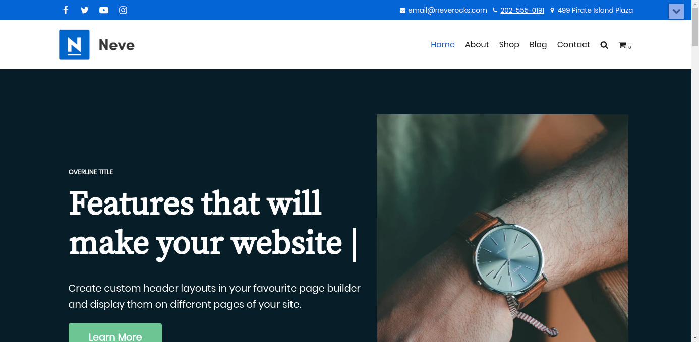
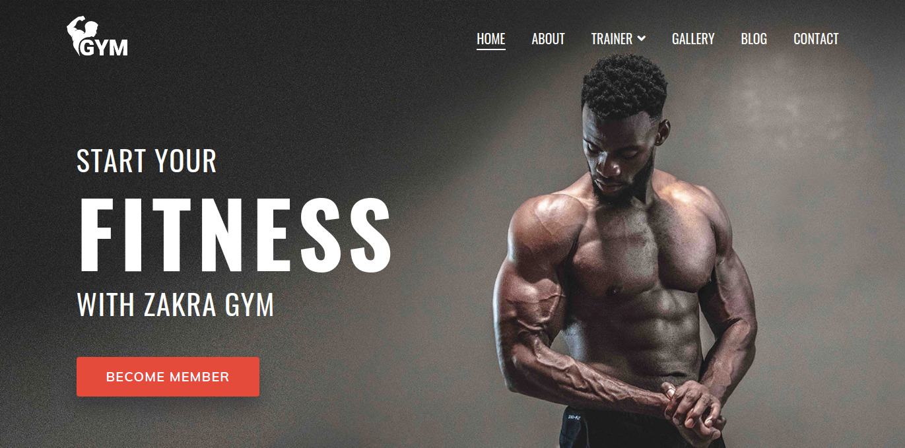
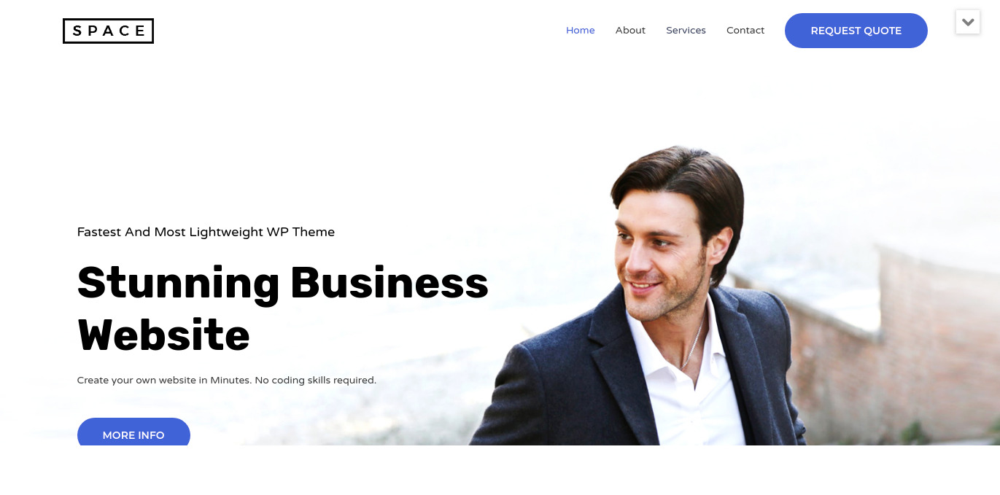
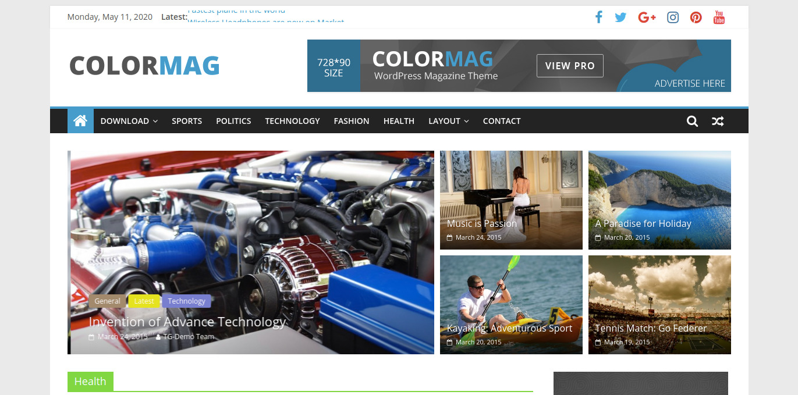
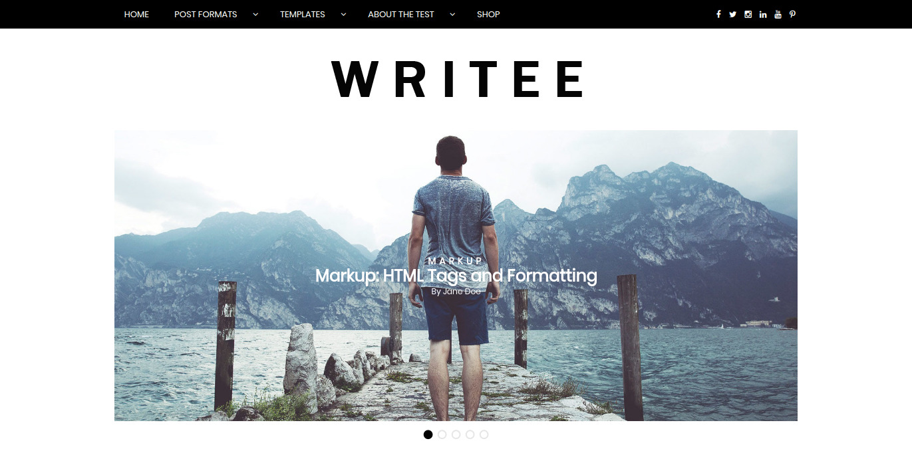
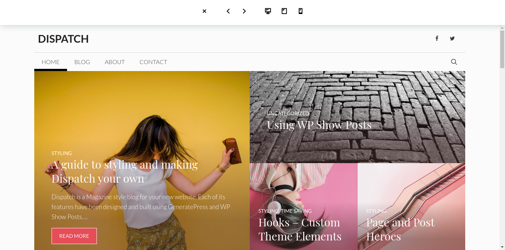

Encontrar o tema perfeito para o seu site ou blog em [WordPress](http://wordpress.com/) é uma tarefa que requer tempo e cuidado. Muitos temas são pagos e caros, mas não se preocupe, existem diversos temas bonitos, responsivos e gratuitos, isso mesmo, de graça!

Separei uma lista com os melhores temas gratuitos para usar em 2020, filtrei essa lista em busca de temas modernos, responsivos (afinal, estamos em 2020 né?) e que de alguma maneira seja otimizado para SEO e performance.

## Os Melhores Temas Gratuitos para WordPress

1.  [Neve](#neve)
2.  [Zakra](#zakra)
3.  [Astra](#astra)
4.  [Customify](#customify)
5.  [Colormag/](#colormag)
6.  [Writee](#writee)
7.  [GeneratePress](#generatepress)
8.  [Supermag](#supermag)

## 1\. [Neve](https://themeisle.com/themes/neve/)

Neve é um tema super rápido, facilmente personalizável e multiuso. É perfeito para blogs, pequenas empresas, startups, agências, empresas, lojas de comércio eletrônico (loja WooCommerce), bem como sites de portfólio pessoal e a maioria dos tipos de projetos. Um tema totalmente otimizado e responsivo para o AMP, o Neve carrega em poucos segundos e se adapta perfeitamente a qualquer dispositivo de visualização. Embora seja leve e tenha um design minimalista, o tema é altamente extensível, mas possui um código otimizado para SEO, resultando em melhores classificações nos resultados de pesquisa do Google. O Neve funciona perfeitamente com Gutenberg e os construtores de páginas mais populares (Elementor, Brizy, Beaver Builder, Visual Composer, SiteOrigin, Divi). Neve também está pronto para WooCommerce, responsivo, RTL e pronto para tradução. Não procure mais. Neve é o tema perfeito para você!

## 2\. [Zakra](https://zakratheme.com)

O Zakra é um tema multiuso flexível, rápido, leve e moderno, que vem com muitos sites gratuitos para iniciantes (atualmente mais de 10 sites gratuitos são adicionados posteriormente) que você pode usar para tornar seu site bonito e profissional. Verifique todos os sites iniciantes em https://zakratheme.com/demos. Adequado para blog pessoal, portfólio, lojas WooCommerce, sites de negócios e sites de nicho (como café, spa, caridade, ioga, casamento, dentista, educação etc.) também. Funciona com o Elementor e outros criadores de páginas principais, para que você possa criar qualquer layout que desejar. O tema é responsivo, compatível com Gutenberg, compatível com SEO, pronto para tradução e compatíveis com os principais plugins do WordPress.

## 3\. [Astra](https://justfreethemes.com/astra/)

Astra é um tema WordPress rápido, totalmente personalizável e bonito, adequado para blog, portfólio pessoal, site de negócios e loja da WooCommerce. É muito leve (menos de 50 KB no front-end) e oferece velocidade incomparável. Construído com o SEO em mente, o Astra vem com o código Schema.org integrado e está pronto para o AMP nativo, para que os mecanismos de pesquisa amem seu site. Oferece recursos e modelos especiais para que funcione perfeitamente com todos os criadores de páginas, como Elementor, Beaver Builder, Visual Composer, SiteOrigin, Divi, etc. Alguns dos outros recursos:

-   Pronto para WooCommerce
-   Responsivo
-   RTL e pronto para tradução
-   Extensível com complementos premium
-   Atualizado regularmente
-   Projetado, Desenvolvido, Mantido e Suportado pela Brainstorm Force.

## 4\. [Customify](https://pressmaximum.com/customify/)

Customify é um tema multiuso rápido, leve, responsivo e super flexível, construído com SEO, velocidade e usabilidade em mente. Liberte o poder da sua imaginação com um verdadeiro construtor WYSIWYG Header & Footer (dentro do WordPress Customizer) criado exclusivamente para esse tema. O tema funciona muito bem com qualquer um dos seus criadores de páginas favoritos, como Elementor, Beaver Builder, SiteOrigin, Thrive Architect, Divi, Visual Composer, etc. Combinado com o construtor Header & Footer, você pode criar qualquer tipo de site, como lojas, agências comerciais, corporativa, portfólio, educação, portal da universidade, consultoria, igreja, restaurante, medicina e assim por diante. O Customify é compatível com todos os plugins bem codificados, incluindo os principais como WooCommerce, OrbitFox, Yoast, BuddyPress, bbPress, etc.

## 5\. [Colormag](https://themegrill.com/themes/colormag/)

O ColorMag é um tema perfeito para WordPress, no estilo de revista responsiva. Adequado para notícias, jornais, revistas, publicações, negócios e qualquer tipo de site.

## 6\. [Writee](https://www.scissorthemes.com/themes/writee-free/)

Writee é um elegante tema de blog pessoal gratuito e WordPress adequado para assuntos pessoais, gastronômicos, de viagens, moda, corporativos ou qualquer outro blog incrível. O Writee é totalmente responsivo e otimizado para dispositivos móveis. O tema apresenta um design perfeito para pixels e inclui 3 widgets personalizados, Opções do Personalizador, controle deslizante de largura total / caixa para exibir seu conteúdo com estilo.

## 7\. [GeneratePress](https://generatepress.com/)

GeneratePress é um tema leve do WordPress, desenvolvido com foco na velocidade e na usabilidade. O desempenho é importante para nós, e é por isso que uma nova instalação do GeneratePress adiciona menos de 15kb (gzipped) ao tamanho da sua página. Aproveitamos ao máximo o novo editor de blocos (Gutenberg), que oferece mais controle sobre a criação de seu conteúdo. Se você usa construtores de páginas, o GeneratePress é o tema certo para você. É totalmente compatível com todos os principais criadores de páginas, incluindo o Beaver Builder e o Elementor. Graças à nossa ênfase nos padrões de codificação do WordPress, podemos ter total compatibilidade com todos os plugins bem codificados, incluindo o WooCommerce. O GeneratePress é totalmente responsivo, usa HTML / CSS válido e é traduzido para mais de 25 idiomas por nossa incrível comunidade de usuários. Alguns de nossos muitos recursos incluem integração de microdados, 9 áreas de widgets, 5 locais de navegação, 5 layouts da barra lateral, menus suspensos (clique ou passe o mouse) e predefinições de cores de navegação.

## 8\. [SuperMag](https://www.acmethemes.com/themes/supermag/)

SuperMag, um tema definitivo para a revista. O SuperMag foi projetado especialmente para notícias, revistas e blogs, adequado para qualquer site no estilo de uma revista. SuperMag também é um tema de anúncio pronto, Anúncio pode ser adicionado a partir do personalizador e widgets. SuperMag é um tema altamente personalizável. Você pode personalizar cabeçalho, rodapé, barra lateral, página principal e seções internas. A cor do site inteiro pode ser alterada com um único clique. SuperMag é um tema widgetizado. Com widgets avançados, você pode criar seu site. Seu recurso exclusivo inclui área widgetizada de arrastar / soltar / reordenar, widgets personalizados avançados, opções avançadas de layout, opções de notícias de última hora, opções de imagens em destaque para páginas de blog / categoria / arquivo e uma única página / publicação, integração de mídia social, anúncio pronto, trilha de navegação, WooCommerce e Page Builder Ready e muito mais. Crie seu site sem tocar no código.
