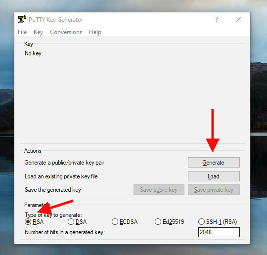
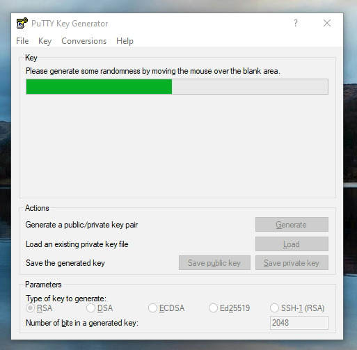
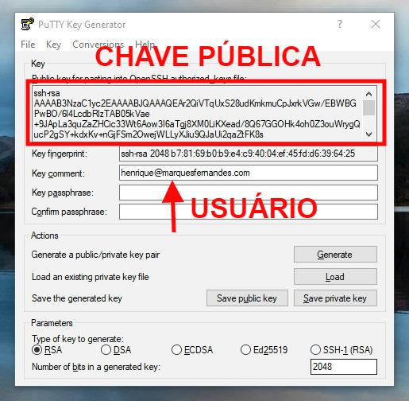
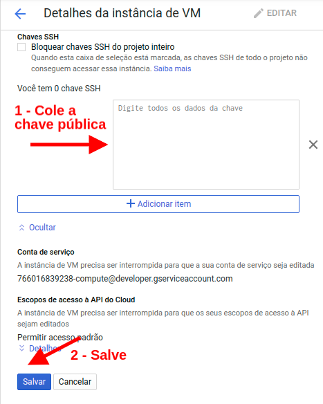
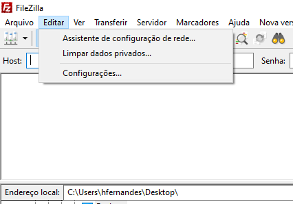
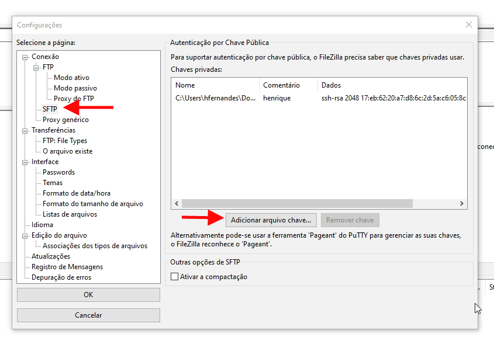

Neste artigo irei ensinar como usar o [FileZilla](https://filezilla-project.org/) para conectar e acessar seus arquivos em suas instâncias de VM no [Google Cloud Compute Engine](https://cloud.google.com/compute/) por SFTP usando o [Putty](https://www.putty.org/) para gerar as chaves SSH e [PPK](http://marquesfernandes.com/2019/02/18/convertendo-arquivos-ppk-para-pem-no-linux-ubuntu-debian/) necessárias.

## Baixando o Putty e FileZilla

Baixe e instale o [PUTTY](https://www.ssh.com/ssh/putty/#sec-PuTTY-downloads) e o [FileZilla](https://filezilla-project.org/download.php) em seu computador.

*O programa PUTTY é um gerador de chaves SSH para criar chaves privadas e públicas que permitem criptografar as conexões.*

*FileZilla é uma ferramenta para transferir e administrar arquivos através do protocolo FTP.*

## Gerando as chaves públicas e privadas com o PUTTYgen

Abra o programa **PUTTYgen** e clique no botão gerar (*Generate*).

Uma barra de progresso aparecerá pedindo para que você mova o mouse para gerar aleatoriedade. Mova seu mouse em cima da área cinza do programa, espere a barra de progresso preencher por completo e então suas chaves serão geradas.

Após a geração das chaves novos campos aparecerão logo abaixo. No campo **Key comment** digite o usuário desejado.

Copie a chave pública e salve a chave privada em um lugar seguro de seu computador.

## Adicionando a chave pública em sua instância no Google Cloud

Acesse sua conta do Google Cloud e navegue até **Compute Engine > Instâncias VM**.

Selecione a instância que você deseja acessar, clique em editar e desça até encontrar a sessão **Chaves SSH**.

Cole a chave pública que você copiou anteriormente no campo "**Digite todos os dados da chave"**, feito isso você verá a esquerda o usuário que você inseriu na criação da chave.

Agora atualize a instância clicando em **Salvar**.

## Configurando autenticação por chave pública no FileZilla

Abra o **FileZilla** e navegue até **Editar > Configurações**.

No menu esquerdo lateral navegue até **Conexão > FTP > SFTP**.

Clique em **adicionar arquivo chave** e selecione a chave privada que você salvou.

Clique em **OK** para salvar as configurações.

## Estabelecendo uma conexão segura (SFTP) com a sua instância

Para conectar em sua instância no Google Cloud você precisa do endereço de IP e do usuário da criação da chave pública/privada.

Na janela do FileZilla, no campo host, digite **sftp://ipdainstancia**. No campo **Usuário** digite o seu usuário e clique em conexão rápida.

Feito isso você já conseguirá acessar e transferir arquivos para a sua instância.
